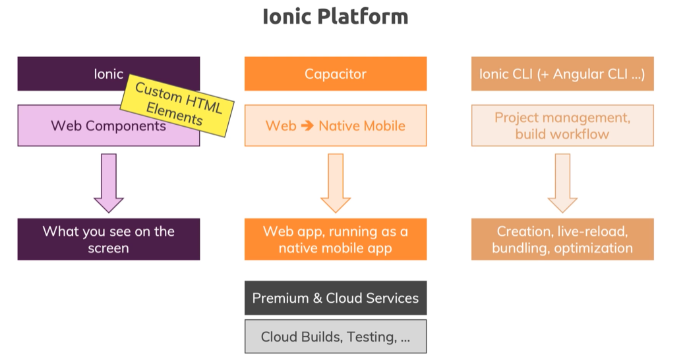
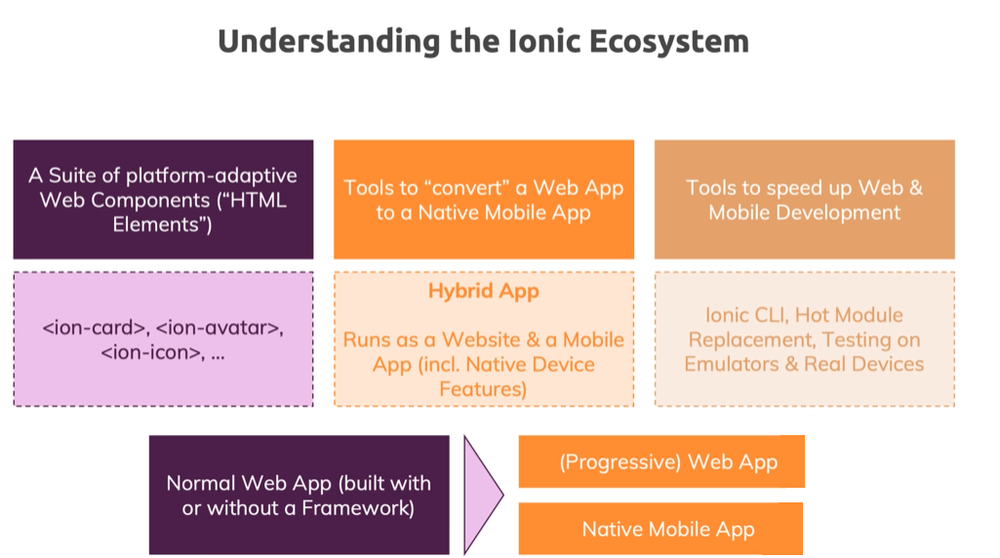
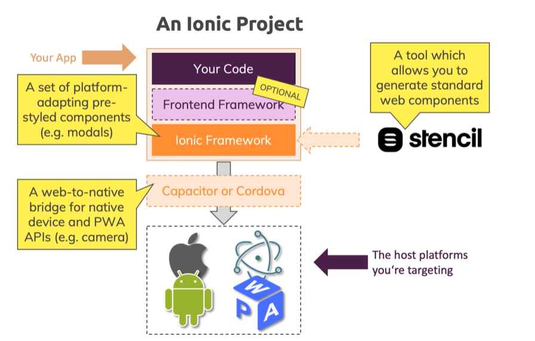
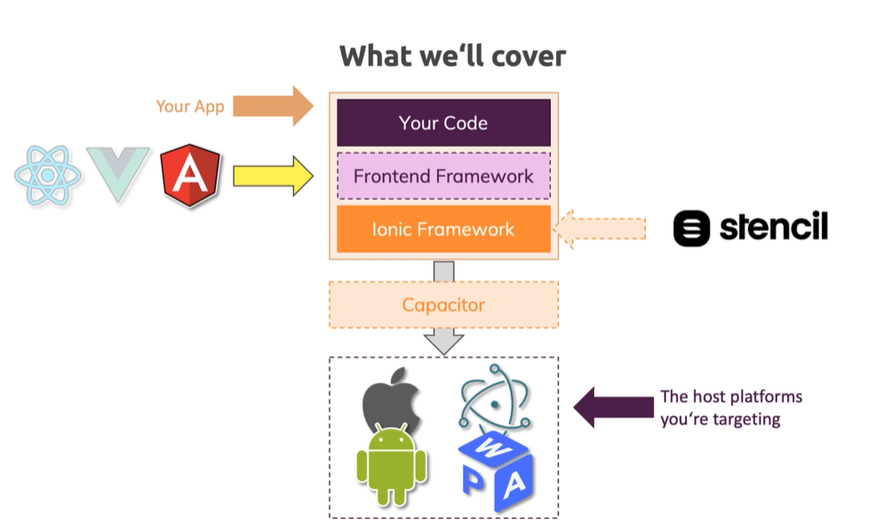
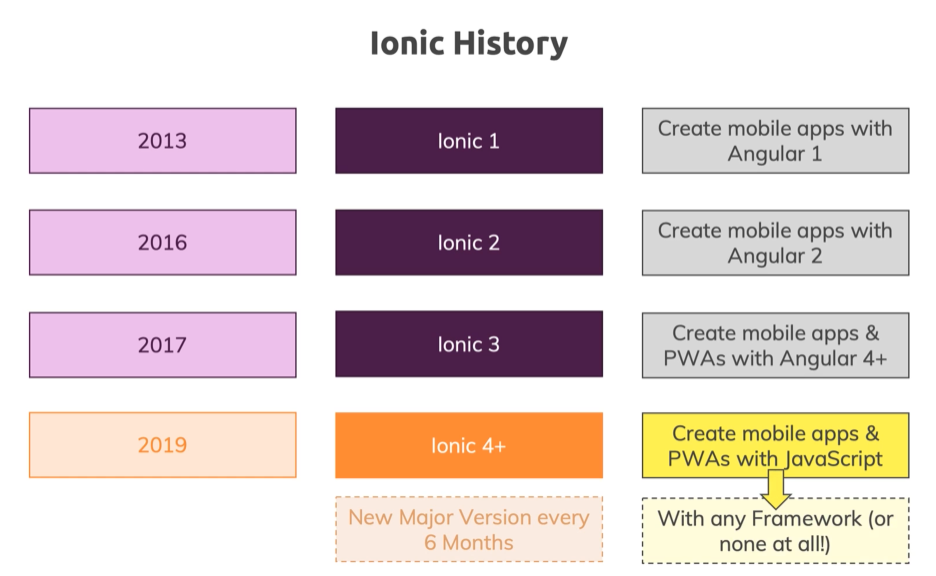
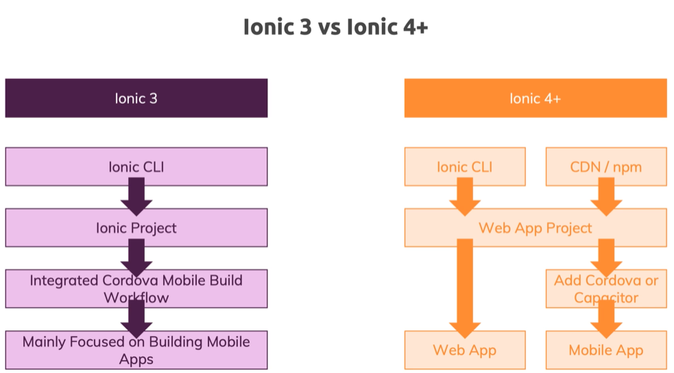
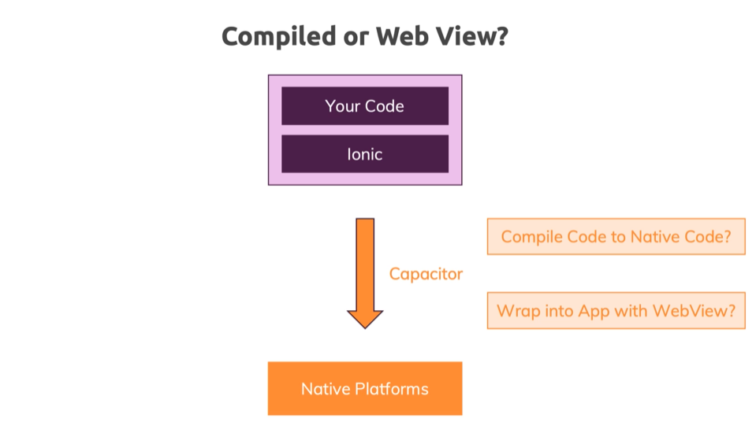
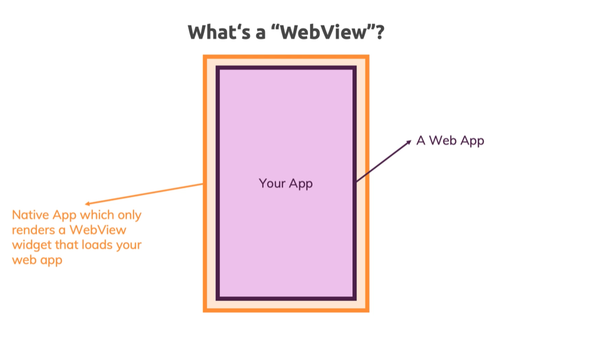
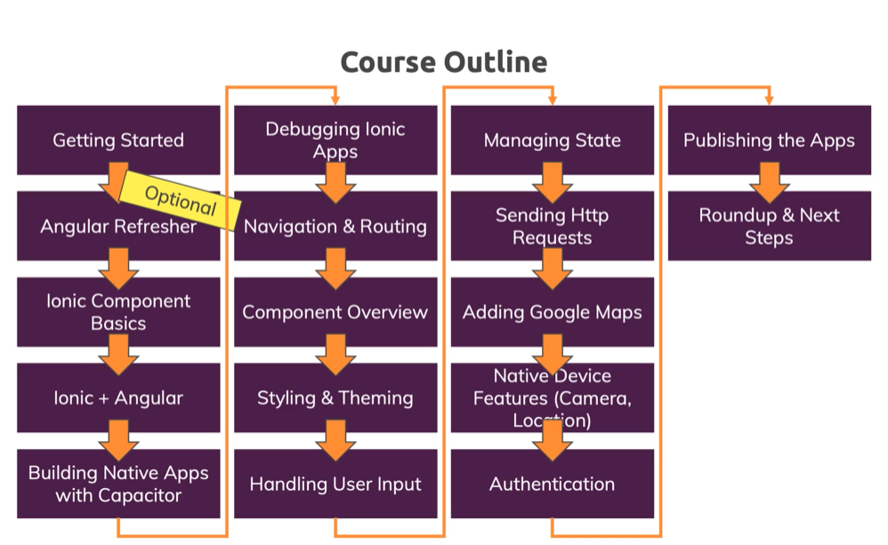
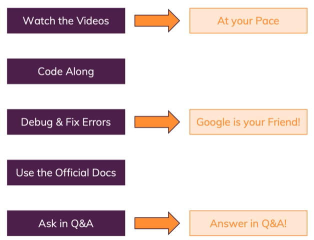

# Ionic Notes

 

<nav>

## Navigation 

 

### <a href="#t01">**Section 01: Getting Started**</a>

### <a href="#t02">**Section 02: Angular Refresher**</a>

</nav>

  

  

## **Section 01: Getting Started** <a href="#navi">&#8593;</a> 

  

1. <a href="#i0100">Introduction</a>
2. <a href="#i0101">What is Ionic?</a>
3. <a href="#i0102">A Closer Look at the Ionic Platform</a>
4. <a href="#i0103">First Ionic App</a>
5. <a href="#i0104">The History of Ionic</a>
6. <a href="#i0105">Ionic 4+ vs Ionic 3</a>
7. <a href="#i0106">How to Build Native Mobile Apps with Ionic</a>
8. <a href="#i0107">Comparing Ionic to Alternatives</a>
9. <a href="#i0108">Course Outline</a>
10. <a href="#i0109">How To Get The Most Out Of The Course</a>

  

### **Introduction** <a href="#t01">&#8593;</a>

 

Ionic allows you to build cross-platform mobile applications.

  

### **What is Ionic?** <a href="#t01">&#8593;</a>

 

Ionic is all about having one code base (HTML + CSS + JS) which is the code base for Web App.

You use Web Technologies (HTML/CSS/JS) & Tools added by Ionic to generate Web Apps, Progressive Web Apps, iOS & Android Apps, and even Electron (Desktop) Apps.

Electron is a Web Technology which allows you to wrap a Web App into a Desktop App.

#### What are Progressive Web Apps (PWAs)?

- Progressive Web App is a normal Web App that looks and feels a bit like a native mobile app. It isn't a native mobile app, you don't distribute through the App Stores, it's still a website which you can find via Google, but it's optimized to:
  - be reliable: Load fast and provide offline functionality
  - Fast: Respond quickly to user actions
  - Engaging: Feel like a native app on mobile devices (e.g. using location or camera)

#### Ionic is flexible

With Ionic you can build such a Progressive Web App, you can also build a normal Web App (which isn't particularly fast, and doesn't tap into native device features), and you can also get a real native app out of it. So you can really target the broadest range of channels possible.

<small>tap - meaning: https://ell.stackexchange.com/questions/58077/why-does-tap-into-mean-what-it-means</small>

#### Ionic Platform

- in it's core it's all about Ionic which is a set of Web Components (lots of those)
  - Web Components - Custom HTML Elements (they're just like Angular Components)
    - you get those from Ionic
  - these components are what you can see on the screen
- Capacitor - a tool which is capable of taking your existing Web App and wrapping it into a so-called "Web View" into a Native Mobile App
  - Web app, running as a native mobile app
- Ionic CLI (+ Angular CLI, ...other)
  - Project management, build workflow
    - creation, live-reload, bundling, optimization

  

### **A Closer Look at the Ionic Platform** <a href="#t01">&#8593;</a>

 

#### Understanding the Ionic Ecosystem

#### An Ionic Project

Ionic Framework -> Capacitor: Accesses a bridge between our web JavaScript code, and the Native Platform (iOS / Android / Desktop). So from our JavaScript Code we can trigger certain functions which then will in the end trigger native code on your device to for example open the camera, to get the user location, to show an alert or anything like that. This then can be done with real native code executed on your behalf without you needing to write it by tools like Capacitor (or Cordova).

#### This course covers:

- Ionic
- Angular
- Capacitor
- PWA / Mobile Apps / Possibly Desktop Apps

  

### **First Ionic App** <a href="#t01">&#8593;</a>

 

Ionic Docs: https://ionicframework.com/docs/

Installation: https://ionicframework.com/docs/intro/cli

Install Ionic CLI: `npm install -g @ionic/cli`

Create app (start): `ionic start`

Starter Template: blank (for now)

Serve the App: `ionic serve`

Ionic UI Components (Web Components): https://ionicframework.com/docs/components

  

### **The History of Ionic** <a href="#t01">&#8593;</a>

 

Ionic 1, 2, & 3: Angular/Ionic (Angular Components)

Ionic 4+: JavaScript/Angular/React/Vue/Etc (Web Components)

  

### **Ionic 4+ vs Ionic 3** <a href="#t01">&#8593;</a>

 

Ionic Migration (e.g. 3.x -> 4.x): https://ionicframework.com/docs/reference/migration

  

### **How to Build Native Mobile Apps with Ionic** <a href="#t01">&#8593;</a>

 

#### Compilation

- You could compile your code (HTML/JS or TS/CSS) + Ionic (Components) into native Java or Objective C code - but you would have to do it for every single platform, that's why WebView is used (wrap app into WebView)
- or wrap into app with WebView
  - WebView - a special widget you can use in Native App Development which is a fully-fledged browser that doesn't look like one (you don't have url at the top, etc), it just is a full-screen browser
  - WebView - host a web page inside of a native app
    - e.g. you can open websites inside of an app (twitter/messenger, etc) - a built-in browser opens up
      - and that what is Ionic uses - with tools like Capacitor or Cordova you in the end get a mobile app shell that has such a WebView in it, and also then has some capabilites of launching a simple web server running mobile on the device that hosts your Ionic Web App inside of that WebView
        - then Cordova or Capacitor gives you a "bridge" through which you can tap into native device features from inside your Web App

#### What's a "WebView"?

WebView - allows you to run your Web App inside of a Native App that renders this full-screen browser:

  

### **Comparing Ionic to Alternatives** <a href="#t01">&#8593;</a>

 

You can build mobile apps with cross-platform technologies (like HTML, JS, CSS) with other technologies, too. For example, React Native and Flutter would be popular alternatives.

Here's my detailed comparison of all these popular approaches: https://academind.com/learn/flutter/react-native-vs-flutter-vs-ionic-vs-nativescript-vs-pwa/

  

### **Course Outline** <a href="#t01">&#8593;</a>

 

  

### **How To Get The Most Out Of The Course** <a href="#t01">&#8593;</a>

 

Problem Solving & How To Get The Most Out Of The Course

  

  

## **Section 02: Angular Refresher** <a href="#navi">&#8593;</a> 

  

1. <a href="#i0200">Angular Core Features - refresher</a>
2. <a href="#i0201">x</a>

  

### **Angular Core Features - refresher** <a href="#t02">&#8593;</a>

 

#### 4 Types of Data-Binding in Angular

- property binding (e.g. `[property]="tsExpression"`),
- event binding (e.g. `(event)="tsExpression"`),
- string interpolation (e.g. `{{ person.name }}`),
- two-way binding (`[(ngModel)]="tsExpression"`)

 
