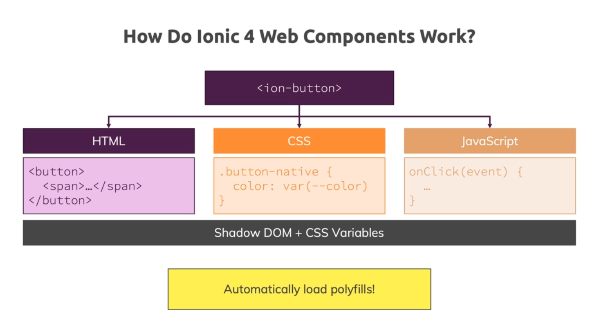
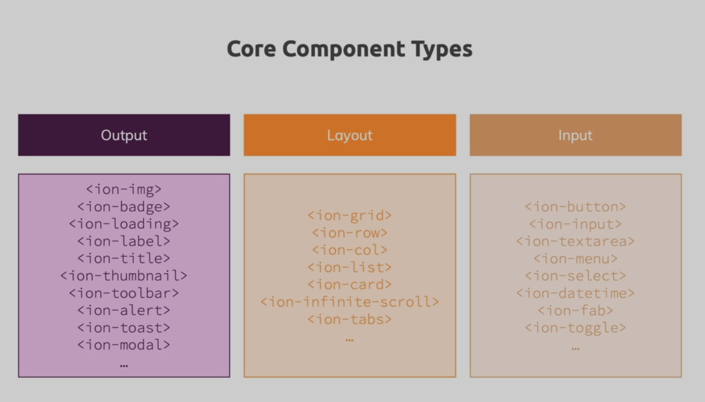
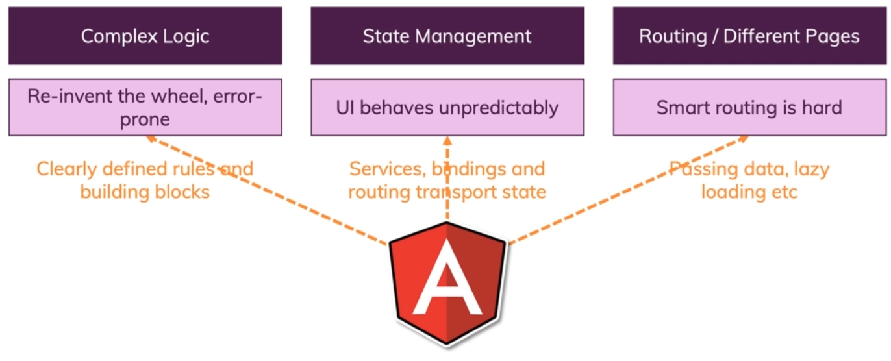

# Ionic Notes

<br>

<nav>

## Navigation <span id="navi"></span>

<br>

### <a href="#t01">**Section 01: Getting Started**</a>

### <a href="#t02">**Section 02: Angular Refresher**</a>

### <a href="#t03">**Section 03: Ionic Component Basics**</a>

</nav>

<br><br>

<hr>

<br><br>

## **Section 01: Getting Started** <a href="#navi">&#8593;</a> <span id="t01"></span>

<br><br>

1. <a href="#i0100">Introduction</a>
2. <a href="#i0101">What is Ionic?</a>
3. <a href="#i0102">A Closer Look at the Ionic Platform</a>
4. <a href="#i0103">First Ionic App</a>
5. <a href="#i0104">The History of Ionic</a>
6. <a href="#i0105">Ionic 4+ vs Ionic 3</a>
7. <a href="#i0106">How to Build Native Mobile Apps with Ionic</a>
8. <a href="#i0107">Comparing Ionic to Alternatives</a>
9. <a href="#i0108">Course Outline</a>
10. <a href="#i0109">How To Get The Most Out Of The Course</a>

<br><br>

### **Introduction** <span id="i0100"></span><a href="#t01">&#8593;</a>

<br>

Ionic allows you to build cross-platform mobile applications.

<br><br>

### **What is Ionic?** <span id="i0101"></span><a href="#t01">&#8593;</a>

<br>

Ionic is all about having one code base (HTML + CSS + JS) which is the code base for Web App.

You use Web Technologies (HTML/CSS/JS) & Tools added by Ionic to generate Web Apps, Progressive Web Apps, iOS & Android Apps, and even Electron (Desktop) Apps.

Electron is a Web Technology which allows you to wrap a Web App into a Desktop App.

#### What are Progressive Web Apps (PWAs)?

- Progressive Web App is a normal Web App that looks and feels a bit like a native mobile app. It isn't a native mobile app, you don't distribute through the App Stores, it's still a website which you can find via Google, but it's optimized to:
  - be reliable: Load fast and provide offline functionality
  - Fast: Respond quickly to user actions
  - Engaging: Feel like a native app on mobile devices (e.g. using location or camera)

#### Ionic is flexible

With Ionic you can build such a Progressive Web App, you can also build a normal Web App (which isn't particularly fast, and doesn't tap into native device features), and you can also get a real native app out of it. So you can really target the broadest range of channels possible.

<small>tap - meaning: https://ell.stackexchange.com/questions/58077/why-does-tap-into-mean-what-it-means</small>

#### Ionic Platform

- in it's core it's all about Ionic which is a set of Web Components (lots of those)
  - Web Components - Custom HTML Elements (they're just like Angular Components)
    - you get those from Ionic
  - these components are what you can see on the screen
- Capacitor - a tool which is capable of taking your existing Web App and wrapping it into a so-called "Web View" into a Native Mobile App
  - Web app, running as a native mobile app
- Ionic CLI (+ Angular CLI, ...other)
  - Project management, build workflow
    - creation, live-reload, bundling, optimization


<br><br>

### **A Closer Look at the Ionic Platform** <span id="i0102"></span><a href="#t01">&#8593;</a>

<br>

#### Understanding the Ionic Ecosystem


#### An Ionic Project


Ionic Framework -> Capacitor: Accesses a bridge between our web JavaScript code, and the Native Platform (iOS / Android / Desktop). So from our JavaScript Code we can trigger certain functions which then will in the end trigger native code on your device to for example open the camera, to get the user location, to show an alert or anything like that. This then can be done with real native code executed on your behalf without you needing to write it by tools like Capacitor (or Cordova).

#### This course covers:

- Ionic
- Angular
- Capacitor
- PWA / Mobile Apps / Possibly Desktop Apps


<br><br>

### **First Ionic App** <span id="i0103"></span><a href="#t01">&#8593;</a>

<br>

Ionic Docs: https://ionicframework.com/docs/

Installation: https://ionicframework.com/docs/intro/cli

Install Ionic CLI: `npm install -g @ionic/cli`

Create app (start): `ionic start`

Starter Template: blank (for now)

Serve the App: `ionic serve`

Ionic UI Components (Web Components): https://ionicframework.com/docs/components

<br><br>

### **The History of Ionic** <span id="i0104"></span><a href="#t01">&#8593;</a>

<br>

Ionic 1, 2, & 3: Angular/Ionic (Angular Components)

Ionic 4+: JavaScript/Angular/React/Vue/Etc (Web Components)


<br><br>

### **Ionic 4+ vs Ionic 3** <span id="i0105"></span><a href="#t01">&#8593;</a>

<br>

Ionic Migration (e.g. 3.x -> 4.x): https://ionicframework.com/docs/reference/migration


<br><br>

### **How to Build Native Mobile Apps with Ionic** <span id="i0106"></span><a href="#t01">&#8593;</a>

<br>

#### Compilation

- You could compile your code (HTML/JS or TS/CSS) + Ionic (Components) into native Java or Objective C code - but you would have to do it for every single platform, that's why WebView is used (wrap app into WebView)
- or wrap into app with WebView
  - WebView - a special widget you can use in Native App Development which is a fully-fledged browser that doesn't look like one (you don't have url at the top, etc), it just is a full-screen browser
  - WebView - host a web page inside of a native app
    - e.g. you can open websites inside of an app (twitter/messenger, etc) - a built-in browser opens up
      - and that what is Ionic uses - with tools like Capacitor or Cordova you in the end get a mobile app shell that has such a WebView in it, and also then has some capabilites of launching a simple web server running mobile on the device that hosts your Ionic Web App inside of that WebView
        - then Cordova or Capacitor gives you a "bridge" through which you can tap into native device features from inside your Web App


#### What's a "WebView"?

WebView - allows you to run your Web App inside of a Native App that renders this full-screen browser:


<br><br>

### **Comparing Ionic to Alternatives** <span id="i0107"></span><a href="#t01">&#8593;</a>

<br>

You can build mobile apps with cross-platform technologies (like HTML, JS, CSS) with other technologies, too. For example, React Native and Flutter would be popular alternatives.

Here's my detailed comparison of all these popular approaches: https://academind.com/learn/flutter/react-native-vs-flutter-vs-ionic-vs-nativescript-vs-pwa/

<br><br>

### **Course Outline** <span id="i0108"></span><a href="#t01">&#8593;</a>

<br>


<br><br>

### **How To Get The Most Out Of The Course** <span id="i0109"></span><a href="#t01">&#8593;</a>

<br>

Problem Solving & How To Get The Most Out Of The Course


<br><br>

<hr>

<br><br>

## **Section 02: Angular Refresher** <a href="#navi">&#8593;</a> <span id="t02"></span>

<br>

#### 4 Types of Data-Binding in Angular

- property binding (e.g. `[property]="tsExpression"`),
- event binding (e.g. `(event)="tsExpression"`),
- string interpolation (e.g. `{{ person.name }}`),
- two-way binding (`[(ngModel)]="tsExpression"`)

<br><br>

<hr>

<br><br>

## **Section 03: Ionic Component Basics** <a href="#navi">&#8593;</a> <span id="t03"></span>

<br><br>

1. <a href="#i0300">Introduction</a>
2. <a href="#i0301">Core App Building Blocks</a>
3. <a href="#i0302">Under the Hood of Ionic Components</a>
4. <a href="#i0303">Setting Up a Non-Angular Ionic Project</a>
5. <a href="#i0304">Using Basic Ionic Components</a>
6. <a href="#i0305">More Basic Components</a>
7. <a href="#i0306">Component Categories</a>
8. <a href="#i0307">Using the Ionic Grid</a>
9. <a href="#i0308">Adding Icons & Using Slots</a>
10. <a href="#i0309">Using CSS Utility Attributes</a>
11. <a href="#i0310">Using Ionic Elements like "Normal" HTML Elements</a>
12. <a href="#i0311">Validating User Input</a>
13. <a href="#i0312">Creating Ionic Elements Programmatically</a>
14. <a href="#i0313">Finishing Up the Base JavaScript Logic</a>
15. <a href="#i0314">Finalizing the Layout</a>
16. <a href="#i0315">Using Controller Components</a>
17. <a href="#i0316">Why Angular?</a>
18. <a href="#i0317">Useful Resources & Links</a>

<br><br>

### **Introduction** <span id="i0300"></span><a href="#t03">&#8593;</a>

<br>

In this module:

- Overview of Ionic Components
- component demos
- how to memorize all the components

<br><br>

### **Core App Building Blocks** <span id="i0301"></span><a href="#t03">&#8593;</a>

<br>

- UI Components (this module)
  - e.g. ion-card, ion-image, ...
- Themes & Styles
  - CSS & CSS Variables
- Navigation
  - custom or built-in router
- State Management
  - Passing data around
- Native Device Features
  - Camera & More
- Ionic CLI & Publishing
  - From Development to Deployment

<br><br>

### **Under the Hood of Ionic Components** <span id="i0302"></span><a href="#t03">&#8593;</a>

<br>

Using the Ionic Components:

- ```html
  <ion-button fill="outline" color="primary"></ion-button>
  ```
  - use like a normal HTML Element
  - supports attributes & properties
  - emits (custom) events

#### How do Ionic 4 Web Components work?



Ionic's GitHub: https://github.com/ionic-team/ionic-framework

Components: https://github.com/ionic-team/ionic-framework/tree/main/core/src/components

<br><br>

### **Setting Up a Non-Angular Ionic Project** <span id="i0303"></span><a href="#t03">&#8593;</a>

<br>

Using Ionic without any framework.

Import those: https://ionicframework.com/docs/intro/cdn#ionic-framework-cdn

```html
<!DOCTYPE html>
<html lang="en">
  <head>
    <meta charset="UTF-8" />
    <meta http-equiv="X-UA-Compatible" content="IE=edge" />
    <meta name="viewport" content="width=device-width, initial-scale=1.0" />
    <title>Budget Planner</title>
    <script
      type="module"
      src="https://cdn.jsdelivr.net/npm/@ionic/core/dist/ionic/ionic.esm.js"
    ></script>
    <script
      nomodule
      src="https://cdn.jsdelivr.net/npm/@ionic/core/dist/ionic/ionic.js"
    ></script>
    <link
      rel="stylesheet"
      href="https://cdn.jsdelivr.net/npm/@ionic/core/css/ionic.bundle.css"
    />
  </head>
  <body></body>
</html>
```

<br><br>

### **Using Basic Ionic Components** <span id="i0304"></span><a href="#t03">&#8593;</a>

<br>

#### `<ion-app></ion-app>`

**Note**: `<ion-app></ion-app>` should always wrap your entire app/code.

You use it as a wrapper once per HTML file.

In Angular you use it as a global component wrapper (only once).

#### `<ion-content></ion-content>` - wrapper for your main content of your app

```html
<body>
  <ion-app>
    <ion-header>
      <ion-toolbar color="primary">
        <ion-title>Budget Planner</ion-title>
      </ion-toolbar>
    </ion-header>
    <ion-content> </ion-content>
  </ion-app>
</body>
```

<br><br>

### **More Basic Components** <span id="i0305"></span><a href="#t03">&#8593;</a>

<br>

```html
<ion-content>
  <ion-card>
    <ion-card-header>
      <ion-card-title>New Expense</ion-card-title>
    </ion-card-header>
    <ion-card-content>
      <ion-item>
        <ion-label position="floating">Expense Reason</ion-label>
        <ion-input type="text"></ion-input>
      </ion-item>
      <ion-item>
        <ion-label position="floating">Expense Amount</ion-label>
        <ion-input type="number"></ion-input>
      </ion-item>
    </ion-card-content>
  </ion-card>
</ion-content>
```

<br><br>

### **Component Categories** <span id="i0306"></span><a href="#t03">&#8593;</a>

<br>

To find a solution for the problem of our components sometimes not having the right width on different screen sizes, it's important to understand that Ionic at its core has 3 different types of components:



<br><br>

### **Using the Ionic Grid** <span id="i0307"></span><a href="#t03">&#8593;</a>

<br>

ion-grid: https://ionicframework.com/docs/api/grid

<br>

Each grid has rows, rows are made up of columns.

`<ion-col size="1 to 12"></ion-col>`

- size - 1 to 12 meaning how much space this column should take (1/12 to 12/12 of the entire width)
  - e.g. size="6" will take half of the width

<br>

Setting different width depending on the screen size:

- size-xs
- size-sm
- size-md
- size-lg

e.g. `size-md="6"` (size for medium-size devices AND higher)

<br>

offsetting columns (centering in this case): `size-md="6" offset="3"`

offset for medium-size devices AND higher: `offset-md="3"`

```html
<ion-col size-md="6" offset-md="3"> </ion-col>
```

offset-md="3" because we want to have 3 columns on the left & 3 columns on the right, total of 12/12 screen width.

<br>

```html
<ion-grid>
  <ion-row>
    <ion-col size-md="6" offset-md="3">
      <ion-card>
        <ion-card-header>
          <ion-card-title>New Expense</ion-card-title>
        </ion-card-header>
        <ion-card-content>
          <ion-item>
            <ion-label position="floating">Expense Reason</ion-label>
            <ion-input type="text"></ion-input>
          </ion-item>
          <ion-item>
            <ion-label position="floating">Expense Amount</ion-label>
            <ion-input type="number"></ion-input>
          </ion-item>
        </ion-card-content>
      </ion-card>
    </ion-col>
  </ion-row>
</ion-grid>
```

<br><br>

### **Adding Icons & Using Slots** <span id="i0308"></span><a href="#t03">&#8593;</a>

<br>

#### Buttons

https://ionicframework.com/docs/api/button

https://ionicframework.com/docs/api/button#fill

#### Icons

https://ionic.io/ionicons

#### Slots

Slots - default Web Component concept which allows Web Components to reserve certain places in their built-in markup where certain content should be rendered, or can be targeted to be redered.

Slots - with slots you can tell the ion-icon where it should go (e.g. in a button).

https://ionicframework.com/docs/api/button#slots

<br>

```html
<ion-button fill="outline" color="danger">
  <ion-icon slot="start" name="close-outline"></ion-icon>
  Clear
</ion-button>
<ion-button>
  <ion-icon slot="start" name="add-outline"></ion-icon>
  Add Expense
</ion-button>
```

<br><br>

### **Using CSS Utility Attributes** <span id="i0309"></span><a href="#t03">&#8593;</a>

<br>

To control general things like a margin, or paddings inside of elements, or position inside of a container or a box, you can use a utility features provided by Ionic. A couple of utility CSS classes or attributes you can add to elements to have some default CSS.

<br>

Guide -> Layout -> CSS Utilities: https://ionicframework.com/docs/layout/css-utilities

<br>

Adding vertical margin (to top & bottom): `ion-margin-vertical`

Align text to the right: `ion-text-right`

<br>

`class="ion-margin-vertical ion-text-right"`

<br>

```html
<div class="ion-margin-vertical ion-text-right">
  <ion-button fill="outline" color="danger">
    <ion-icon slot="start" name="close-outline"></ion-icon>
    Clear
  </ion-button>
  <ion-button>
    <ion-icon slot="start" name="add-outline"></ion-icon>
    Add Expense
  </ion-button>
</div>
```

Note: Keep in mind that this has the advantage of always adding the same default margin, so it means that you don't have to worry about assigning a margin that is too slim, and therefore doesn't fit the general look of the rest of the page. You can always overwrite the default margin.

<br><br>

### **Using Ionic Elements like "Normal" HTML Elements** <span id="i0310"></span><a href="#t03">&#8593;</a>

<br>

```html
<script defer src="app.js"></script>
```

```js
const reasonInput = document.querySelector("#input-reason");
const amountInput = document.querySelector("#input-amount");
const cancelBtm = document.querySelector("#btn-cancel");
const confirmBtn = document.querySelector("#btn-confirm");

confirmBtn.addEventListener("click", () => {
  console.log("it works!");
});
```

<br><br>

### **Validating User Input** <span id="i0311"></span><a href="#t03">&#8593;</a>

<br>

```js
confirmBtn.addEventListener("click", () => {
  const enteredReason = reasonInput.value;
  const enteredAmount = amountInput.value;

  if (
    enteredReason.trim().length <= 0 ||
    enteredAmount <= 0 ||
    enteredAmount.trim().length <= 0
  ) {
    return;
  }

  console.log(enteredReason, enteredAmount);
});
```

<br><br>

### **Creating Ionic Elements Programmatically** <span id="i0312"></span><a href="#t03">&#8593;</a>

<br>

`ion-list`: element provided by Ionic that helps us structure list data (structure elements beneath each other, and display them as a nice list).

You can use ion-item inside of an ion-list to have a nice looking list item.

<br>

```html
<ion-row>
  <ion-col>
    <ion-list id="expenses-list"></ion-list>
  </ion-col>
</ion-row>
```

```js
const newItem = document.createElement("ion-item");
newItem.textContent = enteredReason + ": $" + enteredAmount;

expensesList.appendChild(newItem);
```

<br><br>

### **Finishing Up the Base JavaScript Logic** <span id="i0313"></span><a href="#t03">&#8593;</a>

<br>

```html
<ion-row>
  <ion-col>
    <p>Total Expenses: <span id="total-expenses"></span></p>
  </ion-col>
</ion-row>
```

```js
// ...
const expensesList = document.querySelector("#expenses-list");
const totalExpensesOutput = document.querySelector("#total-expenses");

let totalExpenses = 0;

const clear = () => {
  reasonInput.value = "";
  amountInput.value = "";
};

confirmBtn.addEventListener("click", () => {
  // ...
  const newItem = document.createElement("ion-item");
  newItem.textContent = enteredReason + ": $" + enteredAmount;

  expensesList.appendChild(newItem);

  totalExpenses += +enteredAmount;
  totalExpensesOutput.textContent = totalExpenses;
  clear();
});

cancelBtm.addEventListener("click", () => {
  clear();
});
```

<br><br>

### **Finalizing the Layout** <span id="i0314"></span><a href="#t03">&#8593;</a>

<br>

```html
<ion-row>
  <ion-col size-md="6" offset-md="3">
    <p class="ion-margin">Total Expenses: <span id="total-expenses"></span></p>
  </ion-col>
</ion-row>
```

<br><br>

### **Using Controller Components** <span id="i0315"></span><a href="#t03">&#8593;</a>

<br>

Controller Components - for example an alert.

https://ionicframework.com/docs/api/alert

<br>

```js
async function presentAlert() {
  const alert = document.createElement("ion-alert");
  alert.header = "Invalid inputs";
  alert.subHeader = "";
  alert.message = "Please enter valid reason and amount!";
  alert.buttons = ["OK"];

  document.body.appendChild(alert);
  await alert.present();
}
```

<br>

#### Final Code

```html
<!DOCTYPE html>
<html lang="en">
  <head>
    <meta charset="UTF-8" />
    <meta http-equiv="X-UA-Compatible" content="IE=edge" />
    <meta name="viewport" content="width=device-width, initial-scale=1.0" />
    <title>Budget Planner</title>
    <script
      type="module"
      src="https://cdn.jsdelivr.net/npm/@ionic/core/dist/ionic/ionic.esm.js"
    ></script>
    <script
      nomodule
      src="https://cdn.jsdelivr.net/npm/@ionic/core/dist/ionic/ionic.js"
    ></script>
    <link
      rel="stylesheet"
      href="https://cdn.jsdelivr.net/npm/@ionic/core/css/ionic.bundle.css"
    />
  </head>
  <body>
    <ion-app>
      <ion-header>
        <ion-toolbar color="primary">
          <ion-title>Budget Planner</ion-title>
        </ion-toolbar>
      </ion-header>
      <ion-content>
        <ion-grid>
          <ion-row>
            <ion-col size-md="6" offset-md="3">
              <ion-card>
                <ion-card-header>
                  <ion-card-title>New Expense</ion-card-title>
                </ion-card-header>
                <ion-card-content>
                  <ion-item>
                    <ion-label position="floating">Expense Reason</ion-label>
                    <ion-input type="text" id="input-reason"></ion-input>
                  </ion-item>
                  <ion-item>
                    <ion-label position="floating">Expense Amount</ion-label>
                    <ion-input type="number" id="input-amount"></ion-input>
                  </ion-item>
                  <div class="ion-margin-vertical ion-text-right">
                    <ion-button fill="outline" color="danger" id="btn-cancel">
                      <ion-icon slot="start" name="close-outline"></ion-icon>
                      Clear
                    </ion-button>
                    <ion-button id="btn-confirm">
                      <ion-icon slot="start" name="add-outline"></ion-icon>
                      Add Expense
                    </ion-button>
                  </div>
                </ion-card-content>
              </ion-card>
            </ion-col>
          </ion-row>
          <ion-row>
            <ion-col size-md="6" offset-md="3">
              <ion-list id="expenses-list"></ion-list>
            </ion-col>
          </ion-row>
          <ion-row>
            <ion-col size-md="6" offset-md="3">
              <p class="ion-margin">
                Total Expenses: <span id="total-expenses"></span>
              </p>
            </ion-col>
          </ion-row>
        </ion-grid>
      </ion-content>
    </ion-app>
    <script defer src="app.js"></script>
  </body>
</html>
```

```js
const reasonInput = document.querySelector("#input-reason");
const amountInput = document.querySelector("#input-amount");
const cancelBtm = document.querySelector("#btn-cancel");
const confirmBtn = document.querySelector("#btn-confirm");
const expensesList = document.querySelector("#expenses-list");
const totalExpensesOutput = document.querySelector("#total-expenses");

let totalExpenses = 0;

async function presentAlert() {
  const alert = document.createElement("ion-alert");
  alert.header = "Invalid inputs";
  alert.subHeader = "";
  alert.message = "Please enter valid reason and amount!";
  alert.buttons = ["OK"];

  document.body.appendChild(alert);
  await alert.present();
}

const clear = () => {
  reasonInput.value = "";
  amountInput.value = "";
};

confirmBtn.addEventListener("click", () => {
  const enteredReason = reasonInput.value;
  const enteredAmount = amountInput.value;

  if (
    enteredReason.trim().length <= 0 ||
    enteredAmount <= 0 ||
    enteredAmount.trim().length <= 0
  ) {
    presentAlert();
    return;
  }
  const newItem = document.createElement("ion-item");
  newItem.textContent = enteredReason + ": $" + enteredAmount;

  expensesList.appendChild(newItem);

  totalExpenses += +enteredAmount;
  totalExpensesOutput.textContent = totalExpenses;
  clear();
});

cancelBtm.addEventListener("click", () => {
  clear();
});
```

<br><br>

### **Why Angular?** <span id="i0316"></span><a href="#t03">&#8593;</a>

<br>



<br><br>

### **Useful Resources & Links** <span id="i0317"></span><a href="#t03">&#8593;</a>

<br>

Ionic Component Docs: https://ionicframework.com/docs/components/
