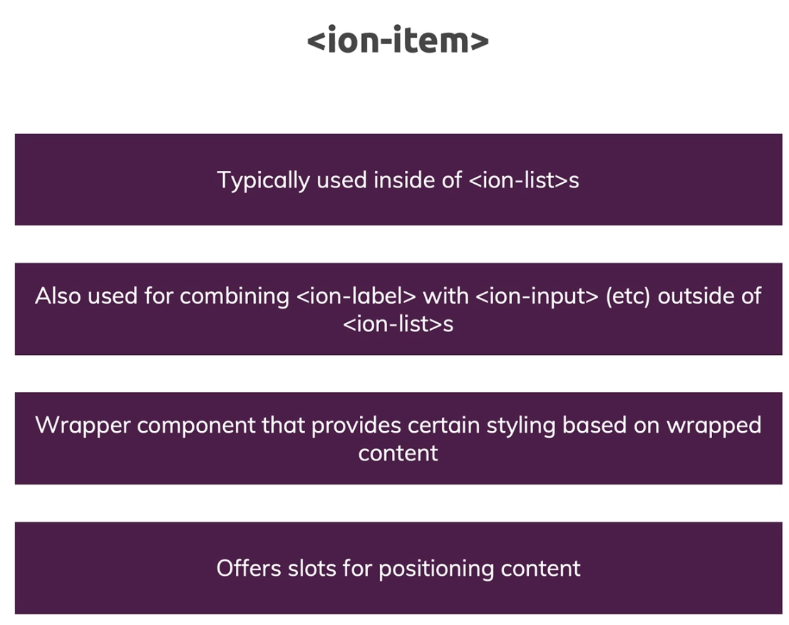
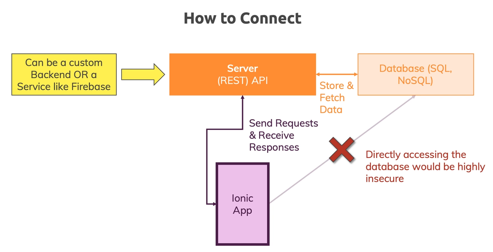

# Ionic Notes

<br>

<nav>

## Navigation <span id="navi"></span>

<br>

### <a href="#t01">**Section 01: Getting Started**</a>

### <a href="#t02">**Section 02: Angular Refresher**</a>

### <a href="#t03">**Section 03: Ionic Component Basics**</a>

### <a href="#t04">**Section 04: Angular + Ionic**</a>

### <a href="#t05">**Section 05: Building Native Apps with Capacitor**</a>

### <a href="#t06">**Section 06: Debugging**</a>

### <a href="#t07">**Section 07: Navigation & Routing in Ionic Apps**</a>

### <a href="#t08">**Section 08: Ionic Components Overview**</a>

### <a href="#t09">**Section 09: Styling & Theming Ionic Apps**</a>

### <a href="#t10">**Section 10: Handling User Input**</a>

### <a href="#t11">**Section 11: Managing State**</a>

### <a href="#t12">**Section 12: Sending Http Requests**</a>

### <a href="#t13">**Section 13: Adding Google Maps**</a>

### <a href="#t14">**Section 14: Using Native Device Features (Camera & Location)**</a>

### <a href="#t15">**Section 15: Adding Authentication**</a>

### <a href="#t16">**Section 16: Publishing the Apps**</a>

</nav>

<br><br>

<hr>

<br><br>

## **Section 01: Getting Started** <a href="#navi">&#8593;</a> <span id="t01"></span>

<br><br>

1. <a href="#i0100">Introduction</a>
2. <a href="#i0101">What is Ionic?</a>
3. <a href="#i0102">A Closer Look at the Ionic Platform</a>
4. <a href="#i0103">First Ionic App</a>
5. <a href="#i0104">The History of Ionic</a>
6. <a href="#i0105">Ionic 4+ vs Ionic 3</a>
7. <a href="#i0106">How to Build Native Mobile Apps with Ionic</a>
8. <a href="#i0107">Comparing Ionic to Alternatives</a>
9. <a href="#i0108">Course Outline</a>
10. <a href="#i0109">How To Get The Most Out Of The Course</a>

<br><br>

### **Introduction** <span id="i0100"></span><a href="#t01">&#8593;</a>

<br>

Ionic allows you to build cross-platform mobile applications.

<br><br>

### **What is Ionic?** <span id="i0101"></span><a href="#t01">&#8593;</a>

<br>

Ionic is all about having one code base (HTML + CSS + JS) which is the code base for Web App.

You use Web Technologies (HTML/CSS/JS) & Tools added by Ionic to generate Web Apps, Progressive Web Apps, iOS & Android Apps, and even Electron (Desktop) Apps.

Electron is a Web Technology which allows you to wrap a Web App into a Desktop App.

#### What are Progressive Web Apps (PWAs)?

- Progressive Web App is a normal Web App that looks and feels a bit like a native mobile app. It isn't a native mobile app, you don't distribute through the App Stores, it's still a website which you can find via Google, but it's optimized to:
  - be reliable: Load fast and provide offline functionality
  - Fast: Respond quickly to user actions
  - Engaging: Feel like a native app on mobile devices (e.g. using location or camera)

#### Ionic is flexible

With Ionic you can build such a Progressive Web App, you can also build a normal Web App (which isn't particularly fast, and doesn't tap into native device features), and you can also get a real native app out of it. So you can really target the broadest range of channels possible.

<small>tap - meaning: https://ell.stackexchange.com/questions/58077/why-does-tap-into-mean-what-it-means</small>

#### Ionic Platform

- in it's core it's all about Ionic which is a set of Web Components (lots of those)
  - Web Components - Custom HTML Elements (they're just like Angular Components)
    - you get those from Ionic
  - these components are what you can see on the screen
- Capacitor - a tool which is capable of taking your existing Web App and wrapping it into a so-called "Web View" into a Native Mobile App
  - Web app, running as a native mobile app
- Ionic CLI (+ Angular CLI, ...other)
  - Project management, build workflow
    - creation, live-reload, bundling, optimization


<br><br>

### **A Closer Look at the Ionic Platform** <span id="i0102"></span><a href="#t01">&#8593;</a>

<br>

#### Understanding the Ionic Ecosystem


#### An Ionic Project


Ionic Framework -> Capacitor: Accesses a bridge between our web JavaScript code, and the Native Platform (iOS / Android / Desktop). So from our JavaScript Code we can trigger certain functions which then will in the end trigger native code on your device to for example open the camera, to get the user location, to show an alert or anything like that. This then can be done with real native code executed on your behalf without you needing to write it by tools like Capacitor (or Cordova).

#### This course covers:

- Ionic
- Angular
- Capacitor
- PWA / Mobile Apps / Possibly Desktop Apps


<br><br>

### **First Ionic App** <span id="i0103"></span><a href="#t01">&#8593;</a>

<br>

Ionic Docs: https://ionicframework.com/docs/

Installation: https://ionicframework.com/docs/intro/cli

Install Ionic CLI: `npm install -g @ionic/cli`

Create app (start): `ionic start`

Starter Template: blank (for now)

Serve the App: `ionic serve`

Ionic UI Components (Web Components): https://ionicframework.com/docs/components

<br><br>

### **The History of Ionic** <span id="i0104"></span><a href="#t01">&#8593;</a>

<br>

Ionic 1, 2, & 3: Angular/Ionic (Angular Components)

Ionic 4+: JavaScript/Angular/React/Vue/Etc (Web Components)


<br><br>

### **Ionic 4+ vs Ionic 3** <span id="i0105"></span><a href="#t01">&#8593;</a>

<br>

Ionic Migration (e.g. 3.x -> 4.x): https://ionicframework.com/docs/reference/migration


<br><br>

### **How to Build Native Mobile Apps with Ionic** <span id="i0106"></span><a href="#t01">&#8593;</a>

<br>

#### Compilation

- You could compile your code (HTML/JS or TS/CSS) + Ionic (Components) into native Java or Objective C code - but you would have to do it for every single platform, that's why WebView is used (wrap app into WebView)
- or wrap into app with WebView
  - WebView - a special widget you can use in Native App Development which is a fully-fledged browser that doesn't look like one (you don't have url at the top, etc), it just is a full-screen browser
  - WebView - host a web page inside of a native app
    - e.g. you can open websites inside of an app (twitter/messenger, etc) - a built-in browser opens up
      - and that what is Ionic uses - with tools like Capacitor or Cordova you in the end get a mobile app shell that has such a WebView in it, and also then has some capabilites of launching a simple web server running mobile on the device that hosts your Ionic Web App inside of that WebView
        - then Cordova or Capacitor gives you a "bridge" through which you can tap into native device features from inside your Web App


#### What's a "WebView"?

WebView - allows you to run your Web App inside of a Native App that renders this full-screen browser:


<br><br>

### **Comparing Ionic to Alternatives** <span id="i0107"></span><a href="#t01">&#8593;</a>

<br>

You can build mobile apps with cross-platform technologies (like HTML, JS, CSS) with other technologies, too. For example, React Native and Flutter would be popular alternatives.

Here's my detailed comparison of all these popular approaches: https://academind.com/learn/flutter/react-native-vs-flutter-vs-ionic-vs-nativescript-vs-pwa/

<br><br>

### **Course Outline** <span id="i0108"></span><a href="#t01">&#8593;</a>

<br>


<br><br>

### **How To Get The Most Out Of The Course** <span id="i0109"></span><a href="#t01">&#8593;</a>

<br>

Problem Solving & How To Get The Most Out Of The Course


<br><br>

<hr>

<br><br>

## **Section 02: Angular Refresher** <a href="#navi">&#8593;</a> <span id="t02"></span>

<br>

#### 4 Types of Data-Binding in Angular

- property binding (e.g. `[property]="tsExpression"`),
- event binding (e.g. `(event)="tsExpression"`),
- string interpolation (e.g. `{{ person.name }}`),
- two-way binding (`[(ngModel)]="tsExpression"`)

<br><br>

<hr>

<br><br>

## **Section 03: Ionic Component Basics** <a href="#navi">&#8593;</a> <span id="t03"></span>

<br><br>

1. <a href="#i0300">Introduction</a>
2. <a href="#i0301">Core App Building Blocks</a>
3. <a href="#i0302">Under the Hood of Ionic Components</a>
4. <a href="#i0303">Setting Up a Non-Angular Ionic Project</a>
5. <a href="#i0304">Using Basic Ionic Components</a>
6. <a href="#i0305">More Basic Components</a>
7. <a href="#i0306">Component Categories</a>
8. <a href="#i0307">Using the Ionic Grid</a>
9. <a href="#i0308">Adding Icons & Using Slots</a>
10. <a href="#i0309">Using CSS Utility Attributes</a>
11. <a href="#i0310">Using Ionic Elements like "Normal" HTML Elements</a>
12. <a href="#i0311">Validating User Input</a>
13. <a href="#i0312">Creating Ionic Elements Programmatically</a>
14. <a href="#i0313">Finishing Up the Base JavaScript Logic</a>
15. <a href="#i0314">Finalizing the Layout</a>
16. <a href="#i0315">Using Controller Components</a>
17. <a href="#i0316">Why Angular?</a>
18. <a href="#i0317">Useful Resources & Links</a>

<br><br>

### **Introduction** <span id="i0300"></span><a href="#t03">&#8593;</a>

<br>

In this module:

- Overview of Ionic Components
- component demos
- how to memorize all the components

<br><br>

### **Core App Building Blocks** <span id="i0301"></span><a href="#t03">&#8593;</a>

<br>

- UI Components (this module)
  - e.g. ion-card, ion-image, ...
- Themes & Styles
  - CSS & CSS Variables
- Navigation
  - custom or built-in router
- State Management
  - Passing data around
- Native Device Features
  - Camera & More
- Ionic CLI & Publishing
  - From Development to Deployment

<br><br>

### **Under the Hood of Ionic Components** <span id="i0302"></span><a href="#t03">&#8593;</a>

<br>

Using the Ionic Components:

- ```html
  <ion-button fill="outline" color="primary"></ion-button>
  ```
  - use like a normal HTML Element
  - supports attributes & properties
  - emits (custom) events

#### How do Ionic 4 Web Components work?


Ionic's GitHub: https://github.com/ionic-team/ionic-framework

Components: https://github.com/ionic-team/ionic-framework/tree/main/core/src/components

<br><br>

### **Setting Up a Non-Angular Ionic Project** <span id="i0303"></span><a href="#t03">&#8593;</a>

<br>

Using Ionic without any framework.

Import those: https://ionicframework.com/docs/intro/cdn#ionic-framework-cdn

```html
<!DOCTYPE html>
<html lang="en">
  <head>
    <meta charset="UTF-8" />
    <meta http-equiv="X-UA-Compatible" content="IE=edge" />
    <meta name="viewport" content="width=device-width, initial-scale=1.0" />
    <title>Budget Planner</title>
    <script
      type="module"
      src="https://cdn.jsdelivr.net/npm/@ionic/core/dist/ionic/ionic.esm.js"
    ></script>
    <script
      nomodule
      src="https://cdn.jsdelivr.net/npm/@ionic/core/dist/ionic/ionic.js"
    ></script>
    <link
      rel="stylesheet"
      href="https://cdn.jsdelivr.net/npm/@ionic/core/css/ionic.bundle.css"
    />
  </head>
  <body></body>
</html>
```

<br><br>

### **Using Basic Ionic Components** <span id="i0304"></span><a href="#t03">&#8593;</a>

<br>

#### `<ion-app></ion-app>`

**Note**: `<ion-app></ion-app>` should always wrap your entire app/code.

You use it as a wrapper once per HTML file.

In Angular you use it as a global component wrapper (only once).

#### `<ion-content></ion-content>` - wrapper for your main content of your app

```html
<body>
  <ion-app>
    <ion-header>
      <ion-toolbar color="primary">
        <ion-title>Budget Planner</ion-title>
      </ion-toolbar>
    </ion-header>
    <ion-content> </ion-content>
  </ion-app>
</body>
```

<br><br>

### **More Basic Components** <span id="i0305"></span><a href="#t03">&#8593;</a>

<br>

```html
<ion-content>
  <ion-card>
    <ion-card-header>
      <ion-card-title>New Expense</ion-card-title>
    </ion-card-header>
    <ion-card-content>
      <ion-item>
        <ion-label position="floating">Expense Reason</ion-label>
        <ion-input type="text"></ion-input>
      </ion-item>
      <ion-item>
        <ion-label position="floating">Expense Amount</ion-label>
        <ion-input type="number"></ion-input>
      </ion-item>
    </ion-card-content>
  </ion-card>
</ion-content>
```

<br><br>

### **Component Categories** <span id="i0306"></span><a href="#t03">&#8593;</a>

<br>

To find a solution for the problem of our components sometimes not having the right width on different screen sizes, it's important to understand that Ionic at its core has 3 different types of components:


<br><br>

### **Using the Ionic Grid** <span id="i0307"></span><a href="#t03">&#8593;</a>

<br>

ion-grid: https://ionicframework.com/docs/api/grid

<br>

Each grid has rows, rows are made up of columns.

`<ion-col size="1 to 12"></ion-col>`

- size - 1 to 12 meaning how much space this column should take (1/12 to 12/12 of the entire width)
  - e.g. size="6" will take half of the width

<br>

Setting different width depending on the screen size:

- size-xs
- size-sm
- size-md
- size-lg

e.g. `size-md="6"` (size for medium-size devices AND higher)

<br>

offsetting columns (centering in this case): `size-md="6" offset="3"`

offset for medium-size devices AND higher: `offset-md="3"`

```html
<ion-col size-md="6" offset-md="3"> </ion-col>
```

offset-md="3" because we want to have 3 columns on the left & 3 columns on the right, total of 12/12 screen width.

<br>

```html
<ion-grid>
  <ion-row>
    <ion-col size-md="6" offset-md="3">
      <ion-card>
        <ion-card-header>
          <ion-card-title>New Expense</ion-card-title>
        </ion-card-header>
        <ion-card-content>
          <ion-item>
            <ion-label position="floating">Expense Reason</ion-label>
            <ion-input type="text"></ion-input>
          </ion-item>
          <ion-item>
            <ion-label position="floating">Expense Amount</ion-label>
            <ion-input type="number"></ion-input>
          </ion-item>
        </ion-card-content>
      </ion-card>
    </ion-col>
  </ion-row>
</ion-grid>
```

<br><br>

### **Adding Icons & Using Slots** <span id="i0308"></span><a href="#t03">&#8593;</a>

<br>

#### Buttons

https://ionicframework.com/docs/api/button

https://ionicframework.com/docs/api/button#fill

#### Icons

https://ionic.io/ionicons

#### Slots

Slots - default Web Component concept which allows Web Components to reserve certain places in their built-in markup where certain content should be rendered, or can be targeted to be redered.

Slots - with slots you can tell the ion-icon where it should go (e.g. in a button).

https://ionicframework.com/docs/api/button#slots

<br>

```html
<ion-button fill="outline" color="danger">
  <ion-icon slot="start" name="close-outline"></ion-icon>
  Clear
</ion-button>
<ion-button>
  <ion-icon slot="start" name="add-outline"></ion-icon>
  Add Expense
</ion-button>
```

<br><br>

### **Using CSS Utility Attributes** <span id="i0309"></span><a href="#t03">&#8593;</a>

<br>

To control general things like a margin, or paddings inside of elements, or position inside of a container or a box, you can use a utility features provided by Ionic. A couple of utility CSS classes or attributes you can add to elements to have some default CSS.

<br>

Guide -> Layout -> CSS Utilities: https://ionicframework.com/docs/layout/css-utilities

<br>

Adding vertical margin (to top & bottom): `ion-margin-vertical`

Align text to the right: `ion-text-right`

<br>

`class="ion-margin-vertical ion-text-right"`

<br>

```html
<div class="ion-margin-vertical ion-text-right">
  <ion-button fill="outline" color="danger">
    <ion-icon slot="start" name="close-outline"></ion-icon>
    Clear
  </ion-button>
  <ion-button>
    <ion-icon slot="start" name="add-outline"></ion-icon>
    Add Expense
  </ion-button>
</div>
```

Note: Keep in mind that this has the advantage of always adding the same default margin, so it means that you don't have to worry about assigning a margin that is too slim, and therefore doesn't fit the general look of the rest of the page. You can always overwrite the default margin.

<br><br>

### **Using Ionic Elements like "Normal" HTML Elements** <span id="i0310"></span><a href="#t03">&#8593;</a>

<br>

```html
<script defer src="app.js"></script>
```

```js
const reasonInput = document.querySelector("#input-reason");
const amountInput = document.querySelector("#input-amount");
const cancelBtm = document.querySelector("#btn-cancel");
const confirmBtn = document.querySelector("#btn-confirm");

confirmBtn.addEventListener("click", () => {
  console.log("it works!");
});
```

<br><br>

### **Validating User Input** <span id="i0311"></span><a href="#t03">&#8593;</a>

<br>

```js
confirmBtn.addEventListener("click", () => {
  const enteredReason = reasonInput.value;
  const enteredAmount = amountInput.value;

  if (
    enteredReason.trim().length <= 0 ||
    enteredAmount <= 0 ||
    enteredAmount.trim().length <= 0
  ) {
    return;
  }

  console.log(enteredReason, enteredAmount);
});
```

<br><br>

### **Creating Ionic Elements Programmatically** <span id="i0312"></span><a href="#t03">&#8593;</a>

<br>

`ion-list`: element provided by Ionic that helps us structure list data (structure elements beneath each other, and display them as a nice list).

You can use ion-item inside of an ion-list to have a nice looking list item.

<br>

```html
<ion-row>
  <ion-col>
    <ion-list id="expenses-list"></ion-list>
  </ion-col>
</ion-row>
```

```js
const newItem = document.createElement("ion-item");
newItem.textContent = enteredReason + ": $" + enteredAmount;

expensesList.appendChild(newItem);
```

<br><br>

### **Finishing Up the Base JavaScript Logic** <span id="i0313"></span><a href="#t03">&#8593;</a>

<br>

```html
<ion-row>
  <ion-col>
    <p>Total Expenses: <span id="total-expenses"></span></p>
  </ion-col>
</ion-row>
```

```js
// ...
const expensesList = document.querySelector("#expenses-list");
const totalExpensesOutput = document.querySelector("#total-expenses");

let totalExpenses = 0;

const clear = () => {
  reasonInput.value = "";
  amountInput.value = "";
};

confirmBtn.addEventListener("click", () => {
  // ...
  const newItem = document.createElement("ion-item");
  newItem.textContent = enteredReason + ": $" + enteredAmount;

  expensesList.appendChild(newItem);

  totalExpenses += +enteredAmount;
  totalExpensesOutput.textContent = totalExpenses;
  clear();
});

cancelBtm.addEventListener("click", () => {
  clear();
});
```

<br><br>

### **Finalizing the Layout** <span id="i0314"></span><a href="#t03">&#8593;</a>

<br>

```html
<ion-row>
  <ion-col size-md="6" offset-md="3">
    <p class="ion-margin">Total Expenses: <span id="total-expenses"></span></p>
  </ion-col>
</ion-row>
```

<br><br>

### **Using Controller Components** <span id="i0315"></span><a href="#t03">&#8593;</a>

<br>

Controller Components - for example an alert.

https://ionicframework.com/docs/api/alert

<br>

```js
async function presentAlert() {
  const alert = document.createElement("ion-alert");
  alert.header = "Invalid inputs";
  alert.subHeader = "";
  alert.message = "Please enter valid reason and amount!";
  alert.buttons = ["OK"];

  document.body.appendChild(alert);
  await alert.present();
}
```

<br>

#### Final Code

```html
<!DOCTYPE html>
<html lang="en">
  <head>
    <meta charset="UTF-8" />
    <meta http-equiv="X-UA-Compatible" content="IE=edge" />
    <meta name="viewport" content="width=device-width, initial-scale=1.0" />
    <title>Budget Planner</title>
    <script
      type="module"
      src="https://cdn.jsdelivr.net/npm/@ionic/core/dist/ionic/ionic.esm.js"
    ></script>
    <script
      nomodule
      src="https://cdn.jsdelivr.net/npm/@ionic/core/dist/ionic/ionic.js"
    ></script>
    <link
      rel="stylesheet"
      href="https://cdn.jsdelivr.net/npm/@ionic/core/css/ionic.bundle.css"
    />
  </head>
  <body>
    <ion-app>
      <ion-header>
        <ion-toolbar color="primary">
          <ion-title>Budget Planner</ion-title>
        </ion-toolbar>
      </ion-header>
      <ion-content>
        <ion-grid>
          <ion-row>
            <ion-col size-md="6" offset-md="3">
              <ion-card>
                <ion-card-header>
                  <ion-card-title>New Expense</ion-card-title>
                </ion-card-header>
                <ion-card-content>
                  <ion-item>
                    <ion-label position="floating">Expense Reason</ion-label>
                    <ion-input type="text" id="input-reason"></ion-input>
                  </ion-item>
                  <ion-item>
                    <ion-label position="floating">Expense Amount</ion-label>
                    <ion-input type="number" id="input-amount"></ion-input>
                  </ion-item>
                  <div class="ion-margin-vertical ion-text-right">
                    <ion-button fill="outline" color="danger" id="btn-cancel">
                      <ion-icon slot="start" name="close-outline"></ion-icon>
                      Clear
                    </ion-button>
                    <ion-button id="btn-confirm">
                      <ion-icon slot="start" name="add-outline"></ion-icon>
                      Add Expense
                    </ion-button>
                  </div>
                </ion-card-content>
              </ion-card>
            </ion-col>
          </ion-row>
          <ion-row>
            <ion-col size-md="6" offset-md="3">
              <ion-list id="expenses-list"></ion-list>
            </ion-col>
          </ion-row>
          <ion-row>
            <ion-col size-md="6" offset-md="3">
              <p class="ion-margin">
                Total Expenses: <span id="total-expenses"></span>
              </p>
            </ion-col>
          </ion-row>
        </ion-grid>
      </ion-content>
    </ion-app>
    <script defer src="app.js"></script>
  </body>
</html>
```

```js
const reasonInput = document.querySelector("#input-reason");
const amountInput = document.querySelector("#input-amount");
const cancelBtm = document.querySelector("#btn-cancel");
const confirmBtn = document.querySelector("#btn-confirm");
const expensesList = document.querySelector("#expenses-list");
const totalExpensesOutput = document.querySelector("#total-expenses");

let totalExpenses = 0;

async function presentAlert() {
  const alert = document.createElement("ion-alert");
  alert.header = "Invalid inputs";
  alert.subHeader = "";
  alert.message = "Please enter valid reason and amount!";
  alert.buttons = ["OK"];

  document.body.appendChild(alert);
  await alert.present();
}

const clear = () => {
  reasonInput.value = "";
  amountInput.value = "";
};

confirmBtn.addEventListener("click", () => {
  const enteredReason = reasonInput.value;
  const enteredAmount = amountInput.value;

  if (
    enteredReason.trim().length <= 0 ||
    enteredAmount <= 0 ||
    enteredAmount.trim().length <= 0
  ) {
    presentAlert();
    return;
  }
  const newItem = document.createElement("ion-item");
  newItem.textContent = enteredReason + ": $" + enteredAmount;

  expensesList.appendChild(newItem);

  totalExpenses += +enteredAmount;
  totalExpensesOutput.textContent = totalExpenses;
  clear();
});

cancelBtm.addEventListener("click", () => {
  clear();
});
```

<br><br>

### **Why Angular?** <span id="i0316"></span><a href="#t03">&#8593;</a>

<br>


<br><br>

### **Useful Resources & Links** <span id="i0317"></span><a href="#t03">&#8593;</a>

<br>

Ionic Component Docs: https://ionicframework.com/docs/components/

<br><br>

<hr>

<br><br>

## **Section 04: Angular + Ionic** <a href="#navi">&#8593;</a> <span id="t04"></span>

<br><br>

1. <a href="#i0400">Creating a New Ionic Angular Project</a>
2. <a href="#i0401">How Angular & Ionic Work Together</a>
3. <a href="#i0402">Using Angular Features on Ionic Components</a>
4. <a href="#i0403">Setting Up Angular Routes</a>
5. <a href="#i0404">Using Angular Features on Ionic Components</a>
6. <a href="#i0405">Extracting and Displaying Route Param Data</a>
7. <a href="#i0406">Navigating Between Pages</a>
8. <a href="#i0407">Deleting a Recipe</a>
9. <a href="#i0408">Injecting Ionic Controllers</a>
10. <a href="#i0409">Angular Components vs Ionic Components</a>

<br><br>

### **Creating a New Ionic Angular Project** <span id="i0400"></span><a href="#t04">&#8593;</a>

<br>

`ionic start`

<br><br>

### **How Angular & Ionic Work Together** <span id="i0401"></span><a href="#t04">&#8593;</a>

<br>

The @ionic/angular package - wrapper around Ionic Web Components (Angular specific) which makes the usage of those easier and more efficient in Angular Projects:


`IonicModule.forRoot()` - includes those Ionic Web Components

<br>

Run Ionic App: `ionic serve`

<br><br>

### **Adding & Loading a New Page** <span id="i0402"></span><a href="#t04">&#8593;</a>

<br>

`ionic generate`

- page
- component
- service
- module
- class
- directive
- guard

<br>

`ionic generate page` - generates a new "page" - a new component, with a module & routing module.

It also includes that "page" in app-routing module to lazy-load it.

<br>

```html
<ion-app>
  <ion-router-outlet></ion-router-outlet>
</ion-app>
```

`ion-app` - wrapper around your entire application

`ion-router-outlet` - directive added by @ionic/angular

<br><br>

### **Using Angular Features on Ionic Components** <span id="i0403"></span><a href="#t04">&#8593;</a>

<br>

- `<ion-avatar></ion-avatar>` - component that wraps the `<ion-img></ion-img>`
- `<ion-img></ion-img>` - it's like an img element, but it is also loaded only when it is visible

<br>

```html
<ion-content>
  <ion-list>
    <ion-item *ngFor="let recipe of recipes">
      <ion-avatar slot="start">
        <ion-img [src]="recipe.imageUrl"></ion-img>
      </ion-avatar>
      <ion-label> {{ recipe.title }} </ion-label>
    </ion-item>
  </ion-list>
</ion-content>
```

<br><br>

### **Managing State with Services** <span id="i0404"></span><a href="#t04">&#8593;</a>

<br>

create a new page (component + routing + lazy loading): `ionic generate page page-name`

<br>

```ts
  getAllRecipes() {
    return [...this.recipes];
  }

  getRecipe(recipeId: string) {
    // find - if returns true - that means this is the object we're looking for
    // compare the id of the recipe I'm looking at with the recipeId I got as an argument
    // if these are equal - I have the recipe I want to return
    // wrap into object, copy everything with spread operator
    return { ...this.recipes.find((recipe) => recipe.id === recipeId) };
  }
```

<br><br>

### **Extracting and Displaying Route Param Data** <span id="i0405"></span><a href="#t04">&#8593;</a>

<br>

CSS Utilities: https://ionicframework.com/docs/layout/css-utilities

<br>

```ts
this.activatedRoute.paramMap.subscribe((paramMap) => {
  if (!paramMap.has("recipeId")) {
    this.router.navigate(["/recipes"]);
    return;
  }
  const recipeId = paramMap.get("recipeId");
  this.loadedRecipe = this.recipesService.getRecipe(recipeId);
});
```

<br><br>

### **Navigating Between Pages** <span id="i0406"></span><a href="#t04">&#8593;</a>

<br>

- `routerLink`
- ```html
  <ion-buttons slot="start">
    <ion-back-button defaultHref="/recipes"></ion-back-button>
  </ion-buttons>
  ```
  - `defaultHref` - if there is no browser history, navigate to `defaultHref="path"`

So you use Angular features, and Ionic just adds animations, Ionic also keeps track of your navigation moves - it constructs a stack of pages under the hood

<br><br>

### **Deleting a Recipe** <span id="i0407"></span><a href="#t04">&#8593;</a>

<br>

```html
<ion-buttons slot="primary">
  <ion-button (click)="onDeleteRecipe()">
    <ion-icon name="trash-outline" slot="icon-only"></ion-icon>
  </ion-button>
</ion-buttons>
```

```ts
deleteRecipe(recipeId: string) {
  // filter: true - keep element, false - discard
  // keep all the elements but the element of id - recipeId
  // so if they are not equal - return true, otherwise false - discard object
  this.recipes = this.recipes.filter((recipe) => recipe.id !== recipeId);
  // this.recipes = this.recipes.filter((recipe) => {
  //   if (recipe.id === recipeId) {
  //     return false;
  //   }
  // });
}
```

<br><br>

### **Injecting Ionic Controllers** <span id="i0408"></span><a href="#t04">&#8593;</a>

<br>

```ts
constructor(private alertCtr: AlertController) {}

onDeleteRecipe() {
  this.alertCtr
    .create({
      header: 'Are you sure?',
      message: 'Do you really want to delete the recipe?',
      buttons: [
        {
          text: 'Cancel',
          // close dialog (role: 'cancel')
          role: 'cancel',
        },
        {
          text: 'Delete',
          // handler - holds a function that will execute
          // when this button is pressed
          handler: () => {
            this.recipesService.deleteRecipe(this.loadedRecipe.id);
            this.router.navigate(['/recipes']);
          },
        },
      ],
    })
    .then((alertEl) => alertEl.present());
}
```

<br><br>

### **Angular Components vs Ionic Components** <span id="i0409"></span><a href="#t04">&#8593;</a>

<br>


<br><br>

<hr>

<br><br>

## **Section 05: Building Native Apps with Capacitor** <a href="#navi">&#8593;</a> <span id="t05"></span>

<br><br>

### **Creating an Android App** <span id="i0500"></span><a href="#t05">&#8593;</a>

<br>

Capacitor docs: https://capacitorjs.com

Ionic - Android Development docs: https://ionicframework.com/docs/developing/android

<br>

Project Setup:

https://ionicframework.com/docs/developing/android#project-setup

<br>

Steps to create Android App:

- Build your App: `ng build`
- run: `ionic capacitor add android`
- set the Package ID. `capacitor.config.ts`:

  ```ts
  import { CapacitorConfig } from "@capacitor/cli";

  const config: CapacitorConfig = {
    appId: "com.udemy.course.ionic.angular",
    appName: "ionic-angular-course",
    webDir: "www",
    bundledWebRuntime: false,
  };

  export default config;
  ```

  - it has to be unique ID

- run: `ionic capacitor copy android`

<br>

You can also run: `ionic capacitor run android` (usually does not work, use your android device in case it doesn't)

- it will run `ng build`, `ionic capacitor add android` plus it will open your app in Android Studio.

<br>

if something doesn't work try those:

`ionic capacitor sync`

`ionic capacitor open android`

<br>

Live reload: `ionic capacitor run android -l`

<br><br>

<hr>

<br><br>

## **Section 06: Debugging** <a href="#navi">&#8593;</a> <span id="t06"></span>

<br><br>

1. <a href="#i0600">Introduction</a>

<br><br>

### **Introduction** <span id="i0600"></span><a href="#t06">&#8593;</a>

<br>

In this module:

- Debugging in the Browser
- Debugging Native Apps

<br>

Debugging (browser):

- Error Messages & console.log
- browser DevTools (console/elements/sources(breakpoints)/network/performance/memory/etc)

Debugging (android):

- `chrome://inspect/#devices`
- inspect
  - there you can use all of the chrome devTools

<br><br>

<hr>

<br><br>

## **Section 07: Navigation & Routing in Ionic Apps** <a href="#navi">&#8593;</a> <span id="t07"></span>

<br><br>

1. <a href="#i0700">Introduction</a>
2. <a href="#i0701">How Routing Work In An Ionic + Angular App</a>
3. <a href="#i0702">Ionic Page Caching & Extra Lifecycle Hooks</a>
4. <a href="#i0703">Planning the Course Project</a>
5. <a href="#i0704">Creating Our App Pages</a>
6. <a href="#i0705">Adding Tabs to the App</a>
7. <a href="#i0706">Outputting "Places"</a>
8. <a href="#i0707">Adding Forward Navigation</a>
9. <a href="#i0708">Going Back with NavController</a>
10. <a href="#i0709">Navigating via Toolbar Buttons</a>
11. <a href="#i0710">Adding a SideDrawer</a>
12. <a href="#i0711">Assigning an id to menu & using it</a>
13. <a href="#i0712">Opening + Closing the SideDrawer</a>
14. <a href="#i0713">Adding Links & Switching Pages</a>
15. <a href="#i0714">Adding the Auth Service</a>
16. <a href="#i0715">Creating and Opening a Modal</a>
17. <a href="#i0716">Closing the Modal & Passing Data</a>
18. <a href="#i0717">Useful Resources & Links</a>

<br><br>

### **Introduction** <span id="i0700"></span><a href="#t07">&#8593;</a>

<br>

In this module:

- Angular Router & NavController
- Using Tabs
- Using a SideDrawer
- Overlays (Modal)
- Guards

<br><br>

### **How Routing Work In An Ionic + Angular App** <span id="i0701"></span><a href="#t07">&#8593;</a>

<br>

- `ion-router` - provides animations/transitions when switching between different routes/pages
- (stack) pages in Ionic are cached (stored in memory)


<br><br>

### **Ionic Page Caching & Extra Lifecycle Hooks** <span id="i0702"></span><a href="#t07">&#8593;</a>

<br>

- `ionViewWillEnter` - runs after `ngOnInit` - executes right after the content of the page has been loaded
- `ionViewDidEnter` - runs right afrer `ionViewWillEnter`

both are called whenever a page becomes visible

<br>

If a page is in cache, and you're not seeing it because another page is on top of it (in the stack of pages), it will actually never be destroyed, so ngOnDestroy will never be called.

<br>

- `ionViewWillLeave`
- `ionViewDidLeave`

both are called whenever a page becomes invisible, whenever a new page is on top of it, but it will also be called in places where ngOnDestroy is not called.


<br>

So this is this stack of pages and how Ionic caches pages. You have to be aware of the fact that ngOnInit and ngOnDestroy will NOT run on every page every time you leave it, it depends whether you're popping the page or pushing a new page on top of it. There you should rely on those ion hooks to manage state data - whenever a page becomes visible or invisible.

<br>

```ts
ngOnInit() {
  console.log('ngOnInit');
  console.log(this.recipes);
}

ionViewWillEnter() {
  this.recipes = this.recipesService.getAllRecipes();
  console.log('ionViewWillEnter');
}

ionViewDidEnter() {
  console.log('ionViewDidEnter');
}

ionViewWillLeave() {
  console.log('ionViewWillLeave');
}

ionViewDidLeave() {
  console.log('ionViewDidLeave');
}

ngOnDestroy(): void {
  console.log('ngOnDestroy');
}
```

<br><br>

### **Planning the Course Project** <span id="i0703"></span><a href="#t07">&#8593;</a>

<br>


<br><br>

### **Creating Our App Pages** <span id="i0704"></span><a href="#t07">&#8593;</a>

<br>

`ionic generate page ...`

<br><br>

### **Adding Tabs to the App** <span id="i0705"></span><a href="#t07">&#8593;</a>

<br>

Different pages have their own stack, so the navigation stack is not mixed.

<br>

https://ionicframework.com/docs/api/tabs

<br>

```html
<ion-tab-button tab="discover">
  <ion-label>Discover</ion-label>
  <ion-icon name="search"></ion-icon>
</ion-tab-button>
```

- `tab="uniqueIdentifier"`
  - the identifier has to match the name of your route
    - for example: `{ path: 'discover' }`, `tab="discover"`

<br><br>

### **Outputting "Places"** <span id="i0706"></span><a href="#t07">&#8593;</a>

<br>

`<ion-thumbnail></ion-thumbnail>` - it's basically ion-avatar, but doesn't render a rounded image, instead it renders a squre image

```html
<ion-content>
  <ion-grid>
    <ion-row>
      <ion-col size="12" size-sm="8" offset-sm="2" class="ion-text-center">
        <ion-card>
          <ion-card-header>
            <ion-card-title>{{ loadedPlaces[0].title }}</ion-card-title>
            <ion-card-subtitle>
              {{ loadedPlaces[0].price | currency }} / Night
            </ion-card-subtitle>
          </ion-card-header>
          <ion-img [src]="loadedPlaces[0].imageUrl"></ion-img>
          <ion-card-content>
            <p>{{ loadedPlaces[0].description }}</p>
          </ion-card-content>
        </ion-card>
      </ion-col>
    </ion-row>
    <ion-row>
      <ion-col size="12" size-sm="8" offset-sm="2" class="ion-text-center">
        <ion-list>
          <ion-item *ngFor="let loadedPlace of loadedPlaces.slice(1)">
            <ion-thumbnail slot="start">
              <ion-img [src]="loadedPlace.imageUrl"></ion-img>
            </ion-thumbnail>
            <ion-label>
              <h2>{{ loadedPlace.title }}</h2>
              <p>{{ loadedPlace.description }}</p>
            </ion-label>
          </ion-item>
        </ion-list>
      </ion-col>
    </ion-row>
  </ion-grid>
</ion-content>
```

<br><br>

### **Adding Forward Navigation** <span id="i0707"></span><a href="#t07">&#8593;</a>

<br>

- `routerDirection="direction"` - this gives Ionic a hint about navigation direction (so it can play different animations)
  - forward
  - backward
- `detail` - (html) attribute - renders arrow icon (e.g. forward arrow)

<br><br>

### **Going Back with NavController** <span id="i0708"></span><a href="#t07">&#8593;</a>

<br>

First Option:

```html
<ion-buttons slot="start">
  <ion-back-button defaultHref="/places/tabs/discover"></ion-back-button>
</ion-buttons>
```

Ionic by default plays the forward animation if it doesn't know what the previous page was (or there could be no previous page).

To use the proper animation we will use navController:

```ts
  constructor(private navController: NavController) {}

  onBookPlace() {
    // this.router.navigateByUrl('/places/tabs/discover');

    // navigateBack takes either array of path segments or just the url
    this.navController.navigateBack('/places/tabs/discover');
  }
```

Under the hood `navController` uses the Angular Router.

<br>

A different way of navigating back:

```ts
// another way of navigating back - use pop() - it will pop the last page off the stack
// the problem is it won't work if the stack of pages is empty
this.navController.pop();
```

<br><br>

### **Navigating via Toolbar Buttons** <span id="i0709"></span><a href="#t07">&#8593;</a>

<br>

any button you add to your toolbar should always be warpped in ion-buttons group.

<br><br>

### **Adding a SideDrawer** <span id="i0710"></span><a href="#t07">&#8593;</a>

<br>

- official docs: https://ionicframework.com/docs/api/menu

- `ion-menu` - needs contentId="id"
- `ion-router-outlet` - needs id of that contentId set in ion-menu

menu:

```html
<ion-app>
  <ion-menu side="start" contentId="menuContent">
    <ion-header>
      <ion-toolbar>
        <ion-title>Menu Title</ion-title>
      </ion-toolbar>
    </ion-header>

    <ion-content class="ion-padding">Content goes here</ion-content>
  </ion-menu>
  <ion-router-outlet id="menuContent"></ion-router-outlet>
</ion-app>
```

menu content:

```html
<ion-content class="ion-padding">
  <ion-list>
    <ion-item lines="none">
      <ion-icon name="business" slot="start"></ion-icon>
      <ion-label>Discover Places</ion-label>
    </ion-item>
    <ion-item lines="none">
      <ion-icon name="checkbox-outline" slot="start"></ion-icon>
      <ion-label>Your Bookings</ion-label>
    </ion-item>
    <ion-item lines="none">
      <ion-icon name="exit" slot="start"></ion-icon>
      <ion-label>Logout</ion-label>
    </ion-item>
  </ion-list>
</ion-content>
```

<br><br>

### **Assigning an id to menu & using it** <span id="i0711"></span><a href="#t07">&#8593;</a>

<br>

assign an id to a menu:

```html
<ion-menu side="start" contentId="menuContent" menuId="mainMenu">
  <!-- header, content, ... -->
</ion-menu>
<!-- outlet... -->
```

Now use that menu (of this id) anywhere you like:

```html
<ion-buttons slot="start">
  <ion-menu-button menu="mainMenu"></ion-menu-button>
</ion-buttons>
```

<br><br>

### **Opening + Closing the SideDrawer** <span id="i0712"></span><a href="#t07">&#8593;</a>

<br>

To add this functionality, you go to the page/component where you want to add hamburger icon, and you add it to the toolbar.

- opening menu with hamburger icon:

```html
<ion-header>
  <ion-toolbar>
    <ion-buttons slot="start">
      <ion-menu-button></ion-menu-button>
    </ion-buttons>
    <ion-title>Component Title</ion-title>
  </ion-toolbar>
</ion-header>
```

- opening menu programmatically:

```html
<ion-buttons slot="start">
  <ion-button (click)="onOpenMenu()">Open</ion-button>
</ion-buttons>
```

```ts
constructor(private menuController: MenuController) {}

onOpenMenu() {
  this.menuController.open('menuId');

  // or toggle it
  this.menuController.toggle('menuId');
}
```

<br><br>

### **Adding Links & Switching Pages** <span id="i0713"></span><a href="#t07">&#8593;</a>

<br>

For an item to behave and look like a button, add `button` attribute:

```html
<ion-item button>
  <!-- ... -->
</ion-item>
```

Closing menu (when you click an item) - we got two options:

- add click listener, inject `MenuController`, then manually call `close()`
- wrap your list items (or anything) with `ion-menu-toggle`

You can wrap your list items with `ion-menu-toggle` to close (or toggle to be precise) the main menu. You can wrap anything with `ion-menu-toggle` in your app that should close/toggle the main menu.

<br>

ion-toggle-menu takes an id in case you're using one (`<ion-menu-toggle menu="mainMenu">`)

<br>

Example:

```html
<ion-menu-toggle menu="mainMenu">
  <ion-item lines="none" routerLink="/places/tabs/discover">
    <ion-icon name="business" slot="start"></ion-icon>
    <ion-label>Discover Places</ion-label>
  </ion-item>
</ion-menu-toggle>
```

<br><br>

### **Adding the Auth Service** <span id="i0714"></span><a href="#t07">&#8593;</a>

<br>

`canLoad` guard - runs before lazy loading code is fetched

<br>

`canLoad` - return true or false - determines whether you can go further or not

<br><br>

### **Creating and Opening a Modal** <span id="i0715"></span><a href="#t07">&#8593;</a>

<br>

Docs: https://ionicframework.com/docs/api/modal

Controller Modals: https://ionicframework.com/docs/api/modal#controller-modals

<br>

**Note**: If you had multiple components in your app which are in different Angular Modules that would open one and the same modal component, then you could create a shared module with that (modal) component in it that you import into all the other components where you need to open it.

<br>

- Creating & Opening a modal
  - `ionic generate component compName`
  - declare it in place where you need it OR create a module for it if you're going to share it across other components
  - use `ModalController` to create/present it

<br>

Example Modal Component

```html
<ion-header>
  <ion-toolbar>
    <ion-title>Modal title</ion-title>
  </ion-toolbar>
</ion-header>

<ion-content>
  <h1>Modal content</h1>
</ion-content>
```

Use/call in another component:

```html
<ion-button color="primary" class="ion-margin" (click)="onOpenModal()">
  Open Modal
</ion-button>
```

```ts
constructor(private modalController: ModalController) {}

onOpenModal() {
  this.modalController
    .create({
      component: SampleModalComponent,
    })
    .then((modalElement) => modalElement.present());
}
```

<br><br>

### **Closing the Modal & Passing Data** <span id="i0716"></span><a href="#t07">&#8593;</a>

<br>

- (1/2) Pass data to modal:

```ts
data: someType;

onModalOpen() {
  this.modalController
    .create({
      component: SampleModalComponent,
      componentProps: { modalDataKey: this.data },
      // you can also set the id (can be useful for dismissing)
      // id: 'modalId'
    })
    .then((modalElement) => modalElement.present());
}
```

- (2/2) pass data to modal: `componentProps: { anyKey: value }`

<br>

- Use/retrieve that data in the modal:

```ts
@Input() modalDataKey: someType;
```

```html
<ion-header>
  <ion-toolbar>
    <ion-title>{{ data.title }}</ion-title>
  </ion-toolbar>
</ion-header>

<ion-content class="ion-text-center ion-padding">
  <p>{{ data.description }}</p>
</ion-content>
```

<br>

Close/dismiss a modal:

```ts
constructor(private modalController: ModalController) {}

onCancel() {
  this.modalController.dismiss();
}
```

<br>

You can pass arguments when dismissing/closing a modal:

- data
- role (e.g. cancel)
- id (it could be useful if you have multiple modals open)

<br>

Adding a listener on modal to listen for modal data:

```ts
  onBookPlace() {
    this.modalController
      .create({
        component: CreateBookingComponent,
        componentProps: { selectedPlace: this.place },
      })
      .then((modalElement) => {
        modalElement.present();
        return modalElement.onDidDismiss(); // here
      })
      .then((resultData) => {
        console.log(resultData.data, resultData.role);
      });
  }
```

<br>

(course project's) Modal Code:

- create modal

```html
<!-- ... -->

<ion-content class="ion-text-center ion-padding">
  <p>{{ selectedPlace.description }}</p>
  <ion-button color="primary" (click)="onBookPlace()">Book!</ion-button>
</ion-content>
```

```ts
// ...
export class CreateBookingComponent implements OnInit {
  @Input() selectedPlace: Place;

  constructor(private modalController: ModalController) {}

  onCancel() {
    this.modalController.dismiss(null, "cancel");
  }

  onBookPlace() {
    this.modalController.dismiss(
      { message: "this is a dummy message" },
      "confirm"
    );
  }
}
```

- present/use modal & get/pass data around:

```html
<!-- ... -->

<ion-content class="ion-padding">
  <ion-button color="primary" class="ion-margin" (click)="onBookPlace()">
    Book
  </ion-button>
</ion-content>
```

```ts
// ...
export class PlaceDetailPage implements OnInit {
  place: Place;

  constructor(
    private navController: NavController,
    private placesService: PlacesService,
    private activatedRoute: ActivatedRoute,
    private modalController: ModalController
  ) {}

  // ...

  onBookPlace() {
    // this.navController.navigateBack('/places/tabs/discover');
    this.modalController
      .create({
        component: CreateBookingComponent,
        componentProps: { selectedPlace: this.place },
      })
      .then((modalElement) => {
        modalElement.present();
        return modalElement.onDidDismiss();
      })
      .then((resultData) => {
        console.log(resultData.data, resultData.role);

        if (resultData.role === "confirm") {
          console.log("BOOKED");
        }
      });
  }
}
```

<br><br>

### **Useful Resources & Links** <span id="i0717"></span><a href="#t07">&#8593;</a>

<br>

- Angular + Ionic Navigation Docs: https://ionicframework.com/docs/navigation/angular

<br><br>

<hr>

<br><br>

## **Section 08: Ionic Components Overview** <a href="#navi">&#8593;</a> <span id="t08"></span>

<br><br>

1. <a href="#i0800">Introduction</a>
2. <a href="#i0801">Attributes & Slots</a>
3. <a href="#i0802">Ionic Grid Basics</a>
4. <a href="#i0803">Controlling Grid Column Sizes</a>
5. <a href="#i0804">Controlling Grid Alignment</a>
6. <a href="#i0805">Responsive Grid Sizing</a>
7. <a href="#i0806">Grid Summary</a>
8. <a href="#i0807">ion-list vs ion-grid</a>
9. <a href="#i0808">ion-label & ion-item</a>
10. <a href="#i0809">ion-text</a>
11. <a href="#i0810">Swipeable List Items</a>
12. <a href="#i0811">Swipeable Bookings</a>
13. <a href="#i0812">Understanding Virtual Scrolling</a>
14. <a href="#i0813">Implementing Virtual Scrolling</a>
15. <a href="#i0814">Virtual Scrolling Bugs</a>
16. <a href="#i0815">Adding Image Elements</a>
17. <a href="#i0816">Segmented Buttons</a>
18. <a href="#i0817">Adding a Spinner</a>
19. <a href="#i0818">Using the ActionSheet Controller</a>

<br><br>

### **Introduction** <span id="i0800"></span><a href="#t08">&#8593;</a>

<br>

In this module:

- Understanding Attributes & Slots
- The Grid Layout
- `<ion-list>`, `<ion-item>`, etc
- More Components
- "Controlller" Components

<br><br>

### **Attributes & Slots** <span id="i0801"></span><a href="#t08">&#8593;</a>

<br>

- slot allows you to define a place in your web component where external content can be rendered in:
  - slot="start" - render content at the left (start) of the component
  - (null - default)
  - slot="end" - render content at the right (end) of the component

<br><br>

### **Ionic Grid Basics** <span id="i0802"></span><a href="#t08">&#8593;</a>

<br>


<br>

Remove padding (class): `ion-no-padding`

<br>

By default if you add one column it will take the full width.

<br><br>

### **Controlling Grid Column Sizes** <span id="i0803"></span><a href="#t08">&#8593;</a>

<br>

- offset="4" - "push" by 4

```html
<ion-grid>
  <ion-row>
    <ion-col size="4" offset="4">Row 1 Col 1</ion-col>
    <ion-col size="4">Row 1 Col 2</ion-col>
  </ion-row>
</ion-grid>
```

<br>

- "push" by 2 - in this case - center:

<br>

```html
<ion-grid>
  <ion-row>
    <ion-col size="4" offset="2">Row 1 Col 1</ion-col>
    <ion-col size="4">Row 1 Col 2</ion-col>
  </ion-row>
</ion-grid>
```

<br><br>

### **Controlling Grid Alignment** <span id="i0804"></span><a href="#t08">&#8593;</a>

<br>

by default row is as high as its tallest child

<br>

https://ionicframework.com/docs/layout/grid

https://ionicframework.com/docs/api/grid

<br>

Vertical Positioning (align-items):

- `ion-align-items-start` - each item's height will be set according to its content, and also align the items at the start (top) - just like flex's `align-items="start"`
- `ion-align-items-end` - does the same thing except items will be placed in the "end" - just like flex's `align-items="end"`
- `ion-align-items-center` - does the same thing AND centers the items vertically

<br>

Horizontal positioning (justify-content):

- `ion-justify-content-start` - align items horizontally to the left
- `ion-justify-content-end` - align items horizontally to the right
- `ion-justify-content-center` - center items horizontally

<br><br>

### **Responsive Grid Sizing** <span id="i0805"></span><a href="#t08">&#8593;</a>

<br>

Default breakpoints: https://ionicframework.com/docs/layout/grid#default-breakpoints

<br>

E.g.:

- size-sm="value"
- offset-sm="value"
  - value: 1-12

<br><br>

### **Grid Summary** <span id="i0806"></span><a href="#t08">&#8593;</a>

<br>

Using fixed pixel width instead of the full width:

By default the grid will take the full width of the screen, with `fixed` attribute it takes breakpoints into account.

<br>

`<ion-grid fixed>...</ion-grid>`

<br>

it can be useful if at some breakpoint you don't want it to take the full width...

<br><br>

### **ion-list vs ion-grid** <span id="i0807"></span><a href="#t08">&#8593;</a>

<br>

- `ion-list`
  - used to render `ion-item`s vertically
  - use when you want to structure content from top to bottom, and you don't need specific control across its width
  - should ONLY contain `ion-item`s
  - used for scrollable, vertical list content
  - you can wrap `ion-list` with `ion-grid` (col)
- `ion-grid`
  - renders ANY content inside of `ion-col`s
  - ion-grid>ion-row>ion-col\*(1-12)
  - ion-col can contain any other content you need - div/p/h1, ion-list, any other component or element

<br>

Summary:

- Use Grid to render more complex structure - where you need to control width/height, breakpoints, alignment
- Use List to render items vertically - from top to bottom
  - set width either via CSS or by wrapping it into grid
    - (ion-grid>ion-row>ion-col>ion-list>ion-item>...)

<br><br>

### **ion-label & ion-item** <span id="i0808"></span><a href="#t08">&#8593;</a>

<br>

Note: Remember that in an `ion-list` you should ONLY have `ion-item`s. Of course you can use `ion-item`s outside of `ion-list`.

<br>

- `ion-label` - you use it typically inside of `ion-item`s to wrap any text-related content

Example:

```html
<ion-list>
  <ion-item>
    <ion-label position="floating">E-Mail</ion-label>
    <ion-input></ion-input>
  </ion-item>
</ion-list>
```

- `ion-item` - is a nice wrapper for any content inside of an `ion-list`, it is usually used to wrap ion-label and ion-input to apply special styling.

<br>

Summary:

<br>



<br>


<br><br>

### **ion-text** <span id="i0809"></span><a href="#t08">&#8593;</a>

<br>

```html
<p>
  <ion-text color="danger"> {{ loadedPlaces[0].description }} </ion-text>
</p>
```

You usually use `ion-text` when you want to just style some text - for example change the color.

If you want to have multiple text elements (h1, p, etc) in an `ion-item` - use `ion-label`

<br><br>

### **Swipeable List Items** <span id="i0810"></span><a href="#t08">&#8593;</a>

<br>

ion-divider and ion-group are components used to split your list into multiple sections:

- https://ionicframework.com/docs/api/item-group
- https://ionicframework.com/docs/api/item-divider

<br>

Sliding ion-items:

https://ionicframework.com/docs/api/item-sliding

<br>

- `ion-item-sliding` - used to wrap the `ion-item`
- `ion-item-options` - placed inside of `ion-item-sliding`, next to `ion-item`
  - `ion-item-option` - option of a slided item
    - `color` attribute - set the color of the button (of the slided item)
    - `side="start"` - slide from left to right
    - `side="end"` - default - slide from right to left

<br><br>

### **Swipeable Bookings** <span id="i0811"></span><a href="#t08">&#8593;</a>

<br>

```html
<ion-grid>
  <ion-row>
    <ion-col size-md="6" offset-md="3">
      <ion-list>
        <ion-item-sliding
          *ngFor="let booking of loadedBookings"
          #slidingBooking
        >
          <ion-item>
            <ion-label>
              <h5>{{ booking.placeTitle }}</h5>
              <p>Guests: {{ booking.guestNumber }}</p>
            </ion-label>
          </ion-item>
          <ion-item-options side="end">
            <ion-item-option
              color="danger"
              (click)="onCancelBooking(booking.id, slidingBooking)"
            >
              <ion-icon name="trash" slot="icon-only"></ion-icon>
            </ion-item-option>
          </ion-item-options>
        </ion-item-sliding>
      </ion-list>
    </ion-col>
  </ion-row>
</ion-grid>
```

```ts
onCancelBooking(offerId: string, slidingEl: IonItemSliding) {
  slidingEl.close();
}
```

<br><br>

### **Understanding Virtual Scrolling** <span id="i0812"></span><a href="#t08">&#8593;</a>

<br>

https://ionicframework.com/docs/api/virtual-scroll

<br>

What is Virtual Scrolling?

- list items that are not visible in viewport (at the moment)
- virtual scrolling - you don't render items that are far away from being visible (3-4 items away from your viewport)
  - certain items are pre-rendered (close to your viewport)
- whenever you scroll, items that are not visible are removed, and items that are visible are added (in advance)
- rendered items are re-used (which are just having with different content)

<br>

Overall it's a performance optimization - which can be a disadvantage if you use it in a short list. Use it only for big lists (e.g. 30/50+ items).

<br>


<br><br>

### **Implementing Virtual Scrolling** <span id="i0813"></span><a href="#t08">&#8593;</a>

<br>

- to use virtual scrolling you replace `ion-list` with `ion-virtual-scroll`.
- instead of \*ngFor you use define `[items]` property
  - the `[items]` property takes an array which you want to render
    - e.g.: `[items]="loadedPlaces.slice(1)"`
  - on `ion-item` you use `*virualItem` which works similar to `*ngFor`
    - e.g.: `*virtualItem="let loadedPlace"`
- you should always provide approximate item height (so the pre-rendering works properly):
  - `approxItemHeight="70px"`

<br>

```html
<ion-row>
  <ion-col size="12" sizeSm="8" offsetSm="2" class="ion-text-center">
    <ion-virtual-scroll [items]="listedLoadedPlaces" approxItemHeight="70px">
      <ion-item
        [routerLink]="['/', 'places', 'tabs', 'discover', loadedPlace.id]"
        detail
        *virtualItem="let loadedPlace"
      >
        <ion-thumbnail slot="start">
          <ion-img [src]="loadedPlace.imageUrl"></ion-img>
        </ion-thumbnail>
        <ion-label>
          <h2>{{ loadedPlace.title }}</h2>
          <p>{{ loadedPlace.description }}</p>
        </ion-label>
      </ion-item>
    </ion-virtual-scroll>
  </ion-col>
</ion-row>
```

<br><br>

### **Virtual Scrolling Bugs** <span id="i0814"></span><a href="#t08">&#8593;</a>

<br>

Virtual scrolling is quite a complex technique behind the scenes and hence the component unfortunately can behave buggy.

At the point of time I recorded the course, more than 3 items weren't rendered correctly for example.

By using an `<ion-list>` (as we did before) instead of `<ion-virtual-scroll>` you can get rid of any bugs you might be facing - of course you lose the virtual scrolling functionality and might have to work around performance issues with other means (e.g. by loading less data).

<br><br>

### **Adding Image Elements** <span id="i0815"></span><a href="#t08">&#8593;</a>

<br>

Note: always use `ion-img`.

<br>

- `ion-img` - img tag with extra optimizations
  - if you have items with images inside of `ion-virtual-scroll` you should ALWAYS use `ion-img`
    - thanks to that images will be loaded in advance
- `ion-img` loads images lazily (only when visible)

<br>

- `ion-thumbnail` & `ion-avatar`
  - these are simply wrappers around `ion-img`
    - `ion-thumbnail` renders square image
    - `ion-avatar` renders rounded image
- into `ion-thumbnail` or `ion-avatar` you don't have to pass an `ion-img`

```html
<ion-thumbnail slot="">
  <ion-img src=""></ion-img>
</ion-thumbnail>

<ion-avatar slot="">
  <ion-img src=""></ion-img>
</ion-thumbnail>
```

<br><br>

### **Segmented Buttons** <span id="i0816"></span><a href="#t08">&#8593;</a>

<br>

https://ionicframework.com/docs/api/segment

<br>

- `ion-segment` - allows you to add "segmented buttons" - buttons where only 1 button of the set of buttons can be active at a time
  - `value=""` - set which button should be checked initially
- `ion-segment-button` - segment buttons, use like normal buttons
  - `value=""` - it is basically an identifier (e.g. you pass it to event)

<br>

- `(ion-change)` - Ionic event emitted whenever a new selection is made

<br>

```html
<ion-segment value="all" (ionChange)="onFilterUpdate($event)">
  <ion-segment-button value="all">All Places</ion-segment-button>
  <ion-segment-button value="bookable">Bookable Places</ion-segment-button>
</ion-segment>
```

```ts
onFilterUpdate(event: Event) {
  console.log((event as CustomEvent<SegmentChangeEventDetail>).detail.value);
}
```

<br><br>

### **Adding a Spinner** <span id="i0817"></span><a href="#t08">&#8593;</a>

<br>

https://ionicframework.com/docs/api/spinner

<br>

#### Basic spinner:

```html
<div class="ion-text-center">
  <ion-spinner color="primary" *ngIf="isLoading"></ion-spinner>
</div>
```

#### Using the Loading Controller (spinner):

https://ionicframework.com/docs/api/loading

```html
<ion-button color="primary" (click)="onLogin()"> Login </ion-button>
```

```ts
onLogin() {
  this.isLoading = true;
  this.authService.login();
  this.loadingController
    .create({
      keyboardClose: true,
      spinner: 'bubbles',
      message: 'Logging in...',
    })
    .then((loadingEl) => {
      loadingEl.present();
      setTimeout(() => {
        loadingEl.dismiss();
        this.router.navigate(['/places/tabs/discover']);
        this.isLoading = false;
      }, 1500);
    });
}
```

Note: Use async await instead of `.then()`s

<br><br>

### **Using the ActionSheet Controller** <span id="i0818"></span><a href="#t08">&#8593;</a>

<br>

ActionSheet - a set of options that slides up from the bottom of the page.

<br>

https://ionicframework.com/docs/api/action-sheet

<br>

- buttons:
  - text: '' - text to be displayed
  - role: 'cancel' - will not color it to red, but it will be always the bottommost button
  - role: 'destructive' will set the color of the button to red
  - handler: ... - the code to be executed (e.g. a method)

<br>

```ts
onBookPlace() {
  // this.navController.navigateBack('/places/tabs/discover');
  this.actionSheetController
    .create({
      header: 'Choose an Action',
      buttons: [
        {
          text: 'Select Date',
        },
        {
          text: 'Random Date',
          handler: () => {
            this.openBookingModal('select');
          },
        },
        {
          text: 'Cancel',
          role: 'cancel',
          handler: () => {
            this.openBookingModal('random');
          },
        },
      ],
    })
    .then((actionSheetEl) => {
      actionSheetEl.present();
    });
}

openBookingModal(mode: 'select' | 'random') {
  console.log(mode);

  this.modalController
    .create({
      component: CreateBookingComponent,
      componentProps: { selectedPlace: this.place },
    })
    .then((modalElement) => {
      modalElement.present();
      return modalElement.onDidDismiss();
    })
    .then((resultData) => {
      console.log(resultData.data, resultData.role);

      if (resultData.role === 'confirm') {
        console.log('BOOKED');
      }
    });
}
```

<br>

Check other Ionic Controllers like for example ion-toast: https://ionicframework.com/docs/api/toast

<br><br>

<hr>

<br><br>

## **Section 09: Styling & Theming Ionic Apps** <a href="#navi">&#8593;</a> <span id="t09"></span>

<br><br>

1. <a href="#i0900">Introduction</a>
2. <a href="#i0901">How Styling & Theming Works in Ionic Apps</a>
3. <a href="#i0902">Docs & Utility Attributes</a>
4. <a href="#i0903">Setting Global Theme Variables</a>
5. <a href="#i0904">Setting Global Styles</a>
6. <a href="#i0905">Setting All Colors at Once</a>
7. <a href="#i0906">Setting Platform-Specific Styles</a>
8. <a href="#i0907">Styling Core Components with Variables</a>
9. <a href="#i0908">Adding Custom CSS Rules</a>
10. <a href="#i0909">Component-specific CSS Variables</a>
11. <a href="#i0910">Useful Resources & Links</a>

<br><br>

### **Introduction** <span id="i0900"></span><a href="#t09">&#8593;</a>

<br>

In this module:

- Ionic Styling Overview (tools)
- Setting & Using a Theme (colors, font, etc)
- CSS Variables
- Custom CSS Styles (SASS)

<br><br>

### **How Styling & Theming Works in Ionic Apps** <span id="i0901"></span><a href="#t09">&#8593;</a>

<br>

CSS Variables - variables you define in CSS where you store values (e.g. color, padding, etc), then you assign that CSS variable as a value to your normal CSS properties


<br><br>

### **Docs & Utility Attributes** <span id="i0902"></span><a href="#t09">&#8593;</a>

<br>

CSS Utilites - text alignment, text transformation, element floating, padding/margin, flex, etc:

- https://ionicframework.com/docs/layout/css-utilities

<br><br>

### **Setting Global Theme Variables** <span id="i0903"></span><a href="#t09">&#8593;</a>

<br>

https://ionicframework.com/docs/theming

<br>

Global Theme Variables: `variables.scss`

Global Theme Variables (docs): https://ionicframework.com/docs/theming/advanced#global-variables

variables.css should be only used for variables

<br><br>

### **Setting Global Styles** <span id="i0904"></span><a href="#t09">&#8593;</a>

<br>

If you have any global styling you want to get up, you should use the `global.scss` file: e.g. `body {margin: 20px }` - here you set specific CSS property.

<br><br>

### **Setting All Colors at Once** <span id="i0905"></span><a href="#t09">&#8593;</a>

<br>

Here you can generate all (9 main) colors: https://ionicframework.com/docs/theming/color-generator

After that you copy & paste generated CSS variables

Note: Replace only (primary/secondary/teritary/success/warning/danger)

<br><br>

### **Setting Platform-Specific Styles** <span id="i0906"></span><a href="#t09">&#8593;</a>

<br>

styling `mode="md"` or `mode="ios"` in any component OR `variables.scss`:

- `:root {}` - styles for the entire app - both platforms
- `.ios body {}` - ios
- `.md body {}` - material design (android)

<br><br>

### **Styling Core Components with Variables** <span id="i0907"></span><a href="#t09">&#8593;</a>

<br>

**Note**: Use developer tools, and see how the elements are styled, so for example it will help greatly when changing themes (dark/light).

<br>

Theming toolbar: https://ionicframework.com/docs/api/toolbar#theming

<br>

```html
<ion-header>
  <ion-toolbar color="primary">
    <ion-title>Authenticate</ion-title>
  </ion-toolbar>
</ion-header>
```

Manually adding that color prop to every toolbar is pretty cumbersome, there is an easier way: setting themes & application colors:

- https://ionicframework.com/docs/theming/themes (!!)

<br>

Application Colors: https://ionicframework.com/docs/theming/themes#application-colors

<br>

```scss
--ion-toolbar-background: var(--ion-color-primary);
--ion-toolbar-color: var(--ion-color-primary-contrast);
```

`var()` function takes 2 arguments - values, the 2nd argument is a fallback value in case 1st argument is broken.

- you can also apply themes on component level with `color="value"`

<br><br>

### **Adding Custom CSS Rules** <span id="i0908"></span><a href="#t09">&#8593;</a>

<br>

```html
<ion-item detail>
  <ion-thumbnail slot="start">
    <ion-img [src]="offer.imageUrl"></ion-img>
  </ion-thumbnail>
  <ion-label>
    <h1>{{ offer.title }}</h1>
    <div class="offer-details">
      <ion-icon name="calendar-outline" color="primary"></ion-icon>
      <ion-text color="tertiary" class="space-left">
        {{ getDummyDate() | date }}
      </ion-text>
      <span class="space-left"> to </span>
      <ion-icon name="calendar-outline" color="primary"></ion-icon>
      <ion-text color="tertiary" class="space-left">
        {{ getDummyDate() | date }}
      </ion-text>
    </div>
  </ion-label>
</ion-item>
```

```scss
h1 {
  font-size: 18px;
  border: 1px solid var(--ion-color-primary);
  padding: 8px;
  color: var(--ion-color-primary);
}

.offer-details {
  display: flex;
  align-items: center;
}

.space-left {
  margin: 5px;
}
```

<br><br>

### **Component-specific CSS Variables** <span id="i0909"></span><a href="#t09">&#8593;</a>

<br>

Docs: Ionic -> Components -> For each component you can find any settable CSS properties for that specific component, if there are any.

For example ion-button component: https://ionicframework.com/docs/api/button#css-custom-properties-1

<br>

You also can set/generate stepped colors for each component (if exists): https://ionicframework.com/docs/theming/themes#stepped-colors

<br>

`variables.scss` (or in a specific component)

```scss
ion-button {
  --background: #0000ff;
  --box-shadow: 2px 2px 20px rgba(0, 0, 0, 0.6);
}
```

<br><br>

### **Useful Resources & Links** <span id="i0910"></span><a href="#t09">&#8593;</a>

<br>

- Styling & Theming Basics Docs: https://ionicframework.com/docs/theming/basics

- Themes & Application Colors: https://ionicframework.com/docs/theming/themes

- More on the CSS Variables: https://ionicframework.com/docs/theming/css-variables

- The Color Generator: https://ionicframework.com/docs/theming/color-generator

- Dive deeper into Theming: https://ionicframework.com/docs/theming/advanced

- More CSS Resources: https://academind.com/learn/css/

<br><br>

<hr>

<br><br>

## **Section 10: Handling User Input** <a href="#navi">&#8593;</a> <span id="t10"></span>

<br><br>

1. <a href="#i1000">Introduction</a>
2. <a href="#i1001">Setting Up a Form Template</a>
3. <a href="#i1002">Adding a Template-driven Form</a>
4. <a href="#i1003">Handling Validation</a>
5. <a href="#i1004">Switching Between Auth Modes</a>
6. <a href="#i1005">Finishing the Auth Form</a>
7. <a href="#i1006">Starting Work on a New Offer Form</a>
8. <a href="#i1007">Finishing the Offer Form Template</a>
9. <a href="#i1008">Creating a Reactive Form</a>
10. <a href="#i1009">Adding the Edit Offer Form</a>
11. <a href="#i1010">Starting with the Booking Form</a>
12. <a href="#i1011">(Updated) ion-datetime, ion-datetime-button</a>
13. <a href="#i1012">Wrap Up / Useful Links</a>

<br><br>

### **Introduction** <span id="i1000"></span><a href="#t10">&#8593;</a>

<br>

In this module:

- Ionic Form Controls (text inputs, date-time selectors)
- Template-driven & Reactive Forms (using Ionic Form Controls in the context of Angular Forms)
- Validation

<br><br>

### **Setting Up a Form Template** <span id="i1001"></span><a href="#t10">&#8593;</a>

<br>

- `expand` attribute:
  - `expand="block"` - adds `display: block;` to an element (button), and makes it rounded
  - `expand="full"` - adds `display: block;`, and expands it to full width (plus it makes it squared)
  - `expand="solid"` - default
- fill attr:
  - `fill="outline"` - removes the background color, but leaves the border (outline)

<br>

More about styling buttons here:

https://ionicframework.com/docs/api/button#expand

<br>

```html
<ion-button color="primary" fill="clear" expand="block">
  Switch to Login
</ion-button>
<ion-button (click)="onLogin()" expand="block"> Login </ion-button>
```

<br><br>

### **Adding a Template-driven Form** <span id="i1002"></span><a href="#t10">&#8593;</a>

<br>

```html
<form #f="ngForm" (ngSubmit)="onSubmit(f)">
  <ion-grid>
    <ion-row>
      <ion-col size-sm="6" offset-sm="3">
        <ion-list>
          <ion-item>
            <ion-label position="floating">E-Mail</ion-label>
            <ion-input
              type="email"
              ngModel
              name="email"
              required
              email
            ></ion-input>
          </ion-item>
          <ion-item>
            <ion-label position="floating">Password</ion-label>
            <ion-input
              type="password"
              ngModel
              name="password"
              required
              minlength="6"
            ></ion-input>
          </ion-item>
        </ion-list>
      </ion-col>
    </ion-row>
    <ion-row>
      <ion-col size-sm="6" offset-sm="3">
        <ion-button color="primary" fill="clear" expand="block" type="button">
          Switch to Login
        </ion-button>
        <ion-button (click)="onLogin()" expand="block" type="submit">
          Login
        </ion-button>
      </ion-col>
    </ion-row>
  </ion-grid>
</form>
```

Notes - reminder:

- in template-driven approach you add a local reference to from element, then you pass it to (ngSubmit)="onSubmit(form)"
- you add ngModel and name="ctrlName" attributes to input element
- you add type="submit" to a button that submits the form OR type="button" to a button that does not submit the form

<br><br>

### **Handling Validation** <span id="i1003"></span><a href="#t10">&#8593;</a>

<br>

Apply x styles to an element which parent has those classes:

```scss
.ion-invalid.ion-touched ion-label {
  color: var(--ion-color-danger) !important;
}
```

The visual representation:

```html
<element class="ion-invalid ion-touched">
  
  <ion-label></ion-label>
</element>
```

<br>

Email validation:

```html
<ion-item>
  <ion-label position="floating">E-Mail</ion-label>
  <ion-input
    type="email"
    ngModel
    name="email"
    required
    email
    #emailCtrl="ngModel"
  ></ion-input>
</ion-item>
<ion-item
  *ngIf="!emailCtrl.valid && (emailCtrl.touched || emailCtrl.dirty)"
  lines="none"
>
  <ion-label>Should be a valid email address.</ion-label>
</ion-item>
```

Password validation:

```html
<ion-item>
  <ion-label position="floating">Password</ion-label>
  <ion-input
    type="password"
    ngModel
    name="password"
    required
    minlength="6"
    #passwordCtrl="ngModel"
  ></ion-input>
</ion-item>
<ion-item
  *ngIf="!passwordCtrl.valid && (passwordCtrl.touched || passwordCtrl.dirty)"
  lines="none"
>
  <ion-label>Should at least be 6 characters long.</ion-label>
</ion-item>
```

Submit button:

```html
<ion-button
  (click)="onLogin()"
  expand="block"
  type="submit"
  [disabled]="!f.valid"
>
  Login
</ion-button>
```

<br><br>

### **Switching Between Auth Modes** <span id="i1004"></span><a href="#t10">&#8593;</a>

<br>

Normally you should use two different components for logging in or signing up.

<br><br>

### **Finishing the Auth Form** <span id="i1005"></span><a href="#t10">&#8593;</a>

<br>

```ts
  onSwitchAuthMode() {
    this.isLogin = !this.isLogin;
  }

  onSubmit(form: NgForm) {
    if (!form.valid) {
      return;
    }

    const email = form.value.email;
    const password = form.value.password;
    console.log(email, password);

    if (this.isLogin) {
      // Send a request to login servers
    } else {
      // Send a request to signup servers
    }
  }
```

<br><br>

### **Starting Work on a New Offer Form** <span id="i1006"></span><a href="#t10">&#8593;</a>

<br>

- https://ionicframework.com/docs/api/searchbar#autocomplete
- https://ionicframework.com/docs/api/searchbar#autocorrect
- https://ionicframework.com/docs/api/textarea

<br>

```html
<ion-grid>
  <ion-row>
    <ion-col size-sm="6" offset-sm="3">
      <ion-item>
        <ion-label position="floating">Title</ion-label>
        <ion-input type="text" autocomplete="on" autocorrect="on"></ion-input>
      </ion-item>
    </ion-col>
  </ion-row>
  <ion-row>
    <ion-col size-sm="6" offset-sm="3">
      <ion-item>
        <ion-label position="floating">Short description</ion-label>
        <ion-textarea rows="3"></ion-textarea>
      </ion-item>
    </ion-col>
  </ion-row>
  <ion-row>
    <ion-col size-sm="6" offset-sm="3">
      <ion-item>
        <ion-label position="floating">Price</ion-label>
        <ion-input type="number"></ion-input>
      </ion-item>
    </ion-col>
  </ion-row>
</ion-grid>
```

<br><br>

### **Finishing the Offer Form Template** <span id="i1007"></span><a href="#t10">&#8593;</a>

<br>

ion-datetime / ion-datetime-button:

- https://ionicframework.com/docs/api/datetime
- https://ionicframework.com/docs/api/datetime-button

<br>

Basic datetime picker:

```html
<ion-col size-sm="6" offset-sm="3">
  <ion-item class="ion-text-center">
    <ion-label>Pick a date</ion-label>
  </ion-item>
  <ion-datetime-button datetime="datePicker"></ion-datetime-button>
  <ion-modal [keepContentsMounted]="true">
    <ng-template>
      <ion-datetime
        id="datePicker"
        min="2022-01-01T00:00:00"
        max="2025-12-31T23:59:59"
      >
      </ion-datetime>
    </ng-template>
  </ion-modal>
</ion-col>
```

<br><br>

### **Creating a Reactive Form** <span id="i1008"></span><a href="#t10">&#8593;</a>

<br>

Note: import ReactiveFormsModule into a module that will use it

<br>

Using FormGroup:

```ts
ngOnInit() {
  this.newOfferForm = new FormGroup({
    title: new FormControl(null, {
      updateOn: 'blur', // blur / change / submit
      validators: [Validators.required],
    }),
    description: new FormControl(null, {
      updateOn: 'blur',
      validators: [Validators.required, Validators.maxLength(180)],
    }),
    price: new FormControl(null, {
      updateOn: 'blur',
      validators: [Validators.required, Validators.min(1)],
    }),
    dateFrom: new FormControl(null, {
      updateOn: 'blur',
      validators: [Validators.required],
    }),
    dateTo: new FormControl(null, {
      updateOn: 'blur',
      validators: [Validators.required],
    }),
  });
}
```

<br>

Using FormBuilder:

```ts
constructor(private formBuilder: FormBuilder) {}

ngOnInit() {
  this.newOfferForm = this.formBuilder.group({
    title: [
      '',
      {
        updateOn: 'blur', // blur / change / submit
        validators: [Validators.required],
      },
    ],
    description: [
      '',
      {
        updateOn: 'blur',
        validators: [Validators.required, Validators.maxLength(180)],
      },
    ],
    price: [
      '',
      {
        updateOn: 'blur',
        validators: [Validators.required, Validators.min(1)],
      },
    ],
    dateFrom: [
      '',
      {
        updateOn: 'blur',
        validators: [Validators.required],
      },
    ],
    dateTo: [
      '',
      {
        updateOn: 'blur',
        validators: [Validators.required],
      },
    ],
  });
}
```

<br>

`updateOn` property:

- `blur` - update form on blur (when it loses focus)
- `change` - update form on every change
- `submit` - ... on submit

<br><br>

### **Syncing the Form to the Template** <span id="i1008"></span><a href="#t10">&#8593;</a>

<br>

- `formControlName="ctrlName"`

<br>

```html
<ion-buttons slot="primary">
  <ion-button (click)="onCreateOffer()" type="submit">
    <ion-icon name="checkmark" slot="icon-only"></ion-icon>
  </ion-button>
</ion-buttons>
```

```html
<form [formGroup]="newOfferForm">
  <!-- ... -->
  <ion-input
    type="text"
    autocomplete="on"
    autocorrect="on"
    formControlName="title"
  ></ion-input>
  <!-- ... -->
</form>
```

<br><br>

### **Adding the Edit Offer Form** <span id="i1009"></span><a href="#t10">&#8593;</a>

<br>

```html
<ion-header>
  <ion-toolbar>
    <ion-buttons slot="start">
      <ion-back-button
        [defaultHref]="'/places/tabs/offers/' + place.id"
      ></ion-back-button>
    </ion-buttons>
    <ion-title>Edit {{ place.title }}</ion-title>
    <ion-buttons slot="end">
      <ion-button [disabled]="!editOfferForm.valid" (click)="onUpdateOffer()">
        <ion-icon name="checkmark" slot="icon-only"></ion-icon>
      </ion-button>
    </ion-buttons>
  </ion-toolbar>
</ion-header>

<ion-content>
  <form [formGroup]="editOfferForm">
    <ion-grid>
      <ion-row>
        <ion-col size-sm="6" offset-sm="3">
          <ion-item>
            <ion-label position="floating">Title</ion-label>
            <ion-input type="text" formControlName="title"></ion-input>
          </ion-item>
        </ion-col>
      </ion-row>
      <ion-row>
        <ion-col size-sm="6" offset-sm="3">
          <ion-item>
            <ion-label position="floating">Short description</ion-label>
            <ion-textarea rows="3" formControlName="description"></ion-textarea>
          </ion-item>
        </ion-col>
      </ion-row>
    </ion-grid>
  </form>
</ion-content>
```

```ts
place: Place;
editOfferForm: FormGroup;

constructor(
  private activatedRoute: ActivatedRoute,
  private placesService: PlacesService,
  private navController: NavController
) {}

ngOnInit() {
  this.activatedRoute.params.subscribe((params) => {
    if (!params.placeId) {
      this.navController.navigateBack('/places/tabs/offers');
    }
    this.place = this.placesService.getPlace(params.placeId);

    this.editOfferForm = new FormGroup({
      title: new FormControl(this.place.title, {
        updateOn: 'blur',
        validators: [Validators.required],
      }),
      description: new FormControl(this.place.description, {
        updateOn: 'blur',
        validators: [Validators.required],
      }),
    });
  });
}

onUpdateOffer() {
  if (!this.editOfferForm) {
    return;
  }
  console.log(this.editOfferForm);
}
```

<br><br>

### **Starting with the Booking Form** <span id="i1010"></span><a href="#t10">&#8593;</a>

<br>

- `ion-select`: https://ionicframework.com/docs/api/select

<br>

```html
<ion-item>
  <ion-label position="floating">Number of Guests</ion-label>
  <ion-select [ngModel]="2" name="guest-number">
    <ion-select-option value="1">1</ion-select-option>
    <ion-select-option value="2">2</ion-select-option>
    <ion-select-option value="3">3</ion-select-option>
  </ion-select>
</ion-item>
```

<br><br>

### (Updated) ion-datetime, ion-datetime-button <span id="i1011"></span><a href="#t10">&#8593;</a>

<br>

```html
<ion-header>
  <ion-toolbar color="tertiary">
    <ion-title> Date Time </ion-title>
  </ion-toolbar>
</ion-header>

<ion-content>
  <ion-item>
    <ion-label position="fixed">Date</ion-label>
    <ion-datetime-button slot="end" datetime="date"></ion-datetime-button>
  </ion-item>

  <ion-item>
    <ion-label position="fixed">Time</ion-label>
    <ion-datetime-button slot="end" datetime="time"></ion-datetime-button>
  </ion-item>

  <ion-item>
    <ion-label position="fixed">Month Year</ion-label>
    <ion-datetime-button slot="end" datetime="monthYear"></ion-datetime-button>
  </ion-item>

  <ion-item>
    <ion-label position="fixed" class="ion-text-wrap"
      >Wheel Date-Time</ion-label
    >
    <ion-datetime-button
      slot="end"
      datetime="wheelDateTime"
    ></ion-datetime-button>
  </ion-item>

  <ion-modal [keepContentsMounted]="true">
    <ng-template>
      <ion-datetime
        locale="es-ES"
        value="2022-04-21T00:00:00"
        min="2022-03-01T00:00:00"
        max="2022-05-31T23:59:59"
        id="date"
        presentation="date"
        (ionChange)="onChange($event)"
      ></ion-datetime>
    </ng-template>
  </ion-modal>

  <ion-modal [keepContentsMounted]="true">
    <ng-template>
      <ion-datetime
        id="time"
        presentation="time"
        (ionChange)="onChange($event)"
      ></ion-datetime>
    </ng-template>
  </ion-modal>

  <ion-modal [keepContentsMounted]="true">
    <ng-template>
      <ion-datetime
        id="monthYear"
        presentation="month-year"
        (ionChange)="onChange($event)"
      ></ion-datetime>
    </ng-template>
  </ion-modal>

  <ion-modal [keepContentsMounted]="true">
    <ng-template>
      <ion-datetime
        id="wheelDateTime"
        presentation="date-time"
        [preferWheel]="true"
        (ionChange)="onChange($event)"
        [showDefaultButtons]="true"
        doneText="All Set"
        cancelText="Nevermind"
        #wheelDateTime
      >
        <ion-buttons slot="buttons">
          <ion-button color="danger" (click)="wheelDateTime.reset()"
            >Reset</ion-button
          >
          <ion-button color="primary" (click)="wheelDateTime.cancel(true)"
            >Never mind</ion-button
          >
          <ion-button color="primary" (click)="wheelDateTime.confirm(true)"
            >All Set</ion-button
          >
        </ion-buttons>
      </ion-datetime>
    </ng-template>
  </ion-modal>

  <ion-datetime
    presentation="date"
    [multiple]="true"
    [value]="['2022-06-03', '2022-06-13', '2022-06-29']"
    (ionChange)="onChange($event)"
    color="success"
    size="cover"
    class="multi"
  >
    <span slot="title">Select Multiple Date</span>
  </ion-datetime>
</ion-content>
```

<br><br>

### **Wrap Up / Useful Links** <span id="i1012"></span><a href="#t10">&#8593;</a>

<br>

Updating ion-datetime to Ionic 6: https://ionicframework.com/docs/intro/upgrading-to-ionic-6#datetime

<br>

#### Documentation

<br>

ion-datetime / ion-datetime-button:

- https://ionicframework.com/docs/api/datetime
- https://ionicframework.com/docs/api/datetime-button

<br><br>

<hr>

<br><br>

## **Section 11: Managing State** <a href="#navi">&#8593;</a> <span id="t11"></span>

<br><br>

1. <a href="#i1100">Introduction</a>
2. <a href="#i1101">What is State?</a>
3. <a href="#i1102">Using RxJS Subjects for State Management / Passing Data via Subjects & Subscriptions</a>
4. <a href="#i1103">UI State in Action & Updating Places</a>
5. <a href="#i1104">UI State with Bookable Places</a>
6. <a href="#i1105">Useful Resources & Links</a>

<br><br>

### **Introduction** <span id="i1100"></span><a href="#t11">&#8593;</a>

<br>

In this module:

- What is State?
- Saving User Input
- Outputting State

<br><br>

### **What is State?** <span id="i1101"></span><a href="#t11">&#8593;</a>

<br>

- State:
  - UI State: Managed inside of Components (e.g. isLoading)
  - Temporary / Local State: Managed inside of Services (e.g. list of loaded events)
  - Persistent State: Managed on Backend / Server, database (data: e.g. list of all events)

<br><br>

### **Using RxJS Subjects for State Management / Passing Data via Subjects & Subscriptions** <span id="i1102"></span><a href="#t11">&#8593;</a>

<br>

Note: keep Ionic's page caching in mind (ionView(Will/Did)(Enter/Leave)). You can use Subjects or other state management instead of that w/ Subscriptions (ngOnInit, ngOnDestroy).

<br>

PlacesService

```ts
import { Injectable } from "@angular/core";
import { BehaviorSubject } from "rxjs";
import { map, take } from "rxjs/operators";
import { AuthService } from "../auth/auth.service";
import { Place } from "./place.model";

@Injectable({
  providedIn: "root",
})
export class PlacesService {
  private _places = new BehaviorSubject<Place[]>([
    new Place(
      "p1",
      "Manhattan Mansion",
      "In the heart of New York City.",
      "https://lonelyplanetimages.imgix.net/mastheads/GettyImages-538096543_medium.jpg?sharp=10&vib=20&w=1200",
      149.99,
      new Date("2022-01-01"),
      new Date("2022-12-31"),
      "abc"
    ),
    new Place(
      "p2",
      // eslint-disable-next-line @typescript-eslint/quotes
      "L'Amour Toujours",
      "A romantic place in Paris.",
      "https://upload.wikimedia.org/wikipedia/commons/thumb/e/e6/Paris_Night.jpg/1024px-Paris_Night.jpg",
      189.99,
      new Date("2022-01-01"),
      new Date("2022-12-31"),
      "abc"
    ),
    new Place(
      "p3",
      "The Foggy Palace",
      "Not your average city trip!",
      "https://upload.wikimedia.org/wikipedia/commons/0/01/San_Francisco_with_two_bridges_and_the_fog.jpg",
      99.99,
      new Date("2022-01-01"),
      new Date("2022-12-31"),
      "abc"
    ),
  ]);

  constructor(private authService: AuthService) {}

  get places() {
    // eslint-disable-next-line no-underscore-dangle
    return this._places.asObservable();
  }

  getPlace(id: string) {
    return this.places.pipe(
      take(1),
      map((places: Place[]) => {
        return { ...places.find((p) => p.id === id) };
      })
    );
  }

  addPlace(
    title: string,
    description: string,
    price: number,
    dateFrom: Date,
    dateTo: Date
  ) {
    const newPlace = new Place(
      Math.random().toString(),
      title,
      description,
      "https://lonelyplanetimages.imgix.net/mastheads/GettyImages-538096543_medium.jpg?sharp=10&vib=20&w=1200",
      price,
      dateFrom,
      dateTo,
      this.authService.userId
    );
    // take(1) - get only current latest list of places, then complete
    this._places.pipe(take(1)).subscribe((places: Place[]) => {
      // concat - takes the old array, adds a new element, and returns a new array
      // then we emit a new array with next
      this._places.next(places.concat(newPlace));
    });
  }
}
```

<br>

OffersPage

```ts
  ngOnInit() {
  // no take(1) here, because we also want to get future places here as well
  this.placesService.places.subscribe((places: Place[]) => {
    this.offers = places;
  });
}
```

<br><br>

Managing subscriptions - reminder:

```ts
  subscription: Subscription;

  constructor(private placesService: PlacesService) {}

  ngOnInit() {
    this.subscription = this.placesService.places.subscribe(
      (observer) => {
        this.offers = places;
      }
    );
  }

  ngOnDestroy(): void {
    if (this.subscription) {
      this.subscription.unsubscribe();
    }
  }
```

<br><br>

### **UI State in Action & Updating Places** <span id="i1103"></span><a href="#t11">&#8593;</a>

<br>

PlacesService

```ts
addPlace(
  title: string,
  description: string,
  price: number,
  dateFrom: Date,
  dateTo: Date
) {
  const newPlace = new Place(
    Math.random().toString(),
    title,
    description,
    'https://lonelyplanetimages.imgix.net/mastheads/GettyImages-538096543_medium.jpg?sharp=10&vib=20&w=1200',
    price,
    dateFrom,
    dateTo,
    this.authService.userId
  );
  // take(1) - get only current latest list of places, then complete
  return this._places.pipe(
    take(1),
    delay(1000),
    tap((places: Place[]) => {
      // concat - takes the old array, adds a new element, and returns a new array
      // then we emit a new array with next
      this._places.next(places.concat(newPlace));
    })
  );
}
```

<br>

NewOfferPage

```ts
onCreateOffer() {
  if (!this.newOfferForm.valid) {
    return;
  }
  this.loadingCtrl
    .create({
      message: 'creating place...',
    })
    .then((loadingEl) => {
      loadingEl.present();
      this.placesService
        .addPlace(
          this.newOfferForm.value.title,
          this.newOfferForm.value.description,
          +this.newOfferForm.value.price,
          new Date(this.newOfferForm.value.dateFrom),
          new Date(this.newOfferForm.value.dateTo)
        )
        .subscribe((places) => {
          this.newOfferForm.reset();
          this.router.navigate(['/places/tabs/offers']);
          this.loadingCtrl.dismiss();
        });
    });
}
```

<br>

Updating logic:

PlacesService

```ts
updatePlace(placeId: string, title: string, description: string) {
  return this.places.pipe(
    take(1),
    delay(1000),
    tap((places) => {
      const updatedPlaceIndex = places.findIndex(
        (place) => place.id === placeId
      );
      const updatedPlaces = [...places];
      const oldPlace = updatedPlaces[updatedPlaceIndex];
      updatedPlaces[updatedPlaceIndex] = new Place(
        oldPlace.id,
        title,
        description,
        oldPlace.imageUrl,
        oldPlace.price,
        oldPlace.availableFrom,
        oldPlace.availableTo,
        oldPlace.userId
      );
      this._places.next(updatedPlaces);
    })
  );
}
```

<br>

EditOfferPage

```ts
onUpdateOffer() {
  if (!this.editOfferForm) {
    return;
  }
  this.loadingCtrl
    .create({
      message: 'Updating place...',
    })
    .then((loadingEl) => {
      loadingEl.present();
      this.placesService
        .updatePlace(
          this.place.id,
          this.editOfferForm.value.title,
          this.editOfferForm.value.description
        )
        .subscribe(() => {
          loadingEl.dismiss();
          this.editOfferForm.reset();
          this.router.navigate(['/places/tabs/offers']);
        });
    });
}
```

<br><br>

### **UI State with Bookable Places** <span id="i1104"></span><a href="#t11">&#8593;</a>

<br>

DiscoverPage

```ts
onFilterUpdate(event: Event) {
  if (
    (event as CustomEvent<SegmentChangeEventDetail>).detail.value === 'all'
  ) {
    this.relevantPlaces = this.loadedPlaces;
    this.listedLoadedPlaces = this.relevantPlaces.slice(1);
  } else {
    this.relevantPlaces = this.loadedPlaces.filter(
      (place) => place.userId !== this.authService.userId
    );
    this.listedLoadedPlaces = this.relevantPlaces.slice(1);
  }
}
```

```html
<ion-grid>
  <ion-row *ngIf="!relevantPlaces || relevantPlaces.length <= 0">
    <ion-col size="12" sizeSm="8" offsetSm="2" class="ion-text-center">
      <p>There are no bookable places right now, please come back later!</p>
    </ion-col>
  </ion-row>
</ion-grid>
<ion-grid *ngIf="relevantPlaces.length > 0"> ... </ion-grid>
```

<br><br>

### **Useful Resources & Links** <span id="i1105"></span><a href="#t11">&#8593;</a>

<br>

- How to pass data around in Angular: https://academind.com/learn/angular/angular-q-a/#how-can-you-pass-data-from-a-to-b-e-g-between-components

<br><br>

<hr>

<br><br>

## **Section 12: Sending Http Requests** <a href="#navi">&#8593;</a> <span id="t12"></span>

<br><br>

1. <a href="#i1200">Introduction</a>
2. <a href="#i1201">How To Connect to a Backend</a>
3. <a href="#i1202">Sending Data via Http / Using Response Data</a>
4. <a href="#i1203">Fetching & Displaying Data</a>
5. <a href="#i1204">Updating Places</a>
6. <a href="#i1205">Fetching Data in Multiple Places</a>
7. <a href="#i1206">Updating Places Correctly</a>
8. <a href="#i1207">Error Handling</a>
9. <a href="#i1208">Fetching Single Places</a>
10. <a href="#i1209">Adding a Booking</a>
11. <a href="#i1210">Fetching Bookings By User</a>
12. <a href="#i1211">Deleting Bookings</a>

<br><br>

### **Introduction** <span id="i1200"></span><a href="#t12">&#8593;</a>

<br>

In this module:

- How to Connect to Backends
- Storing & Fetching Data

<br><br>

### **How To Connect to a Backend** <span id="i1201"></span><a href="#t12">&#8593;</a>

<br>



<br><br>

### **Sending Data via Http / Using Response Data** <span id="i1202"></span><a href="#t12">&#8593;</a>

<br>

```ts
return this.http
  .post<{ name: string }>(environment.firebaseAPIUrl + "offered-places.json", {
    ...newPlace,
    id: null,
  })
  .pipe(
    // switchMap takes the existing Observable chain
    // and result of that chain (resData)
    // then it returns a new Observable that replaces the old Observable
    switchMap((resData) => {
      // get the id from firebase
      generatedId = resData.name;
      return this.places;
    }),
    // take(1) place
    take(1),
    tap((places) => {
      // we're working with places array because of to switchMap
      newPlace.id = generatedId;
      this._places.next(places.concat(newPlace));
    })
  );
```

<br><br>

### **Fetching & Displaying Data** <span id="i1203"></span><a href="#t12">&#8593;</a>

<br>

```ts
fetchPlaces() {
  return (
    this.http
      // [key: string]: PlaceData
      // any key which is a string which value is of type PlaceData
      .get<{ [key: string]: PlaceData }>(
        environment.firebaseAPIUrl + 'offered-places.json'
      )
      .pipe(
        // map - get the response data and return new modified data
        // difference to switchMap - map returns a non-Observable data
        // switchMap returns an Observable
        map((resData) => {
          const places = [];
          // loop through all the keys...
          for (const key in resData) {
            if (resData.hasOwnProperty(key)) {
              // for each key push a new element to an array
              places.push(
                new Place(
                  key,
                  resData[key].title,
                  resData[key].description,
                  resData[key].imageUrl,
                  resData[key].price,
                  new Date(resData[key].availableFrom),
                  new Date(resData[key].availableTo),
                  resData[key].userId
                )
              );
            }
          }
          return places;
        }),
        tap((places: Place[]) => {
          this._places.next(places);
        })
      )
  );
}
```

<br><br>

### **Updating Places** <span id="i1204"></span><a href="#t12">&#8593;</a>

<br>

Note: use optional chaining.

```ts
updatePlace(placeId: string, title: string, description: string) {
  // create the variable so that we can use it in tap()
  let updatedPlaces: Place[];
  return this.places.pipe(
    // take latest snapshot and complete
    take(1),
    // switch Observables (places -> http request)
    switchMap((places: Place[]) => {
      const updatedPlaceIndex = places.findIndex(
        (place) => place.id === placeId
      );
      const updatedPlaces = [...places];
      const oldPlace = updatedPlaces[updatedPlaceIndex];
      updatedPlaces[updatedPlaceIndex] = new Place(
        oldPlace.id,
        title,
        description,
        oldPlace.imageUrl,
        oldPlace.price,
        oldPlace.availableFrom,
        oldPlace.availableTo,
        oldPlace.userId
      );
      return this.http.put(
        environment.firebaseAPIUrl + `offered-places/${placeId}.json`,
        { ...updatedPlaces[updatedPlaceIndex], id: null }
      );
    }),
    tap((resData) => {
      this._places.next(updatedPlaces);
    })
  );
}
```

<br><br>

### **Fetching Data in Multiple Places** <span id="i1205"></span><a href="#t12">&#8593;</a>

<br>

```ts
getPlace(id: string) {
  return this.http
    .get<PlaceData>(environment.firebaseAPIUrl + `offered-places/${id}.json`)
    .pipe(
      map((resData) => {
        return new Place(
          id,
          resData.title,
          resData.description,
          resData.imageUrl,
          resData.price,
          new Date(resData.availableFrom),
          new Date(resData.availableTo),
          resData.userId
        );
      })
    );
}
```

<br><br>

### **Updating Places Correctly** <span id="i1206"></span><a href="#t12">&#8593;</a>

<br>

EditOfferPage

```ts
ngOnInit() {
  this.activatedRoute.params.subscribe((params) => {
    if (!params.placeId) {
      this.navController.navigateBack('/places/tabs/offers');
      return;
    }
    this.placeId = params.placeId;
    this.isLoading = true;
    this.subscription = this.placesService
      .getPlace(params.placeId)
      .subscribe((place) => {
        this.place = place;

        this.editOfferForm = new FormGroup({
          title: new FormControl(this.place.title, {
            updateOn: 'blur',
            validators: [Validators.required],
          }),
          description: new FormControl(this.place.description, {
            updateOn: 'blur',
            validators: [Validators.required],
          }),
        });
        this.isLoading = false;
      });
  });
}
```

<br>

PlacesService

```ts
updatePlace(placeId: string, title: string, description: string) {
  // create the variable so that we can use it in tap()
  let updatedPlaces: Place[];
  return this.places.pipe(
    // take latest snapshot and complete
    take(1),
    // switch Observables (places -> http request)
    switchMap((places: Place[]) => {
      if (!places || places.length <= 0) {
        return this.fetchPlaces();
      } else {
        // of() takes any value and turns it into an Observable
        return of(places);
      }
    }),
    switchMap((places: Place[]) => {
      const updatedPlaceIndex = places.findIndex(
        (place) => place.id === placeId
      );
      const updatedPlaces = [...places];
      const oldPlace = updatedPlaces[updatedPlaceIndex];
      updatedPlaces[updatedPlaceIndex] = new Place(
        oldPlace.id,
        title,
        description,
        oldPlace.imageUrl,
        oldPlace.price,
        oldPlace.availableFrom,
        oldPlace.availableTo,
        oldPlace.userId
      );
      return this.http.put(
        environment.firebaseAPIUrl + `offered-places/${placeId}.json`,
        { ...updatedPlaces[updatedPlaceIndex], id: null }
      );
    }),
    tap((resData) => {
      this._places.next(updatedPlaces);
    })
  );
}
```

<br><br>

### **Error Handling** <span id="i1207"></span><a href="#t12">&#8593;</a>

<br>

EditOfferPage

```ts
ngOnInit() {
  this.activatedRoute.params.subscribe((params) => {
    if (!params.placeId) {
      this.navController.navigateBack('/places/tabs/offers');
      return;
    }
    this.placeId = params.placeId;
    this.isLoading = true;
    this.subscription = this.placesService
      .getPlace(params.placeId)
      .subscribe({
        next: (place) => {
          this.place = place;

          this.editOfferForm = new FormGroup({
            title: new FormControl(this.place.title, {
              updateOn: 'blur',
              validators: [Validators.required],
            }),
            description: new FormControl(this.place.description, {
              updateOn: 'blur',
              validators: [Validators.required],
            }),
          });
          this.isLoading = false;
        },
        error: (error) => {
          this.alertCtrl
            .create({
              header: 'An error occurred!',
              message: 'Place could not be fetched. Please try again later.',
              buttons: [
                {
                  text: 'Okay',
                  handler: () => {
                    this.router.navigate(['/places/tabs/offers']);
                  },
                },
              ],
            })
            .then((alertEl) => {
              alertEl.present();
            });
        },
      });
  });
}
```

<br><br>

### **Fetching Single Places** <span id="i1208"></span><a href="#t12">&#8593;</a>

<br>

PlaceDetailPage

```html
<ion-header>
  <ion-toolbar>
    <ion-buttons slot="start">
      <ion-back-button defaultHref="/places/tabs/discover"></ion-back-button>
    </ion-buttons>
    <ion-title>{{ isLoading ? 'Loading...' : place.title }}</ion-title>
  </ion-toolbar>
</ion-header>

<ion-content>
  <div class="ion-text-center" *ngIf="isLoading">
    <ion-spinner color="primary"></ion-spinner>
  </div>
  <ion-grid class="ion-no-padding" *ngIf="!isLoading">
    <ion-row>
      <ion-col size-sm="6" offset-sm="3" class="ion-no-padding">
        <ion-img [src]="place.imageUrl"></ion-img>
      </ion-col>
    </ion-row>
    <ion-row>
      <ion-col size-sm="6" offset-sm="3" class="ion-text-center ion-padding">
        <p>{{ place.description }}</p>
      </ion-col>
    </ion-row>
    <ion-row *ngIf="isBookable">
      <ion-col size-sm="6" offset-sm="3" class="ion-text-center">
        <ion-button color="primary" class="ion-margin" (click)="onBookPlace()">
          Book
        </ion-button>
      </ion-col>
    </ion-row>
  </ion-grid>
</ion-content>
```

<br>

```ts
ngOnInit() {
  this.activatedRoute.params.subscribe((params) => {
    if (!params.placeId) {
      this.navController.navigateBack('/places/tabs/discover');
    }
    this.isLoading = true;
    this.subscription = this.placesService
      .getPlace(params.placeId)
      .subscribe({
        next: (place) => {
          this.place = place;
          this.isBookable = place.userId !== this.authService.userId;
          this.isLoading = false;
        },
        error: (error) => {
          this.alertCtrl
            .create({
              header: 'An error occurred!',
              message: 'Could not load place.',
              buttons: [
                {
                  text: 'Okay',
                  handler: () => {
                    this.router.navigate(['/places/tabs/discover']);
                  },
                },
              ],
            })
            .then((alertEl) => {
              alertEl.present();
            });
        },
      });
  });
}
```

<br><br>

### **Adding a Booking** <span id="i1209"></span><a href="#t12">&#8593;</a>

<br>

BookingsService

```ts
return this.http
  .post<{ name: string }>(environment.firebaseAPIUrl + "bookings.json", {
    ...newBooking,
    id: null,
  })
  .pipe(
    switchMap((resData) => {
      generatedId = resData.name;
      return this.bookings;
    }),
    // this is important
    take(1),
    tap((bookings) => {
      newBooking.id = generatedId;
      this._bookings.next(bookings.concat(newBooking));
    })
  );
```

<br><br>

### **Fetching Bookings By User** <span id="i1210"></span><a href="#t12">&#8593;</a>

<br>

Using Firebase orderBy & equalTo queries:

```ts
fetchBookings() {
  this.http.get(
    // orderBy="userId"
    // equalTo="${this.authService.userId}"
    environment.firebaseAPIUrl +
      `bookings.json?orderBy="userId"&equalTo="${this.authService.userId}"`
  );
}
```

<br>

For this to work add new rules to Realtime Database:

- ## Realtime Database -> Rules:
  ```json
  {
    "rules": {
      ".read": "now < 1669244400000", // 2022-11-24
      ".write": "now < 1669244400000", // 2022-11-24,
      "bookings": {
        ".indexOn": ["userId"]
      }
    }
  }
  ```
- `".indexOn": [ "values" ]` - the value is array of all the values that should be searchable.

<br>

Finished method (BookingsService):

```ts
fetchBookings() {
  return this.http
    .get<{ [key: string]: BookingData }>(
      // orderBy="userId"
      // equalTo="${this.authService.userId}"
      environment.firebaseAPIUrl +
        `bookings.json?orderBy="userId"&equalTo="${this.authService.userId}"`
    )
    .pipe(
      map((bookingData) => {
        const bookings = [];
        for (const key in bookingData) {
          if (bookingData.hasOwnProperty(key)) {
            bookings.push(
              new Booking(
                key,
                bookingData[key].placeId,
                bookingData[key].userId,
                bookingData[key].placeTitle,
                bookingData[key].placeImage,
                bookingData[key].firstName,
                bookingData[key].lastName,
                bookingData[key].guestNumber,
                new Date(bookingData[key].bookedFrom),
                new Date(bookingData[key].bookedTo)
              )
            );
          }
        }
        return bookings;
      }),
      tap((bookings) => {
        this._bookings.next(bookings);
      })
    );
}
```

<br>

BookingsPage:

```ts
ionViewWillEnter() {
  this.isLoading = true;
  this.bookingsService.fetchBookings().subscribe(() => {
    this.isLoading = false;
  });
}
```

<br><br>

### **Deleting Bookings** <span id="i1211"></span><a href="#t12">&#8593;</a>

<br>

```ts
cancelBooking(bookingId: string) {
  return this.http
    .delete(environment.firebaseAPIUrl + `bookings/${bookingId}.json`)
    .pipe(
      switchMap(() => {
        // return current list of bookings (locally)
        return this.bookings;
      }),
      // take 1 snapshot and complete
      take(1),
      tap((bookings) => {
        // emit a new list of bookings
        // where I filter out the booking that I want to delete
        // if id doesn't match - keep
        // if id matches - discard
        bookings.filter((booking) => booking.id !== bookingId);
      })
    );
}
```

<br><br>

<hr>

<br><br>

## **Section 13: Adding Google Maps** <a href="#navi">&#8593;</a> <span id="t13"></span>

<br><br>

1. <a href="#i1300">Introduction</a>
2. <a href="#i1301">API Setup</a>
3. <a href="#i1302">Adding a LocationPicker/MapModal Components / Adding The Google Maps SDK / Opening a Modal / Rendering a Map / Picking Locations via a Click on the Map</a>
4. <a href="#i1303">Finding the Address for a Place</a>
5. <a href="#i1304">Fetching a Static Image URL</a>
6. <a href="#i1305">Displaying a Place Preview</a>
7. <a href="#i1306">Changing the Selection</a>
8. <a href="#i1307">Removing the Click Listener</a>
9. <a href="#i1308">Submitting the Location</a>
10. <a href="#i1309">Outputting Address & Map</a>
11. <a href="#i1310">Re-using the Maps Modal</a>
12. <a href="#i1311">Useful Resources & Links</a>

<br><br>

### **Introduction** <span id="i1300"></span><a href="#t13">&#8593;</a>

<br>

In this module:

- Setting up the Google Maps API
- Adding Google Maps + Geocoding

<br><br>

### **API Setup** <span id="i1301"></span><a href="#t13">&#8593;</a>

<br>

- First you need to set up Google Maps API Keys

<br>

Google Maps API -> https://developers.google.com/maps -> Get started

<br>

<abbr title="Software Development Kit">SDK</abbr> & <abbr title="Application Programming Interface">API</abbr> Documentation: https://developers.google.com/maps/documentation

<br>

Google Maps <abbr title="Software Development Kit">SDK</abbr> - Toolset that allows you to write code that displays and manages the map in your application

<br>

<abbr title="Application Programming Interface">API</abbr> - is what works behind the scenes into which your Google Maps JavaScript <abbr title="Software Development Kit">SDK</abbr> connects automatically

<br>

Google Maps API Picker: https://developers.google.com/maps/documentation/api-picker

<br>

Get API Key: https://developers.google.com/maps/documentation/javascript/get-api-key

<br><br>

### **Adding a LocationPicker/MapModal Components / Adding The Google Maps SDK / Opening a Modal / Rendering a Map / Picking Locations via a Click on the Map** <span id="i1302"></span><a href="#t13">&#8593;</a>

<br>

You could import Google Maps like this into index.html:

```html
<script
  async
  defer
  src="https://maps.googleapis.com/maps/api/js?key=YOUR_API_KEY&callback=initMap"
></script>
```

- **https://developers.google.com/maps/documentation/javascript**

But that would always load the entire Google Maps JavaScript SDK even if we're not using it yet. Instead we'll dynamically import this when needed.

<br>

- ionic generate component shared/pickers/location-picker
- ionic generate component shared/map-modal

<br>

Note: **This is mostly the finished code, for better reference check the app**

<br>

**MapModalComponent**:

```html
<ion-header>
  <ion-toolbar>
    <ion-title>{{ title }}</ion-title>
    <ion-buttons slot="primary">
      <ion-button (click)="onCancel()">{{ closeButtonText }}</ion-button>
    </ion-buttons>
  </ion-toolbar>
</ion-header>

<ion-content>
  <div class="map" #map></div>
</ion-content>
```

```ts
import {
  AfterViewInit,
  Component,
  ElementRef,
  Input,
  OnDestroy,
  OnInit,
  Renderer2,
  ViewChild,
} from "@angular/core";
import { ModalController } from "@ionic/angular";
import { environment } from "src/environments/environment";

@Component({
  selector: "app-map-modal",
  templateUrl: "./map-modal.component.html",
  styleUrls: ["./map-modal.component.scss"],
})
export class MapModalComponent implements OnInit, AfterViewInit, OnDestroy {
  @ViewChild("map") mapElementRef: ElementRef;
  @Input() center = { lat: -34.397, lng: 150.644 };
  @Input() selectable = true;
  @Input() closeButtonText = "Cancel";
  @Input() title = "Pick Location";
  clickListener: any;
  googleMaps: any;

  constructor(
    private modalCtrl: ModalController,
    private renderer: Renderer2
  ) {}

  ngOnInit() {}

  ngAfterViewInit(): void {
    this.getGoogleMaps()
      .then((googleMaps) => {
        this.googleMaps = googleMaps;
        // get access to the (div) element
        const mapEl = this.mapElementRef.nativeElement;
        // googleMaps.Map(a, b);
        // a - HTML Element to render the map in
        // b - starting configuration for the map
        // for example center - defines on which coordinates it should center initially
        const map = new googleMaps.Map(mapEl, {
          // lat - latitude
          // lng - longitude
          center: this.center,
          // zoom - set how far we're zoomed in
          zoom: 16,
        });

        // fire an event as soon as it (map) has been loaded (during first initial load)
        this.googleMaps.event.addListenerOnce(map, "idle", () => {
          this.renderer.addClass(mapEl, "visible");
        });

        // if selectable - add click listener
        if (this.selectable) {
          // pick location with a click/tap:
          this.clickListener = map.addListener("click", (event) => {
            const selectedCoords = {
              // event.latLng.lat() - get the latitude coordinates of that event
              latitude: event.latLng.lat(),
              // event.latLng.lng() - get the longitude coordinates...
              longitude: event.latLng.lng(),
            };
            // dismiss upon clicking, and pass the coordinates...
            this.modalCtrl.dismiss(selectedCoords);
          });
        }
        // else add marker without click listener
        else {
          const marker = new googleMaps.Marker({
            position: this.center,
            map: map,
            title: "Picked Location",
          });
          marker.setMap(map);
        }
      })
      .catch((err) => {
        console.log(err);
      });
  }

  onCancel() {
    this.modalCtrl.dismiss();
  }

  ngOnDestroy(): void {
    if (this.clickListener) {
      this.googleMaps.event.removeListener(this.clickListener);
    }
  }

  private getGoogleMaps(): Promise<any> {
    const win = window as any;
    const googleModule = win.google; // needed for JS SDK to work
    // if GoogleModule has been loaded then...
    if (googleModule && googleModule.maps) {
      // return google maps module
      return Promise.resolve(googleModule.maps);
    }
    return new Promise((resolve, reject) => {
      // rare case in which we actually interact with DOM directly like this
      const script = document.createElement("script");
      script.src = `https://maps.googleapis.com/maps/api/js?key=${environment.googleMapsAPIKey}`;
      // load in a non-blocking way
      script.async = true;
      script.defer = true;
      // Note: Even if we do interact with the DOM directly, we don't mess with
      // Angular's template here, instead we append this to our root document
      // whereas Angular only has control over a part of this document (body > app-root)
      // so we're not rendering anything into Angular template
      // or into HTML content rendered based on Angular template
      document.body.appendChild(script);
      script.onload = () => {
        const loadedGoogleModule = win.google;
        if (loadedGoogleModule && loadedGoogleModule.maps) {
          resolve(loadedGoogleModule.maps);
        } else {
          reject("Google maps SDK not available.");
        }
      };
    });
  }
}
```

```scss
.map {
  position: absolute;
  height: 100%;
  width: 100%;

  background-color: transparent;

  opacity: 0;
  transition: opacity 150ms ease-in;
}

.map.visible {
  opacity: 1;
}
```

<br>

SharedModule:

```ts
import { CommonModule } from "@angular/common";
import { NgModule } from "@angular/core";
import { IonicModule } from "@ionic/angular";
import { MapModalComponent } from "./map-modal/map-modal.component";
import { LocationPickerComponent } from "./pickers/location-picker/location-picker.component";

@NgModule({
  declarations: [LocationPickerComponent, MapModalComponent],
  // for *ngIf, Ionic Components
  imports: [CommonModule, IonicModule],
  // to be able to use those in different components
  exports: [LocationPickerComponent, MapModalComponent],
})
export class SharedModule {}
```

<br>

**LocationPickerComponent**:

```html
<div class="picker">
  <ion-spinner color="primary" *ngIf="isLoading"></ion-spinner>
  <ion-img
    role="button"
    class="location-image"
    (click)="onPickLocation()"
    [src]="selectedLocationImage"
    *ngIf="selectedLocationImage && !isLoading"
  ></ion-img>
  <ion-button
    color="primary"
    (click)="onPickLocation()"
    *ngIf="!selectedLocationImage && !isLoading"
  >
    <ion-icon name="map" slot="start"> </ion-icon>
    <ion-label> Select Location </ion-label>
  </ion-button>
</div>
```

```ts
import { HttpClient } from "@angular/common/http";
import { Component, EventEmitter, OnInit, Output } from "@angular/core";
import { ModalController } from "@ionic/angular";
import { of } from "rxjs";
import { map, switchMap } from "rxjs/operators";
import { PlaceLocation } from "src/app/places/location.model";
import { environment } from "src/environments/environment";
import { MapModalComponent } from "../../map-modal/map-modal.component";

@Component({
  selector: "app-location-picker",
  templateUrl: "./location-picker.component.html",
  styleUrls: ["./location-picker.component.scss"],
})
export class LocationPickerComponent implements OnInit {
  // @Output() makes it listenable from the outside
  @Output() locationPick = new EventEmitter<PlaceLocation>();
  selectedLocationImage: string;
  isLoading = false;

  constructor(private modalCtrl: ModalController, private http: HttpClient) {}

  ngOnInit() {}

  onPickLocation() {
    this.modalCtrl
      .create({
        component: MapModalComponent,
      })
      .then((modalEl) => {
        // promise that will resolve as soon as it did dismiss
        modalEl.onDidDismiss().then((modalData) => {
          if (!modalData.data) {
            return;
          }
          const pickedLocation: PlaceLocation = {
            latitude: modalData.data.latitude,
            longitude: modalData.data.longitude,
            address: null,
            staticMapImageUrl: null,
          };
          this.isLoading = true;
          this.getAddress(modalData.data.latitude, modalData.data.longitude)
            // switchMap allows us to take the result
            // of Observable 1, and return a new Observable
            .pipe(
              switchMap((address) => {
                pickedLocation.address = address;
                return of(
                  this.getMapImage(
                    pickedLocation.latitude,
                    pickedLocation.longitude,
                    14
                  )
                );
              })
            )
            .subscribe((staticMapImageUrl) => {
              pickedLocation.staticMapImageUrl = staticMapImageUrl;
              this.selectedLocationImage = staticMapImageUrl;
              this.isLoading = false;
              this.locationPick.emit(pickedLocation);
            });
        });
        modalEl.present();
      });
  }

  private getAddress(latitude: number, longitude: number) {
    return this.http
      .get<any>(
        `https://maps.googleapis.com/maps/api/geocode/json?latlng=${latitude},${longitude}&key=${environment.googleMapsAPIKey}`
      )
      .pipe(
        map((geoData) => {
          if (!geoData || !geoData.results || geoData.results.length === 0) {
            return null;
          }
          return geoData.results[0].formatted_address;
        })
      );
  }

  private getMapImage(latitude: number, longitude: number, zoom: number) {
    // no need to send to send a request since this is a string
    // that will yield an image which dynamically generated on Google servers
    // and we will dynamically use that as a source for our images in our application
    // center=lat,lng
    // zoom=...
    // size=widthxheight
    // maptype=roadmap or other
    // &markers
    // label:YourLabel
    // after that you have coordinates for the marker
    // key=APIKEY
    return `https://maps.googleapis.com/maps/api/staticmap?
    center=${latitude},${longitude}
    &zoom=${zoom}
    &size=500x300&maptype=roadmap
    &markers=color:red%7Clabel:Place%7C${latitude},${longitude}
    &key=${environment.googleMapsAPIKey}`;
  }
}
```

```scss
.picker {
  width: 30rem;
  max-width: 80%;
  height: 20rem;
  max-height: 30vh;
  border: 1px solid var(--ion-color-primary);
  margin: auto;
  display: flex;
  justify-content: center;
  align-items: center;
}

.location-image {
  width: 100%;
  height: 100%;
  // fit the surrounding div
  object-fit: cover;
}
```

<br>

In any Component's Module you will import that SharedModule in order to use MapModal/LocationPicker

<br>

Add to a Component:

```html
<app-location-picker
  (locationPick)="onLocationPicked($event)"
></app-location-picker>
```

<br>

**Note**: You can use Angular Google Maps (lots of Ng Componets to work with Google Maps): https://angular-maps.com/
<br><br>

### **Finding the Address for a Place** <span id="i1303"></span><a href="#t13">&#8593;</a>

<br>

Getting Address:

Google Cloud Platform Console -> APIs -> Geocoding

- Google Geocoding Docs: https://developers.google.com/maps/documentation/geocoding/overview

- Reverse Geocoding (address lookup): https://developers.google.com/maps/documentation/geocoding/requests-reverse-geocoding

<br>

```ts
onPickLocation() {
  this.modalCtrl
    .create({
      component: MapModalComponent,
    })
    .then((modalEl) => {
      // promise that will resolve as soon as it did dismiss
      modalEl.onDidDismiss().then((modalData) => {
        if (!modalData.data) {
          return;
        }
        this.getAddress(
          modalData.data.latitude,
          modalData.data.longitude
        ).subscribe((address) => {
          console.log(address);
        });
      });
      modalEl.present();
    });
}

private getAddress(latitude: number, longitude: number) {
  return this.http
    .get<any>(
      `https://maps.googleapis.com/maps/api/geocode/json?latlng=${latitude},${longitude}&key=${environment.googleMapsAPIKey}`
    )
    .pipe(
      map((geoData) => {
        if (!geoData || !geoData.results || geoData.results.length === 0) {
          return null;
        }
        return geoData.results[0].formatted_address;
      })
    );
}
```

<br><br>

### **Fetching a Static Image URL** <span id="i1304"></span><a href="#t13">&#8593;</a>

<br>

- Google Maps Static API - docs: https://developers.google.com/maps/documentation/maps-static/overview

LocationModel

```ts
export interface Coordinates {
  latitude: number;
  longitude: number;
}

export interface PlaceLocation extends Coordinates {
  address: string;
  staticMapImageUrl: string;
}
```

<br>

LocationPicker

```ts
onPickLocation() {
  this.modalCtrl
    .create({
      component: MapModalComponent,
    })
    .then((modalEl) => {
      // promise that will resolve as soon as it did dismiss
      modalEl.onDidDismiss().then((modalData) => {
        if (!modalData.data) {
          return;
        }
        const pickedLocation: PlaceLocation = {
          latitude: modalData.data.latitude,
          longitude: modalData.data.longitude,
          address: null,
          staticMapImageUrl: null,
        };
        this.getAddress(modalData.data.latitude, modalData.data.longitude)
          // switchMap allows us to take the result
          // of Observable 1, and return a new Observable
          .pipe(
            switchMap((address) => {
              pickedLocation.address = address;
              return of(
                this.getMapImage(
                  pickedLocation.latitude,
                  pickedLocation.longitude,
                  14
                )
              );
            })
          ).subscribe((staticMapImageUrl) => {
            pickedLocation.staticMapImageUrl = staticMapImageUrl;
          });
      });
      modalEl.present();
    });
}

// getAddress() {}

private getMapImage(latitude: number, longitude: number, zoom: number) {
  // no need to send to send a request since this is a string
  // that will yield an image which dynamically generated on Google servers
  // and we will dynamically use that as a source for our images in our application
  // center=lat,lng
  // zoom=...
  // size=widthxheight
  // maptype=roadmap or other
  // &markers
  // label:YourLabel
  // after that you have coordinates for the marker
  // key=APIKEY
    return `https://maps.googleapis.com/maps/api/staticmap?
    center=${latitude},${longitude}
    &zoom=${zoom}
    &size=500x300&maptype=roadmap
    &markers=color:red%7Clabel:Place%7C${latitude},${longitude}
    &key=${environment.googleMapsAPIKey}`;
}
```

<br><br>

### **Displaying a Place Preview** <span id="i1305"></span><a href="#t13">&#8593;</a>

<br>

LocationPicker

```scss
.picker {
  width: 30rem;
  max-width: 80%;
  height: 20rem;
  max-height: 30vh;
  border: 1px solid var(--ion-color-primary);
  margin: auto;
  display: flex;
  justify-content: center;
  align-items: center;
}

.location-image {
  width: 100%;
  height: 100%;
  // fit the surrounding div
  object-fit: cover;
}
```

```html
<div class="picker">
  <ion-spinner color="primary" *ngIf="isLoading"></ion-spinner>
  <ion-img
    class="location-image"
    [src]="selectedLocationImage"
    *ngIf="selectedLocationImage && !isLoading"
  ></ion-img>
  <ion-button
    color="primary"
    (click)="onPickLocation()"
    *ngIf="!selectedLocationImage && !isLoading"
  >
    <ion-icon name="map" slot="start"> </ion-icon>
    <ion-label> Select Location </ion-label>
  </ion-button>
</div>
```

```ts
selectedLocationImage: string;
isLoading = false;

onPickLocation() {
  this.modalCtrl
    .create({
      component: MapModalComponent,
    })
    .then((modalEl) => {
      modalEl.onDidDismiss().then((modalData) => {
        // ...
        const pickedLocation: PlaceLocation = {
          // ...
        };
        this.isLoading = true; // <--
        this.getAddress(modalData.data.latitude, modalData.data.longitude)
          .pipe(
            // ...
          )
          .subscribe((staticMapImageUrl) => {
            pickedLocation.staticMapImageUrl = staticMapImageUrl;
            this.selectedLocationImage = staticMapImageUrl;
            this.isLoading = false; // <--
          });
      });
      modalEl.present();
    });
}
```

<br><br>

### **Changing the Selection** <span id="i1306"></span><a href="#t13">&#8593;</a>

<br>

```html
<div class="picker">
  <ion-spinner color="primary" *ngIf="isLoading"></ion-spinner>
  <ion-img
    role="button"
    class="location-image"
    (click)="onPickLocation()"
    [src]="selectedLocationImage"
    *ngIf="selectedLocationImage && !isLoading"
  ></ion-img>
  <ion-button
    color="primary"
    (click)="onPickLocation()"
    *ngIf="!selectedLocationImage && !isLoading"
  >
    <ion-icon name="map" slot="start"> </ion-icon>
    <ion-label> Select Location </ion-label>
  </ion-button>
</div>
```

<br><br>

### **Removing the Click Listener** <span id="i1307"></span><a href="#t13">&#8593;</a>

<br>

MapModalComponent:

```ts
clickListener: any;
googleMaps: any;

  ngAfterViewInit(): void {
  this.getGoogleMaps()
    .then((googleMaps) => {
      // store in a property
      this.googleMaps = googleMaps;
      });

      this.googleMaps.event.addListenerOnce(map, 'idle', () => {
        // ...
      });

      // store in a property
      this.clickListener = map.addListener('click', (event) => {
        // ...
      });
    })
    .catch((err) => {
      // ...
    });
}


ngOnDestroy(): void {
  this.googleMaps.event.removeListener(this.clickListener);
}
```

<br><br>

### **Submitting the Location** <span id="i1308"></span><a href="#t13">&#8593;</a>

<br>

NewOfferPage:

```ts
// add a new form control:
ngOnInit() {
  this.newOfferForm = new FormGroup({
    // ...
    location: new FormControl(null, { validators: [Validators.required] }),
  })
}

onLocationPicked(location: PlaceLocation) {
  this.newOfferForm.patchValue({
    location: location,
  });
}

// add this.newOfferForm.value.location to onCreateOffer/addPlace
```

```html
<app-location-picker
  (locationPick)="onLocationPicked($event)"
></app-location-picker>
```

<br>

LocationPickerComponent:

```ts
// @Output() makes it listenable from the outside
@Output() locationPicked = new EventEmitter<PlaceLocation>();

  onPickLocation() {
  this.modalCtrl
    .create({
      component: MapModalComponent,
    })
    .then((modalEl) => {
      modalEl.onDidDismiss().then((modalData) => {
        // ...
        const pickedLocation: PlaceLocation = {
          // ...
        };
        // ...
        this.getAddress(modalData.data.latitude, modalData.data.longitude)
          .pipe(
            // ...
          )
          .subscribe((staticMapImageUrl) => {
            // ...
            // emit the event
            this.locationPick.emit(pickedLocation);
          });
      });
      modalEl.present();
    });
}
```

also update PlacesService, models.

<br><br>

### **Outputting Address & Map** <span id="i1309"></span><a href="#t13">&#8593;</a>

<br>

PlaceDetailPage

```html
<ion-row>
  <ion-col size-sm="6" offset-sm="3" class="ion-padding ion-text-center">
    <p>{{ place.location.address }}</p>
  </ion-col>
</ion-row>
<ion-row>
  <ion-col size-sm="6" offset-sm="3" class="ion-no-padding">
    <ion-img
      class="location-image"
      [src]="place.location.staticMapImageUrl"
    ></ion-img>
  </ion-col>
</ion-row>
```

```ts
.location-image {
  width: 100%;
  height: 25rem;
  max-height: 30vh;
  object-fit: cover;
}

p {
  margin: 0;
}
```

<br><br>

### **Re-using the Maps Modal** <span id="i1310"></span><a href="#t13">&#8593;</a>

<br>

- import SharedModule

<br>

PlaceDetailPage

```html
<ion-img
  role="button"
  (click)="onShowFullMap()"
  class="location-image"
  [src]="place.location.staticMapImageUrl"
></ion-img>
```

```ts
onShowFullMap() {
  this.modalController
    .create({
      component: MapModalComponent,
    })
    .then((modalEl) => {
      modalEl.present();
    });
}
```

<br>

MapModalComponent

```ts
@ViewChild('map') mapElementRef: ElementRef;
@Input() center = { lat: -34.397, lng: 150.644 };
@Input() selectable = true;
@Input() closeButtonText = 'Cancel';
@Input() title = 'Pick Location';
// ...

constructor(
  // ...
) {}

ngOnInit() {}

ngAfterViewInit(): void {
  this.getGoogleMaps()
    .then((googleMaps) => {
      // ...
      const map = new googleMaps.Map(mapEl, {
      // ...
      });

      this.googleMaps.event.addListenerOnce(map, 'idle', () => {
      // ...
      });

      // if selectable - add click listener
      if (this.selectable) {
        // pick location with a click/tap:
        this.clickListener = map.addListener('click', (event) => {
          const selectedCoords = {
            // event.latLng.lat() - get the latitude coordinates of that event
            latitude: event.latLng.lat(),
            // event.latLng.lng() - get the longitude coordinates...
            longitude: event.latLng.lng(),
          };
          // dismiss upon clicking, and pass the coordinates...
          this.modalCtrl.dismiss(selectedCoords);
        });
      }
      // else add marker, no click listener
      else {
        const marker = new googleMaps.Marker({
          position: this.center,
          map: map,
          title: 'Picked Location',
        });
        marker.setMap(map);
      }
    })
    .catch((err) => {
      // ...
    });
}

// ...

ngOnDestroy(): void {
  if (this.clickListener) {
    this.googleMaps.event.removeListener(this.clickListener);
  }
}
```

<br><br>

PlaceDetailPage (again):

```ts
onShowFullMap() {
  this.modalController
    .create({
      component: MapModalComponent,
      componentProps: {
        center: {
          lat: this.place.location.latitude,
          lng: this.place.location.longitude,
        },
        selectable: false,
        closeButtonText: 'Close',
        title: this.place.location.address,
      },
    })
    .then((modalEl) => {
      modalEl.present();
    });
}
```

<br>

MapModalComponent (again):

```html
<ion-header>
  <ion-toolbar>
    <ion-title>{{ title }}</ion-title>
    <ion-buttons slot="primary">
      <ion-button (click)="onCancel()">{{ closeButtonText }}</ion-button>
    </ion-buttons>
  </ion-toolbar>
</ion-header>

<ion-content>
  <div class="map" #map></div>
</ion-content>
```

<br><br>

### **Useful Resources & Links** <span id="i1311"></span><a href="#t13">&#8593;</a>

<br>

Official Google Maps JS SDK Docs: https://developers.google.com/maps/documentation/javascript/tutorial

<br>

Google Maps Pricing: https://cloud.google.com/maps-platform/pricing/

<br><br>

<hr>

<br><br>

## **Section 14: Using Native Device Features (Camera & Location)** <a href="#navi">&#8593;</a> <span id="t14"></span>

<br><br>

1. <a href="#i1400">Introduction</a>
2. <a href="#i1401">Understanding Capacitor & Cordova</a>
3. <a href="#i1402">Using the Docs</a>
4. <a href="#i1403">Using Capacitor v3</a>
5. <a href="#i1404">Using Capacitor Plugins & Running the App on Native Devices</a>
6. <a href="#i1405">Getting the User Location</a>
7. <a href="#i1406">Testing the Location Feature</a>
8. <a href="#i1407">Starting With the Image Picker</a>
9. <a href="#i1408">Taking Pictures</a>
10. <a href="#i1409">Avoid Distorted Pictures</a>
11. <a href="#i1410">Detecting the Platform Correctly</a>
12. <a href="#i1411">Adding a Filepicker Fallback</a>
13. <a href="#i1412">Converting the Image String to a File</a>
14. <a href="#i1413">Storing the Image in the Form</a>
15. <a href="#i1414">Capacitor v1 & PWA Elements</a>
16. <a href="#i1415">Using PWA Elements</a>
17. <a href="#i1416">Improving the ImagePicker Compponent</a>
18. <a href="#i1417">MUST READ: Firebase Cloud Functions Billing</a>
19. <a href="#i1418">Adding Server-side Image Uploading Code</a>
20. <a href="#i1419">Adding Image Upload</a>

<br><br>

### **Introduction** <span id="i1400"></span><a href="#t14">&#8593;</a>

<br>

In this module:

- How Capacitor Works
- Using Geolocation
- Using the Camera

<br><br>

### **Understanding Capacitor & Cordova** <span id="i1401"></span><a href="#t14">&#8593;</a>

<br>


<br>


<br><br>

### **Using the Docs** <span id="i1402"></span><a href="#t14">&#8593;</a>

<br>

- Capacitor Docs: https://capacitorjs.com/docs
- Capacitor Plugins: https://capacitorjs.com/docs/plugins
- Ionic Native APIs: https://ionicframework.com/docs/native

<br><br>

### **Using Capacitor v3** <span id="i1403"></span><a href="#t14">&#8593;</a>

<br>

In the next lecture, we'll start using the **"Capacitor"** package.

This course was recorded for Capacitor v2 but it also works for the latest version: **Capacitor v3**.

You can check your `package.json` file to determine which version of Capacitor you're using.

There's just a small adjustment you should make, in order to make the code work with **Capacitor v3**:

Whenever I import `Plugins` from `'@capacitor/core'` and then retrieve specific plugins (like the `Camera`) from `Plugins`, you should **install an extra package + import the plugin from there**.

For example, in the next lecture, we'll use the `SplashScreen` plugin like this:

```ts
import { Plugins, Capacitor } from "@capacitor/core";
// other code ...
Plugins.SplashScreen.hide();
```

When using **Capacitor v3**, you should instead install a separate package:

`npm install --save @capacitor/splash-screen`

And then import from that package:

```ts
import { Capacitor } from "@capacitor/core";
import { SplashScreen } from "@capacitor/splash-screen";
// other code ...
SplashScreen.hide();
```

The same will be true for other plugins which we'll use later in the course.

For example, once we use the `Camera` plugin, you would switch from:

```ts
import { Plugins, Capacitor } from "@capacitor/core";
const { Camera } = Plugins;
```

to

`npm install --save @capacitor/camera`

and

```ts
import { Capacitor } from "@capacitor/core";
import { Camera } from "@capacitor/camera";
```

<br><br>

### **Using Capacitor Plugins & Running the App on Native Devices** <span id="i1404"></span><a href="#t14">&#8593;</a>

<br>

- `ng build`
- `ionic capacitor add android`
- `ionic capacitor copy android`
- `ionic capacitor open`

or just do:

- `ionic capacitor sync`
- `ionic capacitor open android`

<br>

- if something doesn't work:
  - `npx cap sync`
  - `ionic capacitor sync`
    - sync: ng build + ionic capacitor copy android

<br>

#### **Apply Changes**

<br>

- `ionic build && ionic cap sync && ionic cap open android`

<br><br>

### **Getting the User Location** <span id="i1405"></span><a href="#t14">&#8593;</a>

<br>

#### **Geolocation Plugin**

<br>

**Note**: whenever you're using any plugin you should check what you need to set up regarding the permissions, e.g. https://capacitorjs.com/docs/apis/geolocation#android, https://capacitorjs.com/docs/apis/geolocation#ios

<br>

- Capacitor - Geolocation: https://capacitorjs.com/docs/apis/geolocation

<br>

**Installation**

```
npm install @capacitor/geolocation
npx cap sync
```

<br>

**Permissions**

- **Android**
  - Go to `android/app/src/main/AndroidManifest.xml`
  - Add these keys:
  - ```xml
    <uses-permission android:name="android.permission.ACCESS_COARSE_LOCATION" />
    <uses-permission android:name="android.permission.ACCESS_FINE_LOCATION" />
    <uses-feature android:name="android.hardware.location.gps" />
    ```

<br>

- **iOS**:
  - Go to `ios/App/App/Info.plist`
  - Set up those keys:
    - `NSLocationAlwaysUsageDescription` (Privacy - Location Always Usage Description)
    - `NSLocationWhenInUseUsageDescription` (Privacy - Location When In Use Usage Description)
      - for example:
      - ```xml
        <key>NSLocationAlwaysUsageDescription</key>
        <string>Always allow Geolocation?</string>
        <key>NSLocationWhenInUseUsageDescription</key>
        <string>Allow Geolocation?</string>
        ```

<br>

**Using Geolocation Plugin**

LocationPickerComponent

```ts
onPickLocation() {
  this.actionSheetCtrl
    .create({
      header: 'Please Choose',
      buttons: [
        {
          text: 'Auto-Locate',
          handler: () => {
            this.locateUser();
          },
        },
        {
          text: 'Pick on Map',
          handler: () => {
            this.openMap();
          },
        },
        {
          text: 'Cancel',
          role: 'cancel',
        },
      ],
    })
    .then((actionSheetEl) => {
      actionSheetEl.present();
    });
}

private locateUser() {
  if (!Capacitor.isPluginAvailable('Geolocation')) {
    this.showErrorAlert();
    return;
  }
  this.isLoading = true;
  Geolocation.getCurrentPosition()
    .then((geoPosition) => {
      const coordinates: Coordinates = {
        latitude: geoPosition.coords.latitude,
        longitude: geoPosition.coords.longitude,
      };
      this.createPlace(coordinates.latitude, coordinates.longitude);
      this.isLoading = false;
    })
    .catch((error) => {
      this.isLoading = false;
      this.showErrorAlert();
    });
}

private showErrorAlert() {
  this.alertCtrl
    .create({
      header: 'Could not fetch location',
      message: 'Please use the map to pick a location',
      buttons: ['Okay'],
    })
    .then((alertEl) => alertEl.present());
}

private openMap() {
  this.modalCtrl
    .create({
      component: MapModalComponent,
    })
    .then((modalEl) => {
      // promise that will resolve as soon as it did dismiss
      modalEl.onDidDismiss().then((modalData) => {
        if (!modalData.data) {
          return;
        }
        const coordinates: Coordinates = {
          latitude: modalData.data.latitude,
          longitude: modalData.data.longitude,
        };
        this.createPlace(coordinates.latitude, coordinates.longitude);
      });
      modalEl.present();
    });
}

private createPlace(latitude: number, longitude: number) {
  const pickedLocation: PlaceLocation = {
    latitude: latitude,
    longitude: longitude,
    address: null,
    staticMapImageUrl: null,
  };
  this.isLoading = true;
  this.getAddress(latitude, longitude)
    // switchMap allows us to take the result
    // of Observable 1, and return a new Observable
    .pipe(
      switchMap((address) => {
        pickedLocation.address = address;
        return of(
          this.getMapImage(
            pickedLocation.latitude,
            pickedLocation.longitude,
            14
          )
        );
      })
    )
    .subscribe((staticMapImageUrl) => {
      pickedLocation.staticMapImageUrl = staticMapImageUrl;
      this.selectedLocationImage = staticMapImageUrl;
      this.isLoading = false;
      this.locationPick.emit(pickedLocation);
    });
}
```

<br><br>

### **Testing the Location Feature** <span id="i1406"></span><a href="#t14">&#8593;</a>

<br>

- `ionic build && ionic cap sync && ionic cap open android`

<br><br>

### **Starting With the Image Picker** <span id="i1407"></span><a href="#t14">&#8593;</a>

<br>

> #### **Camera**

- **iOS**
  - https://capacitorjs.com/docs/apis/camera#ios
- **Android**
  - https://capacitorjs.com/docs/apis/camera#android

<br><br>

### **Taking Pictures** <span id="i1408"></span><a href="#t14">&#8593;</a>

<br>

> #### **ImagePicker**

- `ionic generate component shared/pickers/image-picker`
- All of the options, usage, etc.: https://capacitorjs.com/docs/apis/camera#interfaces

```html
<div class="picker">
  <ion-img
    role="button"
    class="image"
    (click)="onPickImage()"
    [src]="selectedImage"
    *ngIf="selectedImage"
  ></ion-img>
  <ion-button color="primary" (click)="onPickImage()" *ngIf="!selectedImage">
    <ion-icon name="camera" slot="start"> </ion-icon>
    <ion-label> Take Picture </ion-label>
  </ion-button>
</div>
```

```ts
import { Component, EventEmitter, OnInit, Output } from "@angular/core";
import { Camera, CameraResultType, CameraSource } from "@capacitor/camera";
import { Capacitor } from "@capacitor/core";

@Component({
  selector: "app-image-picker",
  templateUrl: "./image-picker.component.html",
  styleUrls: ["./image-picker.component.scss"],
})
export class ImagePickerComponent implements OnInit {
  @Output() imagePick = new EventEmitter<string>();
  selectedImage: string;

  constructor() {}

  ngOnInit() {}

  onPickImage() {
    if (!Capacitor.isPluginAvailable("Camera")) {
      return;
    }

    Camera.getPhoto({
      quality: 50, // 1-100
      source: CameraSource.Prompt,
      correctOrientation: true,
      // height: 320,
      // width: 200,
      width: 600,
      allowEditing: true,
      resultType: CameraResultType.DataUrl, // Or Base64
    })
      .then((image) => {
        this.selectedImage = image.dataUrl;
        this.imagePick.emit(image.dataUrl);
      })
      .catch((error) => {
        console.log(error);
        return false;
      });
  }
}
```

<br>

NewOfferPage

```html
<app-image-picker (imagePick)="onImagePicked($event)"></app-image-picker>
```

```ts
onImagePicked(imageData: string) {}
```

<br><br>

### **Avoid Distorted Pictures** <span id="i1409"></span><a href="#t14">&#8593;</a>

<br>

In the previous lecture, I showed how you can set the `width` and/ or `height` of the taken picture by passing the `width`/ `height` properties to the object you use for configuring the photo.

Of course, you might want to **only use one of the two properties** to avoid distorted images. Hence for this course, I recommend simply going with a `width: 600` or something along these lines.

<br><br>

### **Detecting the Platform Correctly** <span id="i1410"></span><a href="#t14">&#8593;</a>

<br>

Apply the styles from LocationPicker to ImagePicker.

<br>

Platform(s):

```ts
constructor(private platform: Platform) {} // @ionic/angular

ngOnInit() {
  console.log('Mobile:', this.platform.is('mobile'));
  console.log('Hybrid:', this.platform.is('hybrid'));
  console.log('iOS:', this.platform.is('ios'));
  console.log('Android:', this.platform.is('android'));
  console.log('Desktop:', this.platform.is('desktop'));
}
```

<br><br>

### **Adding a Filepicker Fallback** <span id="i1411"></span><a href="#t14">&#8593;</a>

<br>

```html
<div class="picker">
  <ion-img
    role="button"
    class="image"
    (click)="onPickImage()"
    [src]="selectedImage"
    *ngIf="selectedImage"
  ></ion-img>
  <ion-button color="primary" (click)="onPickImage()" *ngIf="!selectedImage">
    <ion-icon name="camera" slot="start"> </ion-icon>
    <ion-label> Take Picture </ion-label>
  </ion-button>
</div>

<input
  type="file"
  *ngIf="usePicker"
  #filePicker
  (change)="onFileChosen($event)"
/>
```

```ts
@ViewChild('filePicker') filePicker: ElementRef<HTMLInputElement>;

constructor(private platform: Platform) {}

ngOnInit() {
  console.log('Mobile:', this.platform.is('mobile'));
  console.log('Hybrid:', this.platform.is('hybrid'));
  console.log('iOS:', this.platform.is('ios'));
  console.log('Android:', this.platform.is('android'));
  console.log('Desktop:', this.platform.is('desktop'));
  if (
    (this.platform.is('mobile') && !this.platform.is('hybrid')) ||
    this.platform.is('desktop')
  ) {
    this.usePicker = true;
  }
}

onPickImage() {
  if (!Capacitor.isPluginAvailable('Camera') || !Camera || this.usePicker) {
    this.filePicker.nativeElement.click(); // execute a click
    return;
  }

  // ...
}

onFileChosen(event: Event) {
  console.log(event);
}
```

```scss
input[type="file"] {
  display: none;
}
```

<br><br>

### **Getting the Picked Image** <span id="i1411"></span><a href="#t14">&#8593;</a>

<br>

```ts
onFileChosen(event: Event) {
  const pickedFile = (event.target as HTMLInputElement).files[0];
  if (!pickedFile) {
    // or show an alert
    return;
  }

  const fr = new FileReader();
  fr.onload = () => {
    // conversion
    const dataUrl = fr.result.toString();
    this.selectedImage = dataUrl;
  };
  fr.readAsDataURL(pickedFile);
}
```

<br><br>

### **Converting the Image String to a File** <span id="i1412"></span><a href="#t14">&#8593;</a>

<br>

ImagePicker

```ts
@Output() imagePick = new EventEmitter<string | File>();
```

<br>

NewOfferPage

```ts
// base64ToBlob
// blob in the end is a file
function base64ToBlob(base64Data, contentType) {
  contentType = contentType || "";
  const sliceSize = 1024;
  const byteCharacters = atob(base64Data);
  const bytesLength = byteCharacters.length;
  const slicesCount = Math.ceil(bytesLength / sliceSize);
  const byteArrays = new Array(slicesCount);

  for (var sliceIndex = 0; sliceIndex < slicesCount; ++sliceIndex) {
    const begin = sliceIndex * sliceSize;
    const end = Math.min(begin + sliceSize, bytesLength);

    const bytes = new Array(end - begin);
    for (let offset = begin, i = 0; offset < end; ++i, ++offset) {
      bytes[i] = byteCharacters[offset].charCodeAt(0);
    }
    byteArrays[sliceIndex] = new Uint8Array(bytes);
  }
  return new Blob(byteArrays, { type: contentType });
}

// ...

onImagePicked(imageData: string | File) {
  let imageFile;
  // NOTE: Only run this logic if you're using Base64 (instead of DataUrl)
  if (typeof imageData === 'string') {
    // if we get base64 string then...
    try {
      imageFile = base64ToBlob(
        imageData.replace('data:image/jpeg;base64', ''),
        'image/jpeg'
      );
    } catch (error) {
      // or throw an alert - conversion failed
      console.log(error);
      return;
    }
  } else {
    // if we get file then...
    imageFile = imageData;
  }
  this.newOfferForm.patchValue({ image: imageFile });
}
```

<br><br>

### **Storing the Image in the Form** <span id="i1413"></span><a href="#t14">&#8593;</a>

<br>

NewOfferPage

```ts
if (!this.newOfferForm.valid || !this.newOfferForm.get("image").value) {
  return;
}

onCreateOffer() {
  if (!this.newOfferForm.valid || !this.newOfferForm.get('image').value) {
    return;
  }
}
```

```html
<ion-button
  (click)="onCreateOffer()"
  type="submit"
  [disabled]="!newOfferForm.valid || !newOfferForm.get('image').value"
></ion-button>
```

<br>

ImagePicker

```html
<input
  type="file"
  accept="image/jpeg"
  *ngIf="usePicker"
  #filePicker
  (change)="onFileChosen($event)"
/>
```

<br><br>

### **Capacitor v1 & PWA Elements** <span id="i1414"></span><a href="#t14">&#8593;</a>

<br>

With Capacitor version 1, you add the PWA Elements, which we'll add in the next lecture, slightly different. Check your project package.json file to find out if you're using Capacitor version 1 (i.e. without any "beta" flag etc).

1. You no longer need to manually add a script import to index.html (i.e. manually adding `<script src="https://unpkg.com/@ionic/pwa-elements@1.0.1/dist/ionicpwaelements.js"> is not required!)`.

2. In your `main.ts` file, add this import:

```ts
import { defineCustomElements } from "@ionic/pwa-elements/loader";
```

and call this method

```ts
defineCustomElements(window);
```

after `platformBrowserDynamic().bootstrapModule(AppModule)...`

Also see: https://capacitorjs.com/docs/web/pwa-elements#installation

<br>

`main.ts`:

```ts
import { defineCustomElements } from "@ionic/pwa-elements/loader";

// ...

// Call the element loader after the platform has been bootstrapped
defineCustomElements(window);
```

<br><br>

### **Using PWA Elements** <span id="i1415"></span><a href="#t14">&#8593;</a>

<br>

- Installation - see last subsection

ImagePicker

```ts
// ...
onPickImage() {
  if (!Capacitor.isPluginAvailable('Camera') || !Camera) {
    this.filePicker.nativeElement.click(); // execute a click
    return;
  }

  Camera.getPhoto({
      // ...
  })
    .then((image) => {
      // ...

    })
    .catch((error) => {
      console.log(error);
      if (this.usePicker) {
        this.filePicker.nativeElement.click();
      }
      return false;
    });
}
```

#### **Customizing pwa-action-sheet**:

- https://capacitorjs.com/docs/apis/action-sheet#example

<br><br>

### **Improving the ImagePicker Compponent** <span id="i1416"></span><a href="#t14">&#8593;</a>

<br>

ImagePicker, LocationPicker

```ts
@Input() showPreview = false;
```

```html
<!-- LocationPicker -->
<ion-img
  role="button"
  class="location-image"
  (click)="onPickLocation()"
  [src]="selectedLocationImage"
  *ngIf="selectedLocationImage && !isLoading && showPreview"
></ion-img>

<!-- ImagePicker -->
<ion-img
  role="button"
  class="image"
  (click)="onPickImage()"
  [src]="selectedImage"
  *ngIf="selectedImage && showPreview"
></ion-img>
<ion-button></ion-button>
```

<br>

NewOfferPage

```html
<ion-row>
  <ion-col size-sm="6" offset-sm="3">
    <app-location-picker
      [showPreview]="newOfferForm.get('location').value"
      (locationPick)="onLocationPicked($event)"
    ></app-location-picker>
  </ion-col>
</ion-row>
<ion-row>
  <ion-col size-sm="6" offset-sm="3">
    <app-image-picker
      [showPreview]="newOfferForm.get('image').value"
      (imagePick)="onImagePicked($event)"
    ></app-image-picker>
  </ion-col>
</ion-row>
```

<br>

ImagePicker

```html
<ion-button
  color="primary"
  (click)="onPickImage()"
  *ngIf="!selectedImage || !showPreview"
>
  <ion-icon name="camera" slot="start"> </ion-icon>
  <ion-label> Take Picture </ion-label>
</ion-button>
```

LocationPicker

```html
<ion-button
  color="primary"
  (click)="onPickLocation()"
  *ngIf="(!selectedLocationImage && !isLoading) || !showPreview"
>
  <ion-icon name="map" slot="start"> </ion-icon>
  <ion-label> Select Location </ion-label>
</ion-button>
```

<br><br>

### **MUST READ: Firebase Cloud Functions Billing** <span id="i1417"></span><a href="#t14">&#8593;</a>

<br>

In the next lecture, we'll write some server-side code which we need. We'll do that with a feature called "Firebase Cloud Functions", the following text refers to that feature and to what we'll do in the next lecture.

**Please read it carefully if you plan on following along in code!**

Especially consider the below notes **before you deploy the function** we created in the next lecture via `firebase deploy`!

---

Generally, Firebase Cloud Functions - a feature we're going to use in the next lecture - are part of Firebase' free tier and you can get started with them for free.

Starting on **June 22nd 2020**, you need a billing account (i.e. also a credit card though) if you're cloud function should run with Node.js v10. So you need a **credit card** to create such a billing account.

This **does not mean that you're going to be billed** for the function execution though! As long as you stay within the free tier, you'll **NOT be billed** (see: https://firebase.google.com/support/faq#expandable-19).

There is one exception though - you can expect a very small charge per month if you deployed your functions - also see https://firebase.google.com/support/faq#expandable-19.

---

**If you don't have a credit card and/ or you don't want to incur that small charge**, you can't use cloud functions with Node 10 unfortunately.

For the moment, **you could use Node 8** instead of Node 10 and you should be able to deploy without a credit card (and without being billed therefore).

You set the Node version in the `functions/package.json` file (which will be created in the next lecture) like this:

```json
"engines": {"node": "8"}
```

Simply add that key-value pair to the `functions/package.json` file.

However, **support for Node 8 will end on February 15th 2021** - see: https://firebase.google.com/support/faq#functions-pricing

Thereafter, you need to use Node 10 and hence you need to use a credit card.

<br><br>

### **Adding Server-side Image Uploading Code** <span id="i1418"></span><a href="#t14">&#8593;</a>

<br>

Firebase tools: https://github.com/firebase/firebase-tools

<br>

CLI:

- `firebase init`

<br>

Firebase Cloud Functions: https://firebase.google.com/docs/functions/

Firebase Cloud Functions tutorial: https://academind.com/tutorials/firebase-cloud-functions

<br>

Functions (index.js):

- replace `YOUR_FIREBASE_PROJECT_ID` with your project's ID

```ts
const functions = require("firebase-functions");
const cors = require("cors")({ origin: true });
const Busboy = require("busboy");
const os = require("os");
const path = require("path");
const fs = require("fs");
const uuid = require("uuid/v4");

const { Storage } = require("@google-cloud/storage");

const storage = new Storage({
  projectId: "ionic-angular-course-i",
});

exports.storeImage = functions.https.onRequest((req, res) => {
  return cors(req, res, () => {
    if (req.method !== "POST") {
      return res.status(500).json({ message: "Not allowed." });
    }
    const busboy = new Busboy({ headers: req.headers });
    let uploadData;
    let oldImagePath;

    busboy.on("file", (fieldname, file, filename, encoding, mimetype) => {
      const filePath = path.join(os.tmpdir(), filename);
      uploadData = { filePath: filePath, type: mimetype, name: filename };
      file.pipe(fs.createWriteStream(filePath));
    });

    busboy.on("field", (fieldname, value) => {
      oldImagePath = decodeURIComponent(value);
    });

    busboy.on("finish", () => {
      const id = uuid();
      let imagePath = "images/" + id + "-" + uploadData.name;
      if (oldImagePath) {
        imagePath = oldImagePath;
      }

      console.log(uploadData.type);
      return storage
        .bucket("ionic-angular-course-i.appspot.com")
        .upload(uploadData.filePath, {
          uploadType: "media",
          destination: imagePath,
          metadata: {
            metadata: {
              contentType: uploadData.type,
              firebaseStorageDownloadTokens: id,
            },
          },
        })

        .then(() => {
          return res.status(201).json({
            imageUrl:
              "https://firebasestorage.googleapis.com/v0/b/" +
              storage.bucket("ionic-angular-course-i.appspot.com").name +
              "/o/" +
              encodeURIComponent(imagePath) +
              "?alt=media&token=" +
              id,
            imagePath: imagePath,
          });
        })
        .catch((error) => {
          console.log(error);
          return res.status(401).json({ error: "Unauthorized!" });
        });
    });
    return busboy.end(req.rawBody);
  });
});
```

functions/package.json:

```json
"dependencies": {
  "firebase-admin": "^10.0.2",
  "firebase-functions": "^3.18.0",
  "@google-cloud/storage": "^2.3.4",
  "busboy": "^0.2.14",
  "cors": "^2.8.4",
  "uuid": "^3.2.1"
},
```

- `cd functions`
- `npm install`

<br>

- `firebase deploy`

<br><br>

### **Adding Image Upload** <span id="i1419"></span><a href="#t14">&#8593;</a>

<br>

- https://console.firebase.google.com/project/Your-Project-Name/functions

<br>

PlacesService

```ts
uploadImage(image: File) {
  const uploadData = new FormData();
  uploadData.append('image', image);

  return this.http.post<{ imageUrl: string; imagePath: string }>(
    environment.firebaseStorageImageFunctionAPIUrl,
    uploadData
  );
}
```

<br>

NewOfferPage

```ts
onCreateOffer() {
  if (!this.newOfferForm.valid || !this.newOfferForm.get('image').value) {
    return;
  }
  console.log(this.newOfferForm.value);

  this.loadingCtrl
    .create({
      message: 'Creating place...',
    })
    .then((loadingEl) => {
      loadingEl.present();
      this.placesService
        .uploadImage(this.newOfferForm.get('image').value)
        .pipe(
          switchMap((uploadResponse) => {
            return this.placesService.addPlace(
              this.newOfferForm.value.title,
              this.newOfferForm.value.description,
              +this.newOfferForm.value.price,
              new Date(this.newOfferForm.value.dateFrom),
              new Date(this.newOfferForm.value.dateTo),
              this.newOfferForm.value.location,
              uploadResponse.imageUrl
            );
          })
        )
        .subscribe((places) => {
          this.loadingCtrl.dismiss();
          this.newOfferForm.reset();
          this.router.navigate(['/places/tabs/offers']);
        });
    });
}
```

<br>

LocationPicker

```html
<ion-button
  color="primary"
  (click)="onPickLocation()"
  *ngIf="(!selectedLocationImage || !showPreview) && !isLoading"
>
  <ion-icon name="map" slot="start"> </ion-icon>
  <ion-label> Select Location </ion-label>
</ion-button>
```

<br><br>

<hr>

<br><br>

## **Section 15: Adding Authentication** <a href="#navi">&#8593;</a> <span id="t15"></span>

<br><br>

1. <a href="#i1500">Introduction</a>
2. <a href="#i1501">How Authentication Works</a>
3. <a href="#i1502">Adding User Signup</a>
4. <a href="#i1503">Adding User Login</a>
5. <a href="#i1504">Managing the User with a Subject</a>
6. <a href="#i1505">Storing the Token in Memory</a>
7. <a href="#i1506">Using the ID Observable Correctly</a>
8. <a href="#i1507">Using the userId Everywhere</a>
9. <a href="#i1508">IMPORTANT: Storing Auth Data in Device Storage</a>
10. <a href="#i1509">IMPORTANT: Retrieving Auth Data in Device Storage & Adding Autologin</a>
11. <a href="#i1510">Using Autologin</a>
12. <a href="#i1511">IMPORTANT: REMOVING data from Capacitor's Data Storage & Adding a Reactive Logout System</a>
13. <a href="#i1512">Adding Autologout</a>
14. <a href="#i1513">Requiring the Auth Token on the Backend</a>
15. <a href="#i1514">Sending the Auth Token to the Backend</a>
16. <a href="#i1515">Optional: Check Auth State When App Resumes</a>
17. <a href="#i1516">Useful Resources & Links</a>

<br><br>

### **Introduction** <span id="i1500"></span><a href="#t15">&#8593;</a>

<br>

In this module:

- How Authentication Works
- Adding Authentication
- Managing the Auth Token

<br><br>

### **How Authentication Works** <span id="i1501"></span><a href="#t15">&#8593;</a>

<br>


<br><br>

### **Adding User Signup** <span id="i1502"></span><a href="#t15">&#8593;</a>

<br>

Firebase Auth REST API: https://firebase.google.com/docs/reference/rest/auth

<br>

AuthPage

```ts
constructor(
  private authService: AuthService,
  private router: Router,
  private loadingController: LoadingController,
  private alertCtrl: AlertController
) {}

ngOnInit() {}

authenticate(email: string, password: string) {
  this.isLoading = true;
  this.authService.login();
  this.loadingController
    .create({
      keyboardClose: true,
      spinner: 'bubbles',
      message: 'Logging in...',
    })
    .then((loadingEl) => {
      loadingEl.present();
      this.authService.signup(email, password).subscribe({
        next: (resData) => {
          console.log(resData);
          loadingEl.dismiss();
          this.router.navigate(['/places/tabs/discover']);
          this.isLoading = false;
        },
        error: (errRes) => {
          loadingEl.dismiss();
          const code = errRes.error.error.message;
          let message;
          if (code === 'EMAIL_EXISTS') {
            message = ErrorCodeEnum.EMAIL_EXISTS;
          } else if (code === 'EMAIL_NOT_FOUND') {
            message = ErrorCodeEnum.EMAIL_NOT_FOUND;
          } else {
            message = 'An unknown error has occurred';
          }
          this.showAlert(message);
        },
      });
    });
}

onSwitchAuthMode() {
  this.isLogin = !this.isLogin;
}

onSubmit(form: NgForm) {
  if (!form.valid) {
    return;
  }

  const email = form.value.email;
  const password = form.value.password;

  if (this.isLogin) {
    // Send a request to login servers
  } else {
    // Send a request to signup servers
    this.authenticate(email, password);
  }
}

private showAlert(message: string) {
  this.alertCtrl
    .create({
      header: 'Authentication failed',
      message: message,
      buttons: ['Okay'],
    })
    .then((alertEl) => alertEl.present());
}
```

<br>

AuthService

```ts
signup(email: string, password: string) {
  return this.http.post<AuthResponseData>(
    'https://identitytoolkit.googleapis.com/v1/accounts:signUp?key=' +
      environment.firebaseWebAPIKey,
    { email, password, returnSecureToken: true }
  );
}
```

<br><br>

### **Adding User Login** <span id="i1503"></span><a href="#t15">&#8593;</a>

<br>

AuthService

```ts
login(email: string, password: string) {
  return this.http.post<AuthResponseData>(
    'https://identitytoolkit.googleapis.com/v1/accounts:signInWithPassword?key=' +
      environment.firebaseWebAPIKey,
    { email, password, returnSecureToken: true }
  );
}
```

AuthPage

```ts
authenticate(email: string, password: string) {
  this.isLoading = true;
  this.loadingController
    .create({
      keyboardClose: true,
      spinner: 'bubbles',
      message: 'Logging in...',
    })
    .then((loadingEl) => {
      loadingEl.present();
      let authObs: Observable<AuthResponseData>;
      if (this.isLogin) {
        authObs = this.authService.login(email, password);
      } else {
        authObs = this.authService.signup(email, password);
      }
      authObs.subscribe({
        next: (resData) => {
          console.log(resData);
          loadingEl.dismiss();
          this.router.navigate(['/places/tabs/discover']);
          this.isLoading = false;
        },
        error: (errRes) => {
          loadingEl.dismiss();
          const code = errRes.error.error.message;
          let message;
          // could be improved with iteration on Object's keys
          if (code === 'EMAIL_EXISTS') {
            message = ErrorCodeEnum.EMAIL_EXISTS;
          } else if (code === 'EMAIL_NOT_FOUND') {
            message = ErrorCodeEnum.EMAIL_NOT_FOUND;
          } else if (code === 'INVALID_PASSWORD') {
            message = ErrorCodeEnum.INVALID_PASSWORD;
          } else {
            message = 'An unknown error has occurred';
          }
          this.showAlert(message);
        },
      });
    });
}
```

<br><br>

### **Managing the User with a Subject** <span id="i1504"></span><a href="#t15">&#8593;</a>

<br>

UserModel

```ts
export class User {
  constructor(
    public id: string,
    public email: string,
    private _token: string,
    private tokenExpirationDate: Date
  ) {}

  get token() {
    if (!this.tokenExpirationDate || this.tokenExpirationDate <= new Date()) {
      return null;
    }
    return this._token;
  }
}
```

AuthService

```ts
  private _user = new BehaviorSubject<User>(null);

  constructor(private http: HttpClient) {}

  signup(email: string, password: string) {
    return this.http.post<AuthResponseData>(
      'https://identitytoolkit.googleapis.com/v1/accounts:signUp?key=' +
        environment.firebaseWebAPIKey,
      { email, password, returnSecureToken: true }
    );
  }

  get userIsAuthenticated() {
    // return user if we have token
    return this._user.asObservable().pipe(
      map((user) => {
        if (user) {
          return !!user.token;
        } else {
          return false;
        }
      })
    );
  }

  get userId() {
    return this._user.asObservable().pipe(
      map((user) => {
        if (user) {
          return user.id;
        } else {
          return null;
        }
      })
    );
  }

  // login() ...

  logout() {
    this._user.next(null);
  }
```

<br><br>

### **Storing the Token in Memory** <span id="i1505"></span><a href="#t15">&#8593;</a>

<br>

```ts
signup(email: string, password: string) {
  return this.http
    .post<AuthResponseData>(
      'https://identitytoolkit.googleapis.com/v1/accounts:signUp?key=' +
        environment.firebaseWebAPIKey,
      { email, password, returnSecureToken: true }
    )
    .pipe(tap((userData) => this.setUserData(userData))); // here
}

get userIsAuthenticated() {
  // return user if we have token
  return this._user.asObservable().pipe(
    map((user) => {
      if (user) {
        return !!user.token;
      } else {
        return false;
      }
    })
  );
}

get userId() {
  return this._user.asObservable().pipe(
    map((user) => {
      if (user) {
        return user.id;
      } else {
        return null;
      }
    })
  );
}

login(email: string, password: string) {
  return this.http
    .post<AuthResponseData>(
      'https://identitytoolkit.googleapis.com/v1/accounts:signInWithPassword?key=' +
        environment.firebaseWebAPIKey,
      { email, password, returnSecureToken: true }
    )
    .pipe(tap((userData) => this.setUserData(userData))); // here
}

logout() {
  this._user.next(null);
}

private setUserData(userData: AuthResponseData) {
  // generate timestamp: 1 hour from now
  // new Date().getTime() - current time in ms
  const expirationTime = new Date(
    new Date().getTime() + +userData.expiresIn * 1000
  );
  this._user.next(
    new User(
      userData.localId,
      userData.email,
      userData.idToken,
      expirationTime
    )
  );
}
```

<br><br>

### **Using the ID Observable Correctly** <span id="i1506"></span><a href="#t15">&#8593;</a>

<br>

BookingsService

```ts
addBooking(
  placeId: string,
  placeTitle: string,
  placeImage: string,
  firstName: string,
  lastName: string,
  guestNumber: number,
  dateFrom: Date,
  dateTo: Date
) {
  let generatedId: string;
  let newBooking: Booking;
  return this.authService.userId.pipe(
    take(1),
    switchMap((userId) => {
      if (!userId) {
        throw new Error('No user id found!');
      }
      newBooking = new Booking(
        Math.random().toString(),
        placeId,
        userId,
        placeTitle,
        placeImage,
        firstName,
        lastName,
        guestNumber,
        dateFrom,
        dateTo
      );

      return this.http.post<{ name: string }>(
        environment.firebaseAPIUrl + 'bookings.json',
        {
          ...newBooking,
          id: null,
        }
      );
    }),
    switchMap((resData) => {
      generatedId = resData.name;
      return this.bookings;
    }),
    take(1),
    tap((bookings) => {
      newBooking.id = generatedId;
      this._bookings.next(bookings.concat(newBooking));
    })
  );
}
```

<br>

DiscoverPage

```ts
onFilterUpdate(event: Event) {
  this.authService.userId.pipe(take(1)).subscribe((userId) => {
    if (
      (event as CustomEvent<SegmentChangeEventDetail>).detail.value === 'all'
    ) {
      this.relevantPlaces = this.loadedPlaces;
      this.listedLoadedPlaces = this.relevantPlaces?.slice(1);
    } else {
      this.relevantPlaces = this.loadedPlaces.filter(
        (place) => place.userId !== userId
      );
      this.listedLoadedPlaces = this.relevantPlaces?.slice(1);
    }
  });
}
```

<br>

PlaceDetailPage

```ts
ngOnInit() {
  this.activatedRoute.params.subscribe((params) => {
    if (!params.placeId) {
      this.navController.navigateBack('/places/tabs/discover');
    }
    this.isLoading = true;
    let fetchedUserId: string;
    this.subscription = this.authService.userId
      .pipe(
        switchMap((userId) => {
          if (!userId) {
            throw new Error('Found no user!');
          }
          fetchedUserId = userId;
          return this.placesService.getPlace(params.placeId);
        })
      )
      .subscribe({
        next: (place) => {
          this.place = place;
          this.isBookable = place.userId !== fetchedUserId;
          this.isLoading = false;
        },
        error: (error) => {
          this.alertCtrl
            .create({
              header: 'An error occurred!',
              message: 'Could not load place.',
              buttons: [
                {
                  text: 'Okay',
                  handler: () => {
                    this.router.navigate(['/places/tabs/discover']);
                  },
                },
              ],
            })
            .then((alertEl) => {
              alertEl.present();
            });
        },
      });
  });
}
```

<br>

PlacesService

```ts
addPlace(
  title: string,
  description: string,
  price: number,
  dateFrom: Date,
  dateTo: Date,
  location: PlaceLocation,
  imageUrl: string
) {
  let generatedId: string;
  let newPlace: Place;
  return this.authService.userId.pipe(
    // get 1 userId (then complete) - do not set up an ongoing subscription
    take(1),
    switchMap((userId) => {
      if (!userId) {
        throw new Error('No user found');
      }
      newPlace = new Place(
        Math.random().toString(),
        title,
        description,
        imageUrl,
        price,
        dateFrom,
        dateTo,
        userId,
        location
      );

      return this.http.post<{ name: string }>(
        environment.firebaseAPIUrl + 'offered-places.json',
        {
          ...newPlace,
          id: null,
        }
      );
    }),
    // switchMap takes the existing Observable chain
    // and result of that chain (resData)
    // then it returns a new Observable that replaces the old Observable
    // and the cycle continues - so you can run code on both Observables
    switchMap((resData) => {
      // get the id from firebase
      generatedId = resData.name;
      return this.places;
    }),
    // take(1) place
    take(1),
    tap((places) => {
      // we're working with places array because of to switchMap
      newPlace.id = generatedId;
      this._places.next(places.concat(newPlace));
    })
  );
  // take(1) - (emit provided number of values, then complete) - emit current latest list of places, then complete
}
```

<br><br>

### **Using the userId Everywhere** <span id="i1507"></span><a href="#t15">&#8593;</a>

<br>

AuthGuard

```ts
import { Injectable } from "@angular/core";
import { CanLoad, Route, Router, UrlSegment, UrlTree } from "@angular/router";
import { Observable } from "rxjs";
import { take, tap } from "rxjs/operators";
import { AuthService } from "./auth.service";

@Injectable({
  providedIn: "root",
})
export class AuthGuard implements CanLoad {
  constructor(private authService: AuthService, private router: Router) {}

  canLoad(
    route: Route,
    segments: UrlSegment[]
  ):
    | boolean
    | UrlTree
    | Observable<boolean | UrlTree>
    | Promise<boolean | UrlTree> {
    return this.authService.userIsAuthenticated.pipe(
      // sub, take 1, complete
      take(1),
      tap((isAuthenticated) => {
        if (!isAuthenticated) {
          this.router.navigate(["/auth"]);
        }
      })
    );
  }
}
```

<br>

BookingsService

```ts
fetchBookings() {
  return this.authService.userId.pipe(
    switchMap((userId) => {
      if (!userId) {
        throw new Error('User not found!');
      }
      return this.http.get<{ [key: string]: BookingData }>(
        // orderBy="userId"
        // equalTo="${this.authService.userId}"
        environment.firebaseAPIUrl +
          `bookings.json?orderBy="userId"&equalTo="${userId}"`
      );
    }),
    map((bookingData) => {
      const bookings = [];
      for (const key in bookingData) {
        if (bookingData.hasOwnProperty(key)) {
          bookings.push(
            new Booking(
              key,
              bookingData[key].placeId,
              bookingData[key].userId,
              bookingData[key].placeTitle,
              bookingData[key].placeImage,
              bookingData[key].firstName,
              bookingData[key].lastName,
              bookingData[key].guestNumber,
              new Date(bookingData[key].bookedFrom),
              new Date(bookingData[key].bookedTo)
            )
          );
        }
      }
      return bookings;
    }),
    tap((bookings) => {
      this._bookings.next(bookings);
    })
  );
}
```

<br><br>

### **IMPORTANT: Storing Auth Data in Device Storage** <span id="i1508"></span><a href="#t15">&#8593;</a>

<br>

In normal Web Apps we use `localStorage`. That is not the case in Mobile Apps - Web API localStorage is not reliable (it's transient - which means it will be lost eventually). That's why we use Capacitor's Data Storage.

Note: It's only usable for small data, for large data or high performance storage you would want to use SQLite (or other DBMS).

<br>

---

Capacitorjs - Storage: https://capacitorjs.com/docs/guides/storage

---

<br>

- run:

```
npm install @capacitor/preferences
npx cap sync
```

<br>

```ts
// ...
import { Preferences } from '@capacitor/preferences';
// ...
// ...  { } ...
  private setUserData(userData: AuthResponseData) {
    const expirationTime = new Date(
      new Date().getTime() + +userData.expiresIn * 1000
    );
    // ...
    this.storeAuthData(
      userData.localId,
      userData.idToken,
      expirationTime.toISOString()
    );
  }

  private storeAuthData(
    userId: string,
    token: string,
    tokenExpirationDate: string
  ) {
    // JSON.stringify() - convert Object into a string
    const data = JSON.stringify({ userId, token, tokenExpirationDate });
    Preferences.set({
      key: 'authData',
      value: data,
    });
  }
```

<br><br>

### **IMPORTANT: Retrieving Auth Data in Device Storage & Adding Autologin** <span id="i1509"></span><a href="#t15">&#8593;</a>

<br>

AuthService

```ts
autoLogin() {
  // convert Promise into an Observable
  return from(Preferences.get({ key: 'authData' })).pipe(
    map((storedData) => {
      if (!storedData || !storedData.value) {
        return null;
      }
      // convert string back into Object
      const parsedData = JSON.parse(storedData.value) as {
        token: string;
        tokenExpirationDate: string;
        userId: string;
        email: string;
      };
      const expirationTime = new Date(parsedData.tokenExpirationDate);
      // expirationTime is in the past - expired
      if (expirationTime <= new Date()) {
        return null;
      }
      const user = new User(
        parsedData.userId,
        parsedData.email,
        parsedData.token,
        expirationTime
      );
      return user;
    }),
    tap((user) => {
      if (user) {
        this._user.next(user);
      }
    }),
    map((user) => {
      return !!user;
    })
  );
}

private storeAuthData(
  userId: string,
  token: string,
  tokenExpirationDate: string,
  email: string
) {
  // JSON.stringify() - convert Object into a string
  const data = JSON.stringify({ userId, token, tokenExpirationDate, email });
  Preferences.set({
    key: 'authData',
    value: data,
  }).then(() => console.log('Successfully stored'));
}
```

<br><br>

### **Using Autologin** <span id="i1510"></span><a href="#t15">&#8593;</a>

<br>

AuthGuard

```ts
canLoad(
  route: Route,
  segments: UrlSegment[]
):
  | boolean
  | UrlTree
  | Observable<boolean | UrlTree>
  | Promise<boolean | UrlTree> {
  return this.authService.userIsAuthenticated.pipe(
    // sub, take 1, complete
    take(1),
    switchMap((isAuthenticated) => {
      if (!isAuthenticated) {
        return this.authService.autoLogin();
      } else {
        return of(isAuthenticated);
      }
    }),
    tap((isAuthenticated) => {
      if (!isAuthenticated) {
        this.router.navigate(['/auth']);
      }
    })
  );
}
```

<br>

- Checking the Local Storage: Console -> Application -> Local Storage -> localhost

<br><br>

### **Adding a Reactive Logout System** <span id="i1511"></span><a href="#t15">&#8593;</a>

<br>

#### **REMOVING data from Capacitor's Data Storage**

AuthService

```ts
logout() {
  this._user.next(null);
  Preferences.remove({ key: this.storageAuthDataKey }); // or clear() to clear everything
}
```

<br>

AppComponent

```ts
private previousAuthState = false;

ngOnInit(): void {
  this.subscription = this.authService.userIsAuthenticated.subscribe(
    (isAuth) => {
      // if we're not authenticated and previously we were authenticated then...
      if (!isAuth && this.previousAuthState !== isAuth) {
        this.router.navigate(['/auth']);
      }
      this.previousAuthState = isAuth;
    }
  );
}

onLogout() {
  this.authService.logout();
}

ngOnDestroy(): void {
  if (this.subscription) {
    this.subscription.unsubscribe();
  }
}
```

<br>

PlaceDetailPage / BookingsService

```ts
// add take(1) (ngOnInit)
this.subscription = this.authService.userId.pipe(
  take(1)
  // ...
);
```

<br>

AuthPage: (onSubmit) `form.reset();`

<br><br>

### **Adding Autologout** <span id="i1512"></span><a href="#t15">&#8593;</a>

<br>

AuthService

```ts
  // ...
  private activeLogoutTimer: any;
  // ...

  autoLogin() {
    return from(Preferences.get({ key: this.storageAuthDataKey })).pipe(
      map((storedData) => {
        // ...
        // ...
        // ...
      }),
      tap((user) => {
        if (user) {
          // ...
          this.autoLogout(user.tokenDuration); // here
        }
      }),
      map((user) => {
        // ...
      })
    );
  }

  signup(email: string, password: string) {
    // ...
  }

  // ...
  // ...

  logout() {
    // remove any existing logout timers
    if (this.activeLogoutTimer) {
      clearTimeout(this.activeLogoutTimer);
    }
    this._user.next(null);
    Preferences.remove({ key: this.storageAuthDataKey }); // or clear() to clear everything
  }

  private autoLogout(duration: number) {
    // when setting a new logoutTimer - clear the existing one
    if (this.activeLogoutTimer) {
      clearTimeout(this.activeLogoutTimer);
    }
    this.activeLogoutTimer = setTimeout(() => {
      this.logout();
    }, duration);
  }

  private setUserData(userData: AuthResponseData) {
    // ...
    const user = new User(
      userData.localId,
      userData.email,
      userData.idToken,
      expirationTime
    );
    this._user.next(user);
    this.autoLogout(user.tokenDuration); // here
    // ...
  }

  // ...

  ngOnDestroy(): void {
    // whenever this service gets destroyed - clear timeouts
    if (this.activeLogoutTimer) {
      clearTimeout(this.activeLogoutTimer);
    }
  }
}

```

<br>

UserModel

```ts
get tokenDuration() {
  if (!this.token) {
    return 0;
  }
  // future timestamp - present timestamp
  // if negative or 0 - it expired
  return this.tokenExpirationDate.getTime() - new Date().getTime();
}
```

<br><br>

### **Requiring the Auth Token on the Backend** <span id="i1513"></span><a href="#t15">&#8593;</a>

<br>

Realtime Database:

```json
{
  "rules": {
    ".read": "auth != null",
    ".write": "auth != null",
    "bookings": {
      ".indexOn": ["userId"]
    }
  }
}
```

Storage:

```conf
service firebase.storage {
  match /b/{bucket}/o {
    match /{allPaths=**} {
      allow read, write: if request.auth != null;
    }
  }
}
```

<br>

Project Settings -> Service Accounts -> Generate

<br>

functions/index.js

```js
const fbAdmin = require("firebase-admin");

// ...

fbAdmin.initializeApp({
  credential: fbAdmin.credential.cert(
    require("./ionic-app-firebase-admin.json")
  ),
});

// ...

    if (
      !req.headers.authorization ||
      !req.headers.authorization.startsWith("Bearer ")
    ) {
      return res.startus(401).json({ error: "Unauthorized!" });
    }

    let idToken;
    idToken = req.header.authorization.split('Bearer ')[1];

    // ...

  return fbAdmin
    .auth()
    .verifyIdToken(idToken)
    .then((decodedToken) => {
      // ...
    }
```

<br><br>

### **Sending the Auth Token to the Backend** <span id="i1514"></span><a href="#t15">&#8593;</a>

<br>

AuthService

```ts
get token() {
  return this._user.asObservable().pipe(
    map((user) => {
      if (user) {
        return user.token;
      } else {
        return null;
      }
    })
  );
}
```

<br>

PlacesService

```ts
// ...

export class PlacesService {
  private _places = new BehaviorSubject<Place[]>([]);

  constructor(private authService: AuthService, private http: HttpClient) {}

  fetchPlaces() {
    return this.authService.token.pipe(
      take(1),
      switchMap((token) => {
        return this.http.get<{ [key: string]: PlaceData }>(
          environment.firebaseAPIUrl + "offered-places.json?auth=" + token
        );
      })
      // ...
    );
  }

  // ...

  getPlace(id: string) {
    return this.authService.token.pipe(
      take(1),
      switchMap((token) => {
        return this.http.get<PlaceData>(
          environment.firebaseAPIUrl + `offered-places/${id}.json?auth=${token}`
        );
      })
      // ...
    );
  }

  uploadImage(image: File) {
    const uploadData = new FormData();
    uploadData.append("image", image);

    return this.authService.token.pipe(
      take(1),
      switchMap((token) => {
        return this.http.post<{ imageUrl: string; imagePath: string }>(
          environment.firebaseStorageImageFunctionAPIUrl,
          uploadData,
          { headers: { Authorization: "Bearer " + token } }
        );
      })
    );
  }

  addPlace() {
    // ...
    // ...
    return this.authService.userId.pipe(
      // ...
      take(1),
      switchMap((token) => {
        // ...
        return this.http.post<{ name: string }>(
          environment.firebaseAPIUrl + "offered-places.json?auth=" + token,
          {
            ...newPlace,
            id: null,
          }
        );
      })
      // ...
    );
  }

  updatePlace(placeId: string, title: string, description: string) {
    // ...
    return this.http.put(
      environment.firebaseAPIUrl +
        `offered-places/${placeId}.json?auth=${fetchedToken}`,
      { ...updatedPlaces[updatedPlaceIndex], id: null }
    );
    // ...
  }
}
```

<br>

BookingsService

```ts
// ...
export class BookingsService {
  // ...

  addBooking() {
    // ...
    // ...
    let fetchedUserId: string;
    return this.authService.userId.pipe(
      take(1),
      switchMap((userId) => {
        if (!userId) {
          throw new Error("No user id found!");
        }
        fetchedUserId = userId;
        return this.authService.token;
      }),
      take(1),
      switchMap((token) => {
        // ...
        return this.http.post<{ name: string }>(
          environment.firebaseAPIUrl + "bookings.json?auth=" + token,
          {
            ...newBooking,
            id: null,
          }
        );
      })
      // ...
    );
  }

  cancelBooking(bookingId: string) {
    return this.authService.token.pipe(
      take(1),
      switchMap((token) => {
        return this.http.delete(
          environment.firebaseAPIUrl +
            `bookings/${bookingId}.json?auth=${token}`
        );
      })
      // ...
    );
  }

  fetchBookings() {
    let fetchedUserId: string;
    return this.authService.userId.pipe(
      take(1),
      switchMap((userId) => {
        if (!userId) {
          throw new Error("User not found!");
        }
        fetchedUserId = userId;
        return this.authService.token.pipe(
          take(1),
          switchMap((token) => {
            return this.http.get<{ [key: string]: BookingData }>(
              // orderBy="userId"
              // equalTo="${this.authService.userId}"
              environment.firebaseAPIUrl +
                `bookings.json?orderBy="userId"&equalTo="${fetchedUserId}"&auth=${token}`
            );
          })
        );
      })
      // ...
    );
  }
}
```

<br><br>

### **Optional: Check Auth State When App Resumes** <span id="i1515"></span><a href="#t15">&#8593;</a>

<br>

We added an "Auto Logout" functionality to the app in this module.

You could also check the authentication status when the app resumes - to make sure that the user is logged out even if the app was running in the background (of course only, if the token did invalidate in the meantime).

Acting when the app resumes is easy - you can use Capacitor for that:

E.g. in `AppComponent`:

```ts
import { App } from '@capacitor/app';
... // Other imports or code
```

With the `App` imported, you can set up a listener to state changes of your app (here, "state" refers to the general state of your app - i.e. if it's in the background or foreground).

Still in `AppComponent`:

```ts
ngOnInit() {
    ... // Other code
    App.addListener('appStateChange', this.checkAuthOnResume.bind(this));
}

ngOnDestroy() {
    if (this.authSub) {
      this.authSub.unsubscribe();
    }
}

private checkAuthOnResume(state: AppState) {
    if (state.isActive) {
      this.authService
        .autoLogin()
        .pipe(take(1))
        .subscribe(success => {
          if (!success) {
            this.onLogout();
          }
        });
    }
  }
```

Attached, you find the course project with this feature implemented.

Also see: https://capacitorjs.com/docs/apis/app

<br><br>

### **Useful Resources & Links** <span id="i1516"></span><a href="#t15">&#8593;</a>

<br>

Learn more about JSON Web Tokens: https://jwt.io/

<br><br>

<hr>

<br><br>

## **Section 16: Publishing the Apps** <a href="#navi">&#8593;</a> <span id="t16"></span>

<br><br>

1. <a href="#i1600">Introduction</a>
2. <a href="#i1601">Preparing App Configs: Android & iOS</a>
3. <a href="#i1602">Custom Icons & Splash Screens</a>
4. <a href="#i1603">Android Deployment</a>
5. <a href="#i1604">Deployment</a>
6. <a href="#i1605">Web Development</a>
7. <a href="#i1606">Useful Resources & Links</a>

<br><br>

### **Introduction** <span id="i1600"></span><a href="#t16">&#8593;</a>

<br>

In this module:

- Adding Icons & a Splash Screen
- Deploying an Android App
- Deploying an iOS App
- Deploying a (Progressive) Web App

<br><br>

### **Preparing App Configs: Android & iOS** <span id="i1601"></span><a href="#t16">&#8593;</a>

<br>

- Build the (web) App: `ng build`
- Copy & Build Web App to Android App: `ionic cap sync android`
- Copy & Build Web App to iOS App: `ionic capacitor sync ios`
- (optional) Open: `ionic cap open <platform>` (android/ios)
- set the appId (`capacitor.config.ts`) - this is a must if you want to deploy it to App Store:
  - e.g.
    - `appId: 'com.udemycourse.ionicangular'`
    - `com.myapp.calendar.2022`

<br>

- config:

> Android: `AndroidManifest.xml`

- **Configuring Android** - Capacitor Docs: https://capacitorjs.com/docs/android/configuration

- set the `package="appId"` - to the id you've set in `capacitor.config.ts`:

```xml
<manifest ... package="com.udemycourse.ionicangular">
```

<br>

> Changing the App Name & Other Settings:

`android/app/src/res/strings.xml`:

```xml
<?xml version='1.0' encoding='utf-8'?>
<resources>
  <string name="app_name">PairBnB</string>
  <!-- e.g. shown in task manager -->
  <string name="title_activity_main">PairBnB</string>
  <!-- set both to your appId -->
  <string name="package_name">com.udemycourse.ionicangular</string>
  <string name="custom_url_scheme">com.udemycourse.ionicangular</string>
</resources>
```

- **IMPORTANT** - configuring `build.gradle`:

  - https://capacitorjs.com/docs/android/configuration#changing-the-package-id
  - `build.gradle` - setting the `appId`, changing versions, etc...
  -

  ```conf
    defaultConfig {
        applicationId "com.udemycourse.ionicangular"
        minSdkVersion rootProject.ext.minSdkVersion
        targetSdkVersion rootProject.ext.targetSdkVersion
        versionCode 1
        versionName "1.0"
        testInstrumentationRunner "androidx.test.runner.AndroidJUnitRunner"
        aaptOptions {
             // Files and dirs to omit from the packaged assets dir, modified to accommodate modern web apps.
             // Default: https://android.googlesource.com/platform/frameworks/base/+/282e181b58cf72b6ca770dc7ca5f91f135444502/tools/aapt/AaptAssets.cpp#61
            ignoreAssetsPattern '!.svn:!.git:!.ds_store:!*.scc:.*:!CVS:!thumbs.db:!picasa.ini:!*~'
        }
    }
  ```

- Changing Version:

```xml
<?xml version="1.0" encoding="utf-8"?>
<!-- ... -->
```

<br>

> iOS: `ios/App/App/info.plist`

- **Configuring iOS** - Capacitor Docs: https://capacitorjs.com/docs/ios/configuration

```xml
    <key>CFBundleDisplayName</key>
    <string>YourAppName</string>
```

Version (change in xcode), e.g.

```xml
<?xml version="1.0" encoding="UTF-8"?>
<!-- ... -->
<plist version="1.0">
```

- Change it every time you add some updates...

<br><br>

### **Custom Icons & Splash Screens** <span id="i1602"></span><a href="#t16">&#8593;</a>

<br>

============

**Setting up Icons**

============

<br>

> **iOS**

- (Android & iOS) Generating icons & splash screens: https://apetools.webprofusion.com/#/tools/imagegorilla
  - in xcode - drag and drop icons

<br>

> **Android**

- `ionic cap open android`
- click on app (dir)
- right click on res -> New -> Image Asset
- Icon Type: Launcher Icons (Adaptive and Legacy)
- Path: (path to your icons)
- Background Layer: choose a bg color...

============

**Setting up Splash Screens**

============

<br>

- (Android & iOS) Generating icons & splash screens: https://apetools.webprofusion.com/#/tools/imagegorilla
  - generate for Android (splash screens only)
- go to: `android/src/main/res/` and replace all instances of `splash.png`s with your custom ones

<br><br>

### **Android Deployment** <span id="i1603"></span><a href="#t16">&#8593;</a>

<br>

- Android Studio: build -> Generate Signed Bundle / APK...
  - Android App Bundle
  - keystore:
    - create new
    - path: `your-project-path/keystore`
    - password: ... (e.g. ionicangular)
    - key:
      - alias: can be default
      - password ...
    - Certificate: first/last name, organization, city, etc...
  - build variants: release

<br>

This will bundle your application which can be uploaded to Play Store.

<br>

- Google Play Store Console: https://play.google.com/console/about/
  - Sign-in with your Google Account -> Accept Developer Agreement -> Play Registration Fee -> Complete...
    - Log in
    - Create Application
    - Title: Your App Name
    - Create -> Fill out information, upload some images, etc...
  - App Releases:
    - Production -> Manage -> Create a Release -> Continue
      - Browse Files -> Upload your APK
        - `project-dir/android/app/release/app-release.aab` (app bundle)
    - once you finish the rest you can deploy your app bundle.

<br><br>

### **Deployment** <span id="i1604"></span><a href="#t16">&#8593;</a>

<br>

- Xcode: Provisioning Profile - Xcode Managed Profile
  - you will need Apple Developer Account (paid)
  - Certificates, IDs & Profiles
    - App IDs
      - name & ID
      - register
  - Account -> App Store Connect
    - Users and Access -> My Apps
    - New App
      - fill up the form
- XcodeL: stop app
  - choose Generic iOS Device
  - Product -> Archive
    - wait for it to bundle the App
    - Distribute App
    - upload the App

<br><br>

### **Web Development** <span id="i1605"></span><a href="#t16">&#8593;</a>

<br>

?Good to run first:

- `ng update`
- `npm install -g @angular/cli`

<br>

> Turning your ng App into Progressive Web App:

- `ng add @angular/pwa`
- defaults are okay, you can set them up later: https://angular.io/guide/service-worker-config
- you can set up your own icons/favicons for your Web App
  - `src/app/assets/icon/favicon.ico`
  - `src/app/assets/icons/...`

> Deployment

You can deploy it to Firebase, or you can also deploy it to any static website host (you only need a host capable of serving HTML/JavaScript/CSS)

- Deploying to Firebase
  - `firebase init`
    - choose hosting
    - public directory: www (or dist, etc)
    - configure as single page app: y
    - DO NOT overwrite index.html
  - settings: `firebase.json` (you can leave defaults)
  - `firebase deploy`

<br><br>

### **Useful Resources & Links** <span id="i1606"></span><a href="#t16">&#8593;</a>

<br>

- Ionic iOS Publishing Docs: https://ionicframework.com/docs/publishing/app-store
- Ionic Android Publishing Docs: https://ionicframework.com/docs/publishing/play-store
- Ionic PWA Publishing Docs: https://ionicframework.com/docs/publishing/progressive-web-app

<br><br>

<hr>
